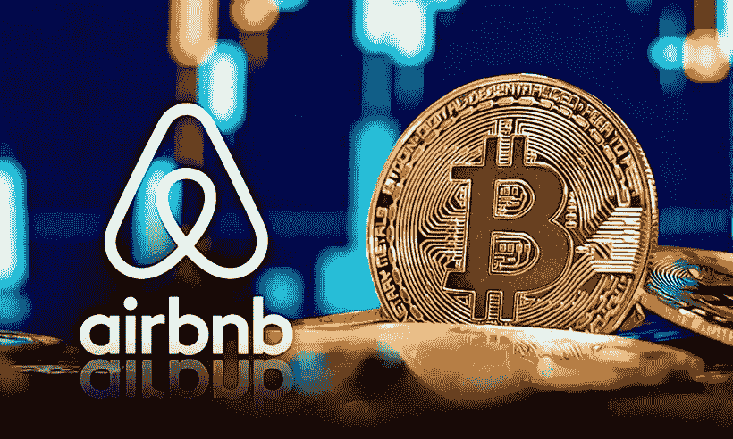

# 2022 年有可能在 Airbnb 上用加密货币支付吗？

> 原文：<https://medium.com/coinmonks/will-it-be-possible-to-pay-in-cryptocurrencies-on-airbnb-in-2022-2996481465c8?source=collection_archive---------12----------------------->

在询问了他的追随者他们希望 Airbnb 平台的新功能后，**首席执行官布莱恩·切斯基**透露，他们希望能够以加密货币支付。因此，尽管他对它们的最终采用保持模糊，但一个问题出现了:2022 年**在 Airbnb 上用加密货币支付可能吗？**

****

**Airbnb: payment in cryptocurrencies possible in 2022?**