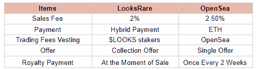
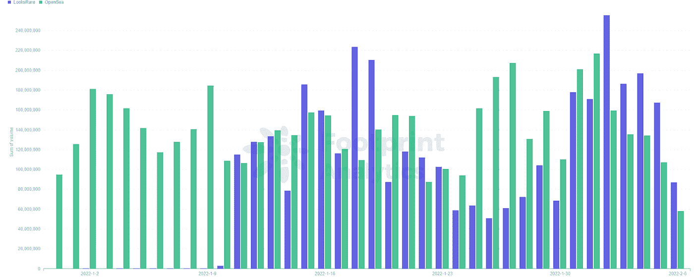
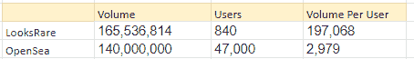
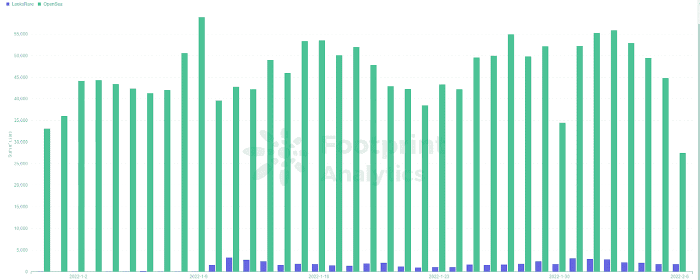
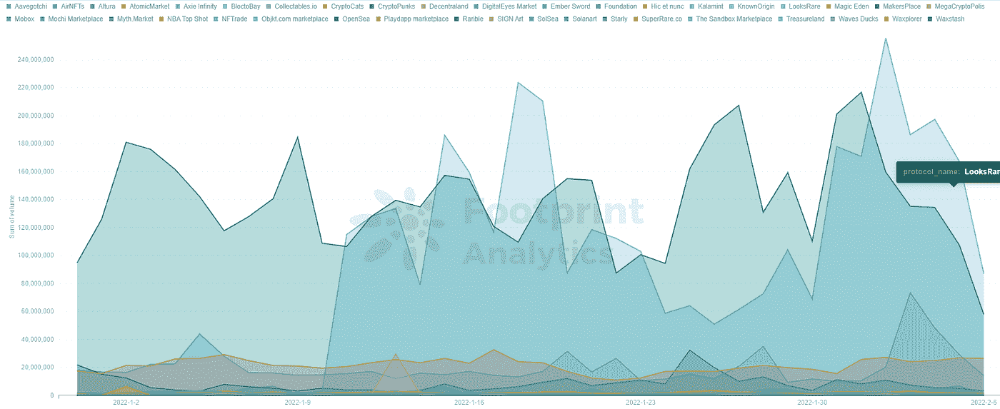
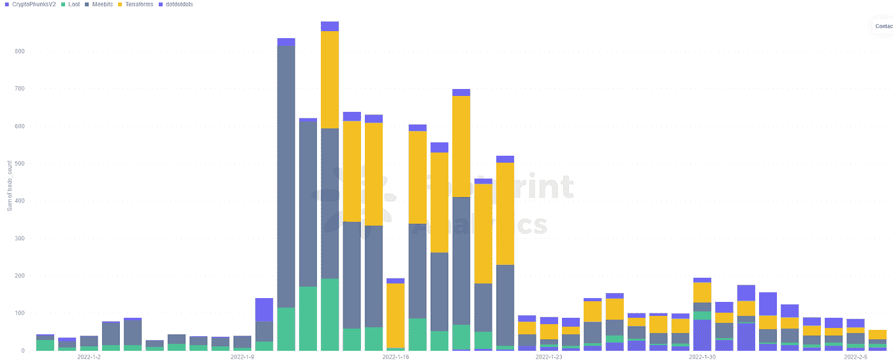
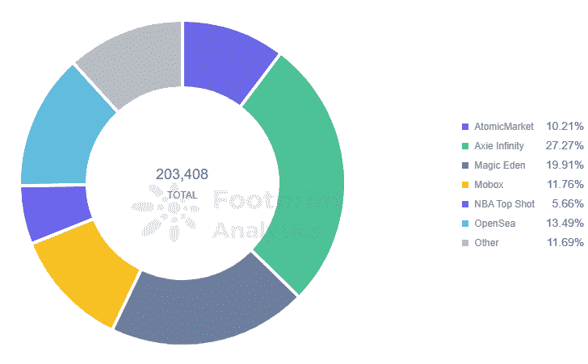

# LooksRare 会超过 OpenSea 吗？

> 原文：<https://medium.com/coinmonks/will-looksrare-overtake-opensea-19e8c72edda1?source=collection_archive---------21----------------------->

2022 年 LooksRare 还会继续增长吗？

数据来源: [LooksRare](https://footprint.cool/0poa)

1 月 10 日，NFT 市场 [LooksRare](https://footprint.cool/0poa) 发行了它的代币 [$LOOKS](https://footprint.cool/0poa) ，并向社区空投了它。第二天，该平台的交易量超过了 1 . 15 亿美元，超过了 OpenSea 成为交易量最高的 NFT 市场。

2022 年还会继续增长吗？以下是它的优势和挑战。

# 看:一个 Web 3.0 的 NFT 市场

LooksRare 由两位匿名的联合创始人 Zodd 和 Guts 创建，口号是“由 NFT 人，为 NFT 人”。

LooksRare 在它的使命声明中对 OpenSea 进行了尝试，宣布它“厌倦了创作者和决策者的去平台化，他们重视商业而不是社区，寻求 IPO 而不是让社区受益。”

虽然现在有大量的 NFT 市场，但 LooksRare 已经能够在几个关键领域进行创新。

**社区优先的 NFT 市场**

以下是 LooksRare 的主要 uvp，正如其产品和营销路线图中所解释的那样。

*   **社区优先:**总代币的 75%将分配给社区，以吸引新成员并持续奖励他们。
*   **收入分散:**交易费用 100%由$LOOKS 赌注者赚取。
*   **NFT 项目的去中心化管理:**与可以随意拿下 NFT 项目的 OpenSea 不同，LooksRare 的立场是，只要“他们没有恶意”，就不会拿下或冻结衍生项目的状态。

**用户受益分配**

LooksRare 提供了比 OpenSea 更便宜、更友好的交易体验。

*Footprint Analytics — Comparison of OpenSea and LoosRare*

应该注意的是，OpenSea 并不是第一个 NFT 市场，也不仅仅是在 NFT 市场的一些未经打磨的首次尝试。相反，它花了几年时间开发产品，赢得了 95%以上的市场份额。OpenSea 的创新包括:

*   第一次无证上榜，降低了 NFT 创作者的操作门槛。
*   一个拥有各种 NFT 资产类型的市场，包括艺术品、音乐和域名。
*   一个强大的分类系统，带有基于 NFT 特征的标签(例如，用户可以根据服装、眼睛颜色、配饰等搜索一只大象)。)

也就是说，LooksRare 想要超越 OpenSea 并不容易。然而，这个新贵也实现了标签过滤，但也提供了更低的费用，更多的收入分配，以及优化的报价方法和支付选项。

**交易奖励:一把双刃剑**

有三种方法可以在 LooksRare 上赚取$LOOKS

*   通过交易赚取:每次你在 LooksRare 上购买或出售 NFT，你就可以赚取$LOOKS。
*   通过赌注赚取:赌注$看起来赚取超过 600%的 APY。LooksRare 的交易费 100%按比例重新分配给$LOOKS 赌注者。
*   通过提供流动性赚取:向 Uniswap V2 的$LOOKS-ETH 组合提供流动性，在 Uniswap 的常规流动性提供者奖励之外赚取额外的$LOOKS 奖励。

LooksRare 的发展主要依靠其令牌组学和奖励模型。LooksRare 成功吸引了一批交易用户，现在的日均交易量为 1.3 亿美元，超过了 OpenSea 几次。

*Footprint Analytics — Comparison of trading volume of OpenSea and LoosRare*

然而，这也产生了“清洗交易”的问题，用户重复交易只是为了获得回报。查看一月份随机一天的[足迹分析](https://www.footprint.network/)数据，LooksRare 发现人均交易额为 197，068 美元，而在 OpenSea 上这个数字是人均 29，790 万美元。

*Footprint Analytics — Comparison of of trading users of OpenSea and LoosRare*

LooksRare 将在 2 月 10 日将其交易和赌注奖励减半。这将揭示市场的真正力量。

# LooksRare 会成为 NFT 的主要市场吗？

可能不会，至少在短期内不会。

1.虽然 LooksRare 的交易量已经几次超过了 OpenSea，但 OpenSea 一直保持着稳定的交易量，没有明显的下降。

*Footprint Analytics — Trading Volume of NFT Marketplace*

2.LooksRare 尚未能吸引主流的 NFT 项目。目前在 looks 上交易的前 5 个 NFT 项目之前交易量很低，观众也很少。CrpytoPunks 等主流项目没有加入。

*Footprint Analytics — Top 5 NFT on LooksRare*

3.LooksRare 的市场份额很小。

从交易量来看，OpenSea 仍然占据着 90%的市场份额。

就用户量而言，截至 2006 年 2 月，在 LooksRare 上交易的用户比例仅为 0.83%。

*Footprint Analytics — Trading Users of NFT Marketplace*

# 摘要

OpenSea 对于 NFT 市场就像以太坊对于 DeFi 一样。

2021 年初，[以太坊](https://footprint.cool/war6)以 95.88%的份额领先于 DeFi 链，而 OpenSea 目前以超过 95%的市场份额领先。然而，自 2021 年以来，以太坊受到了新兴连锁店的挑战，以太坊的市场份额现已降至 57%。

NFT 市场可能也会以同样的方式发展。也就是说，新的暴发户将继续与 OpenSea 并发增长，但超越领先者既不是一件容易的事情，也不是必然的。

**什么是足迹**

足迹分析是一个一体化的分析平台，用于可视化区块链数据和发现见解。它清理和整合链上数据，因此任何经验水平的用户都可以快速开始研究令牌，项目和协议。凭借一千多个仪表板模板和一个拖放界面，任何人都可以在几分钟内构建自己的定制图表。发掘区块链数据，利用足迹进行更明智的投资。

*足迹网址:*[*https://www . Footprint . network/*](https://www.footprint.network/)

*不和:*[*https://discord.gg/3HYaR6USM7*](https://discord.gg/3HYaR6USM7)

*推特:*[*https://twitter.com/Footprint_DeFi*](https://twitter.com/Footprint_DeFi)

> *加入 Coinmonks* [*电报频道*](https://t.me/coincodecap) *和* [*Youtube 频道*](https://www.youtube.com/c/coinmonks/videos) *了解加密交易和投资*

# 另外，阅读

*   [维护卡审核](https://coincodecap.com/uphold-card-review) | [信任钱包 vs 元掩码](https://coincodecap.com/trust-wallet-vs-metamask)
*   [Exness 评测](https://coincodecap.com/exness-review)|[moon xbt Vs bit get Vs Bingbon](https://coincodecap.com/bingbon-vs-bitget-vs-moonxbt)
*   [如何开始用加密贷款赚取被动收入](https://coincodecap.com/passive-income-crypto-lending)
*   [BigONE 交易所评论](/coinmonks/bigone-exchange-review-64705d85a1d4) | [电网交易机器人](https://coincodecap.com/grid-trading)
*   [氹欞侊贸易评论](https://coincodecap.com/anny-trade-review) | [硬币现货评论](https://coincodecap.com/coinspot-review)
*   [新加坡十大最佳加密交易所](https://coincodecap.com/crypto-exchange-in-singapore) | [购买 AXS](https://coincodecap.com/buy-axs-token)
*   [投资印度的最佳加密软件](https://coincodecap.com/best-crypto-to-invest-in-india-in-2021) | [WazirX P2P](https://coincodecap.com/wazirx-p2p)
*   [7 大最佳零费用密码交易平台](https://coincodecap.com/zero-fee-crypto-exchanges)