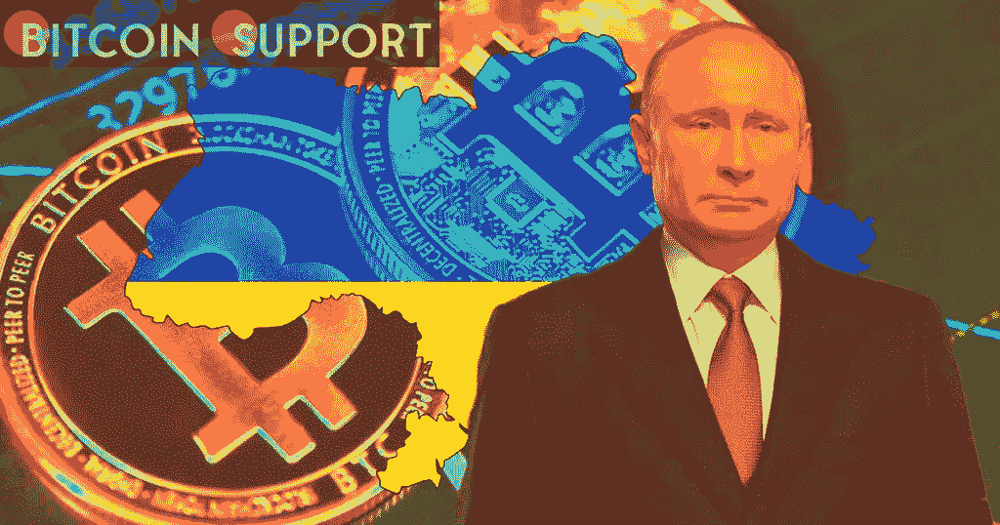

# 如果实施 SWIFT 封锁，俄罗斯会采用加密货币吗？

> 原文：<https://medium.com/coinmonks/will-russia-adopt-cryptocurrency-if-the-swift-blockade-is-implemented-7de19efaaf62?source=collection_archive---------11----------------------->

**Visit our website:-** [**https://bitcoinsupports.com/**](https://bitcoinsupports.com/)

*   世界各国领导人正在考虑对俄罗斯进行迅速的驱逐惩罚。

    ——为了逃避它，俄罗斯亿万富翁可能会转向加密货币。

    ——俄国将不得不脱离美元霸权。

    由于美国和其他国家针对俄罗斯金融系统的制裁，以及俄罗斯被踢出 SWIFT 支付网络的可能性，比特币和加密资产可能会转移。2 月 24 日，美国总统乔·拜登承诺对俄罗斯银行和金融机构实施一系列惩罚措施。他补充说，在与 G7 领导人交谈后，他们一致同意共同努力，通过限制俄罗斯获得关键货币，将俄罗斯排除在全球经济之外。

    **“我们将限制俄罗斯用美元、欧元、英镑和日元进行交易的能力，以便其参与全球经济。我们会让他们很难做到。”**

    除了处罚之外，该国退出 SWIFT 支付网络的问题正在接受审查。这将限制从国外转移到俄罗斯银行的资金数量。

    【英国首相鲍里斯·约翰逊(Boris Johnson)曾“极其努力地”游说禁止俄罗斯使用 Swift，而乌克兰外交部长 Dmytro Kuleba 在推特上说:“任何现在质疑俄罗斯是否应该被禁止使用 SWIFT 的人必须意识到，他们的双手也将沾满无辜的乌克兰男人、女人和儿童的鲜血。”俄罗斯应该被禁止使用 SWIFT。”

    **改用比特币。**

    SWIFT 是一家比利时组织，每天为全球 11，000 多家银行和金融机构处理 4，200 万条报文。尽管它最近被指责为缓慢、昂贵和过时的资金转移方法，但它仍然是行业标准。有人担心，将俄罗斯排除在全球支付网络之外，可能会鼓励他们建立自己的体系，类似于中国的体系。如果俄罗斯想要摆脱这些繁琐的限制，采用比特币等加密货币的时机已经成熟。VanEck 的数字资产研究主管马修·西格(Matthew Sigel)说:“独裁者和人权活动家都不会面临比特币网络的审查，”声明说。

    据彭博称，俄罗斯的百万富翁和寡头可能会转向加密货币来规避银行限制。”量子经济学首席执行官马体·格林斯潘说:“如果富人担心他们的账户可能会因制裁而被冻结，他们可以简单地将他们的财富放在比特币中，以避免这种行为。”

    **摆脱美元霸权**

    没有银行、集中支付网络或第三方中介的介入，crypto 可以直接从一个人交换到另一个人。正如 BeInCrypto 在 2 月 24 日指出的那样，俄罗斯拥有复杂的加密工具包，可以在这种情况下使用。Altamont Capital Management 副总裁萨希尔布鲁姆(Sahil Bloom)表示，迅速暂停可能会“对比特币和非法定货币产生长期的二级后果”，然后补充道:“俄罗斯可能会试图通过使用自己的系统和放弃美元作为储备货币的组合来绕过这些限制。

**访问我们的网站:-**[**【https://bitcoinsupports.com/】**](https://bitcoinsupports.com/)

**免责声明:这些是作者的观点，不应被视为投资建议。读者应该自己做研究。**

> *加入 Coinmonks* [*电报频道*](https://t.me/coincodecap) *和* [*Youtube 频道*](https://www.youtube.com/c/coinmonks/videos) *了解加密交易和投资*

# 另外，阅读

*   [3 商业评论](/coinmonks/3commas-review-an-excellent-crypto-trading-bot-2020-1313a58bec92) | [Pionex 评论](https://coincodecap.com/pionex-review-exchange-with-crypto-trading-bot) | [Coinrule 评论](/coinmonks/coinrule-review-2021-a-beginner-friendly-crypto-trading-bot-daf0504848ba)
*   [莱杰 vs n rave](/coinmonks/ledger-vs-ngrave-zero-7e40f0c1d694)|[莱杰 nano s vs x](/coinmonks/ledger-nano-s-vs-x-battery-hardware-price-storage-59a6663fe3b0) | [币安评论](/coinmonks/binance-review-ee10d3bf3b6e)
*   [Bybit Exchange 审查](/coinmonks/bybit-exchange-review-dbd570019b71) | [Bityard 审查](https://coincodecap.com/bityard-reivew) | [Jet-Bot 审查](https://coincodecap.com/jet-bot-review)
*   [3 commas vs crypto hopper](/coinmonks/3commas-vs-pionex-vs-cryptohopper-best-crypto-bot-6a98d2baa203)|[赚取加密利息](/coinmonks/earn-crypto-interest-b10b810fdda3)
*   最好的比特币[硬件钱包](/coinmonks/hardware-wallets-dfa1211730c6) | [BitBox02 回顾](/coinmonks/bitbox02-review-your-swiss-bitcoin-hardware-wallet-c36c88fff29)
*   [BlockFi vs 摄氏度](/coinmonks/blockfi-vs-celsius-vs-hodlnaut-8a1cc8c26630) | [Hodlnaut 审核](/coinmonks/hodlnaut-review-best-way-to-hodl-is-to-earn-interest-on-your-bitcoin-6658a8c19edf) | [KuCoin 审核](https://coincodecap.com/kucoin-review)
*   [Bitsgap 评审](/coinmonks/bitsgap-review-a-crypto-trading-bot-that-makes-easy-money-a5d88a336df2) | [Quadency 评审](/coinmonks/quadency-review-a-crypto-trading-automation-platform-3068eaa374e1) | [Bitbns 评审](/coinmonks/bitbns-review-38256a07e161)
*   [加密复制交易平台](/coinmonks/top-10-crypto-copy-trading-platforms-for-beginners-d0c37c7d698c) | [Coinmama 审核](/coinmonks/coinmama-review-ace5641bde6e)