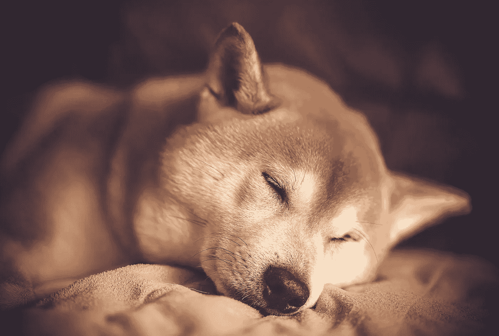

# 柴犬会到 1 分钱吗？

> 原文：<https://medium.com/coinmonks/will-shiba-inu-reach-1-cent-cf843f89ee9?source=collection_archive---------17----------------------->

如果你听说过加密货币，你可能听说过柴犬币。由于价格飞涨，它最近变得非常受欢迎。

有人用柴犬赚了很多钱，所以你可能会想“嗯，也许我可以从这东西上赚点钱，对吧？”许多人相信 Shib 的这一点，其中大多数人认为柴犬的加密货币 SHIB 可以达到 1 美分。

请记住，柴犬目前的价格是每 SHIB 0.000008157 美元。这意味着一美元可以买 122，594 个代币，如果 SHIB 中了一便士，那么最终价值为 1，225.94 美元。现在想象一笔 100 美元的投资！它可能值 122，594 美元！

这听起来很神奇，但是回到地球上来。柴犬有可能达到一分钱吗？

# **柴犬币是什么？**

柴犬币是一种模仿另一种流行的模因币 Dogecoin 的成功而创造的模因币。Dogecoin 很快受到欢迎，其价格也随之上涨。许多人投资 Dogecoin 赚了很多钱。同样的事情也开始发生在柴犬身上。有人一开始在 SHIB 投资了 100 美元，很快就发现他的存货价值 321 万美元。

柴犬和 Dogecoin 的主要区别在于，Dogecoin 是使用与比特币相同类型的技术构建的。另一方面，柴犬是建立在以太坊之上的，因此可以使用柴犬来构建分散的应用程序。这些应用可能是柴犬长期成功的关键。

# **柴犬能达到 1 分钱的途径**

有几种方法可以让柴犬达到 1 美分。

在我们继续之前，我们必须看看柴犬的市值是多少。市值是一个项目的总价值，计算方法是流通中的硬币数量乘以价格。

柴犬目前有 549.1 万亿代币在流通！

因此，通过一些简单的数学计算，我们可以计算出柴犬需要 5.491 万亿美元的市值才能达到 1 美分。

这是一个相当大的市值，但让我们看看柴犬能做些什么来达到一分钱。

首先，我们可以看看企业。柴犬可以用来买卖商品，就像钱一样，除了柴犬是数字的。柴犬实际上被超过 40，000 家商户接受，包括 AMC 剧院、Twitch 和 Sling TV。所以，如果你的投资成功了，下次去看电影时，你可以用你的 SHIB 买些爆米花。

第二，我们可以看到所有与柴犬合作建设的项目。两个主要的是 ShibaSwap 和 Shibaverse。ShibaSwap 是一个分散的交易所，允许你只使用你的钱包地址来交换加密货币。Shibaverse 是一个数字现实，用户可以在这里玩游戏，交易 NFT，并使用虚拟现实进入元宇宙。

第三，我们必须看看供应燃烧。 [**焚烧加密货币**](https://www.cryptolovesh2o.com/blog-posts/what-does-burning-crypto-mean-and-why-is-it-important) 有很多，但简单来说，就是你故意把硬币从流通的供给中去除。你可以永久地“摧毁”加密发送到一个钱包地址，没有人可以访问它。烧密码的主要原因是减少供应量，因为如果当前流通供应量减少，市值保持不变，硬币的价格就会上升。

# **总结**

柴犬是一个被创造来利用密码流行的迷因币，但已经进化成如此之多。

它的许多投资者声称柴犬可以达到一分钱。不太可能，但有可能。

如果企业继续将它用作数字货币，如果它的项目变得非常受欢迎，或者如果它烧掉了一大块供应，柴犬可能会达到 1 便士。

> 加入 Coinmonks [电报频道](https://t.me/coincodecap)和 [Youtube 频道](https://www.youtube.com/c/coinmonks/videos)了解加密交易和投资

# 另外，阅读

*   [Bookmap 评论](https://coincodecap.com/bookmap-review-2021-best-trading-software) | [美国 5 大最佳加密交易所](https://coincodecap.com/crypto-exchange-usa)
*   最佳加密[硬件钱包](/coinmonks/hardware-wallets-dfa1211730c6) | [Bitbns 评论](/coinmonks/bitbns-review-38256a07e161)
*   [新加坡十大最佳加密交易所](https://coincodecap.com/crypto-exchange-in-singapore) | [购买 AXS](https://coincodecap.com/buy-axs-token)
*   [红狗赌场评论](https://coincodecap.com/red-dog-casino-review) | [Swyftx 评论](https://coincodecap.com/swyftx-review) | [CoinGate 评论](https://coincodecap.com/coingate-review)
*   [投资印度的最佳密码](https://coincodecap.com/best-crypto-to-invest-in-india-in-2021)|[WazirX P2P](https://coincodecap.com/wazirx-p2p)|[Hi Dollar Review](https://coincodecap.com/hi-dollar-review)