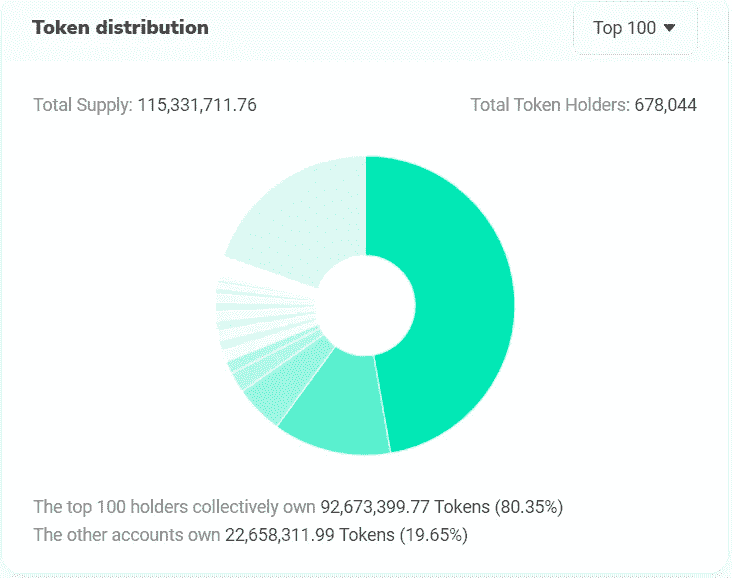
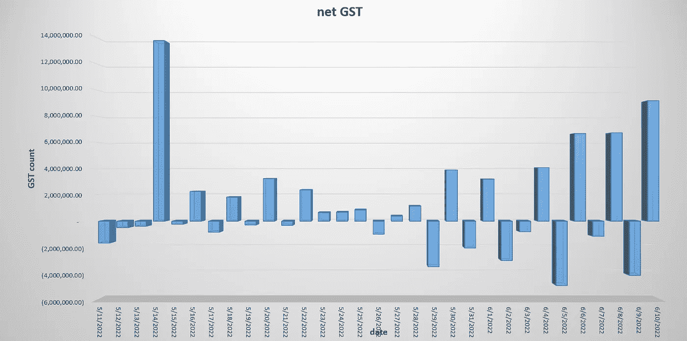
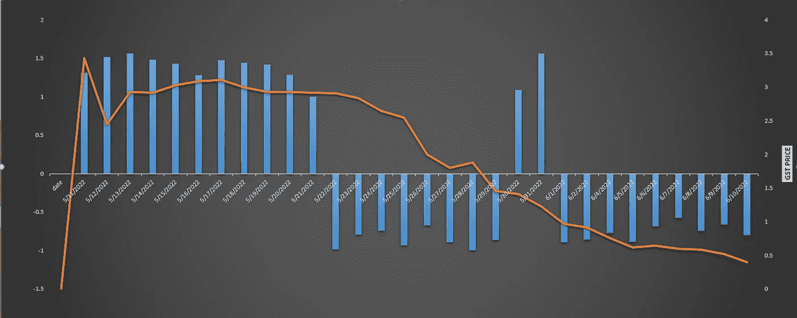

# StepN 会复活吗？

> 原文：<https://medium.com/coinmonks/will-stepn-be-revived-31d1bf404b45?source=collection_archive---------0----------------------->

StepN 是一个向人们介绍使用区块链的概念比其他任何项目都多的项目，向我们介绍了一个我们可以通过步行赚钱的世界。这个美好的时代是随着 StepN 价值的下降而结束了吗，还是 StepN 可以重新焕发生机，为其用户创造良好的收入？

在本文中，我想深入讨论这个项目和可用的解决方案

首先，让我们看看商品及服务税代币的状况。根据 Solscan 提供的信息，约有 1.15 亿枚商品及服务税代币在流通。大约 47%的代币在属于项目本身的钱包中，当你想进入或退出应用程序的商品及服务税时，这是通过这个钱包为你完成的，所以我们可以得出结论，大约 47%的代币被锁定在应用程序内，根据 Solscan 的说法，大约 80%的代币在前 100 个钱包中，9 个钱包占总代币的 1%以上，似乎没有非常大的鲸鱼。

现在让我们看看过去一个月商品及服务税的流入和流出

如你所见，大部分时间我们有商品及服务税流入，如果我们把每天流入和流出的数量加起来，我们会看到在过去 30 天的余额为正 3600 万英镑。

由此产生的一个重要问题是，如果我们有这么多流入代币，那么为什么商品及服务税的价格在过去 30 天里下降了约 86%?对于这个问题，我没有确切的答案，但我会提出一些可能性。

我们从网上获得的信息可能是不正确的，或者商品及服务税的价格可能被操纵了，但无论是什么，商品及服务税的价格与鞋的价格相比，目前似乎并不真实。而且现在铸造鞋子不赚钱，为了赚钱，要么鞋子的价格必须提高，要么商品及服务税的价格必须降低。鉴于商品及服务税的流入总体上是积极的，我认为鞋子价格上涨比商品及服务税价格下降更符合逻辑。但是，为什么这种情况没有发生，我们看到商品及服务税的价格每天都在下降？

在我看来，这是一个致命的循环，商品及服务税价格下降的未知原因可以加速它，秘密就在下图中。

在该图中，您可以看到每日新用户与当天新鞋的比率，并且商品及服务税的每日价格也可以用橙色显示。

你可以看到，当新用户与新鞋薄荷的比例大于 1.5X 时，GST 价格形势是有利的，但当这个比例为负，新鞋薄荷大于每日新用户时，问题就开始了。这种比例逆转导致鞋的日常供应大于需求，另一方面，每个用户的鞋增加，所以鞋的价格下降，当鞋的价格下降时，盈亏平衡期也下降，并鼓励用户出售商品及服务税，结果，价格一天比一天低。

当然，项目团队试图通过增加鞋薄荷的成本来减少鞋薄荷的数量，但似乎他们失败了，当然，我再说一遍，基于链上信息，双重销售压力从应用程序外部施加到商品及服务税，一些人喜欢拉低商品及服务税价格

解决方案:
振兴 StepN 的解决方案是平衡每天的鞋子铸造数量和每天的新用户，他们应该通过有吸引力的游戏设置规则，不允许每天的鞋子铸造超过当天新用户的 60%。

> 加入 Coinmonks [电报频道](https://t.me/coincodecap)和 [Youtube 频道](https://www.youtube.com/c/coinmonks/videos)了解加密交易和投资

# 另外，阅读

*   [如何开始通过加密贷款赚取被动收入](https://coincodecap.com/passive-income-crypto-lending)
*   [加密货币储蓄账户](/coinmonks/cryptocurrency-savings-accounts-be3bc0feffbf) | [加密交易机器人](https://coincodecap.com/best-crypto-trading-bots)
*   [BigONE 交易所评论](/coinmonks/bigone-exchange-review-64705d85a1d4) | [CEX。IO 审查](https://coincodecap.com/cex-io-review) | [交换区审查](/coinmonks/swapzone-review-crypto-exchange-data-aggregator-e0ad78e55ed7)
*   [最佳比特币保证金交易](/coinmonks/bitcoin-margin-trading-exchange-bcbfcbf7b8e3) | [比特币保证金交易](https://coincodecap.com/bityard-margin-trading)
*   [加密保证金交易交易所](/coinmonks/crypto-margin-trading-exchanges-428b1f7ad108) | [赚取比特币](/coinmonks/earn-bitcoin-6e8bd3c592d9)
*   [WazirX vs CoinDCX vs bit bns](/coinmonks/wazirx-vs-coindcx-vs-bitbns-149f4f19a2f1)|[block fi vs coin loan vs Nexo](/coinmonks/blockfi-vs-coinloan-vs-nexo-cb624635230d)