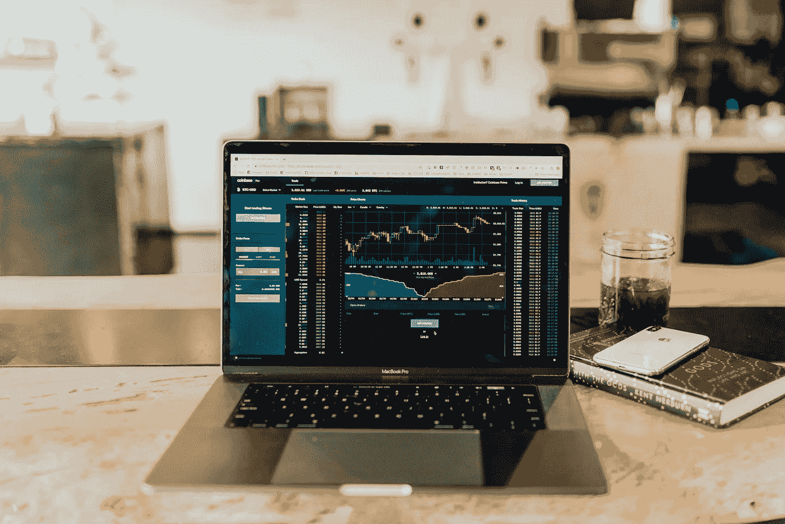

# 在末世崩溃之后，对地球月神有什么期待

> 原文：<https://medium.com/coinmonks/will-terra-luna-reach-at-1-b6c673ba846b?source=collection_archive---------1----------------------->

Source photo Unsplash.com

在 4 月的某个时候，Terra 的 LUNA token 价值 100 美元一个 LUNA，但这个价格后来几乎降到了零。一种叫做“UST”的算法稳定的货币，曾经与美元挂钩，现在已经失去了它的挂钩地位。

在加密市场大幅下跌的背景下，比特币的价格下跌了 20%以上..