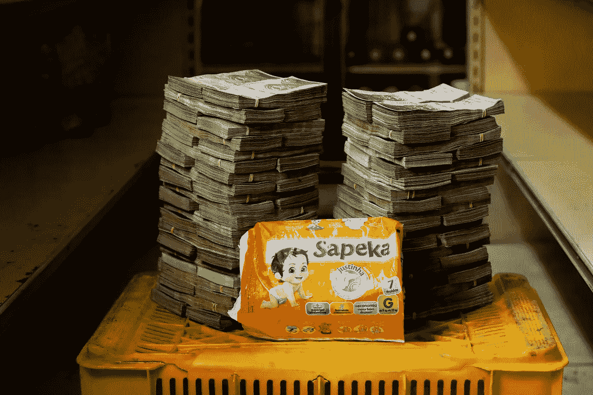
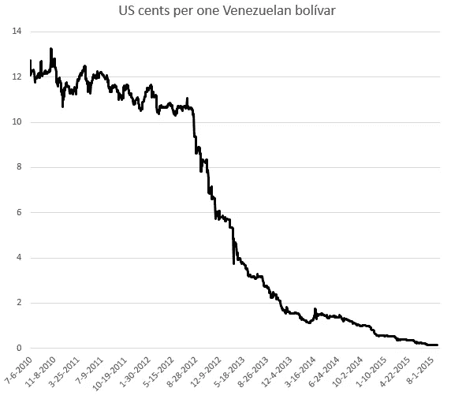

# 区块链会永远改变我们吗？

> 原文：<https://medium.com/coinmonks/will-the-blockchain-change-us-forever-9895784ed611?source=collection_archive---------21----------------------->

我总是与流行词汇作战，区块链似乎是继人工智能之后最热门的一个，但与电影描绘的人工智能不同，我们实际上对区块链知之甚少，除了一些像比特币和以太坊这样的密码。起初我试图忽略这一点，但作为软件开发人员的灵魂，我被所有这些大惊小怪所吸引。因此，在这篇文章中，我想强调什么是这项技术，它的用途和未来的影响，我们可能会因为这项技术和谁可以阻止这项技术。和往常一样，我会尽可能简单地解释，这样每个人至少可以知道这是什么？我将按照我刚才提到的顺序进行。

# **那么，什么是区块链？？**

这是这篇博文要回答的最重要的问题，这样我们才能理解这项技术的含义。区块链无非就是分布式数据库！！那是什么意思？简而言之，这是一本每个人都能读，很少有人能写的日志。让我解释一下，假设我住在美国，我想给印度的某个人寄钱。我能做它的方法是什么？让我们假设你正在做电汇。您在美洲银行(bofa)有账户，并且您想汇款给居住在印度并且在印度国家银行(SBI)有账户的父亲。

这将如何实现？

我假设我们生活在电脑出现之前的时代。所以，当我试图通过我的银行汇款到我父亲的账户时，这就是将要发生的事情。我的银行有一个账本，试图记录我的交易。所以，它检查我今天的声明，说是的 Piyush 有 500 美元，所以他可以汇款到印度。所以，他们会打电话给印度的某人(假设某人 X ),基本上是说 Piyush 想给他父亲寄钱，这是我们这边的绿灯，因为我们在我们的书上查过他有足够的钱。

某人 X 碰巧认识一个 SBI 人，他说，嘿，SBI·皮尤什从他的账户中借记了 500 美元，请给他父亲 35000 美元(考虑到 1 美元= 70 卢比)。因此，SBI 将检查其图书，找到皮尤什的父亲的账号，并将存款 35000。这是如何做的基本过程。这是一个伟大的过程，但也有其缺点，如…

1.  需要 2-3 个工作日才能把钱打到他父亲的账户上。
2.  如果其中一家银行破产了，你的钱就有危险了。
3.  X 人传递的信息错了怎么办，你亏了。
4.  这些公司收取他们自己的提成来提供资金，所以即使你寄了 500 美元，你也会得到 32000 美元。
5.  如果你所在的城市发生骚乱，服务就会中断，你就无法汇款。

这些也是一些缺点，但是相信我，这个列表比这篇博客还要长。那么，如果这个旧系统不够用，我们为什么还要使用它呢？尽管我已经列出了这个系统的缺点，但它仍然盛行，因为我们相信金钱。**美元是美元，卢比是卢比，这不会改变**。**我的 1 美元是有价值的，因为你要接受这 1 美元来提供你的服务。但是为什么银行对你有这么大的权力呢？？**

以 2008 年金融危机及其影响为例。一群银行家搅乱了整个金融体系，最终你失去了房子、工作和金钱，而他们却变得更加富有。一旦发生这种情况，成千上万的家庭变得无家可归，许多人生活在贫困线以下。我的观点是，我们不能相信银行家，因为他们有巨大的现金流来波动你的资金。但是我们有选择吗？输入加密货币。

请，请读这个:**密码不是区块链。区块链是一种支持加密的技术，所以加密是一种用例，区块链是一种技术，但我举一个加密的例子，因为它是区块链最受欢迎的应用。**

让我们回到我们的例子，考虑一下:你的钱有价值，因为你相信你的政府，当明天太阳升起时，你的美元仍然是美元，但不一定是。我们看到了像委内瑞拉这样国家的例子。如果你不相信，请看这张图表。人们给一篮子钱只是为了买一瓶水。所以，你对金钱的信任依赖于你的政府仍然支持你，相信我，你的政府完全有可能像纸牌屋一样在一夜之间渗透。

a baby diaper for a pile of cash and crash of currency.

所以，问题够多了，让我们来谈谈解决方案。输入密码。这是什么？您汇款的交易发生了，因为在我的例子中，两家银行都验证了必要的东西。美国银行检查我是否有足够的钱发送，SBI 直接我的钱到适当的账号。如果这是通过互联网完成的，并且相互连接的计算机同意我有足够的钱，并且我可以将钱发送到各自的帐户，那该怎么办？这解决了我的问题，对吧？现在，我不再相信银行会验证(一些人会验证)，现在我有一套电脑检查我是否有钱，并把我的钱转给我的父亲。在这种情况下，我们从银行手中接过权力，依靠成千上万的电脑说我有足够的钱，我可以把钱转给我的父亲。所以，区块链是一个打破权力金字塔，依靠计算机网络的系统。所以，我依靠银行来处理交易，我依靠这台电脑来完成任务。从技术上讲，你不能欺骗这一点，因为你不能让世界上一半的计算机来使交易无效。瞧啊。！你没有通过中间人就把钱寄给了你父亲。即使你的政府失败了，你的互联网不会。你的钱是你的，没有人能动它，因为有了你自己的互联网钥匙，你可以打开你的钱包。它安全，便宜，快捷，超级神奇。即使你的国家辜负了你，你也没有破产！正如 Twitter 联合创始人所说的“**互联网将会有它自己的货币**..我希望这是真的。

**为什么要进行这种革命，它意味着什么？**

在所示的例子中，权力掌握在人们手中，而不是一些银行和政府手中。这个想法是革命性的，改变了我们相互交流的方式。这关系到你的数据、金钱和隐私的所有权。想象一下，你的政府通过的每一项法案，你都可以投票。你决定每一个政策应该发生什么。目前的民主制度掌握在 500 名政客手中，他们有偏见，可能腐败，所以他们的决定可能会被扭曲。如果我做一个应用程序，你可以对从修路到通过下水道的每一个问题进行投票。你比他们更了解你。所以，你投票通过一项法案。但是那些公路的预算又不知道投在哪里呢？好吧，我有个解决办法。我做了一个应用程序，contactor 将每天上传道路的详细信息，你可以看到你的税款是否投资正确？嘣！没有腐败，在你的手机总功率。如果你想做一个模因并将其货币化，请欢迎 NFTs。现在每次有人使用你的迷因，你就赚了钱。如果在博客网站上，每次你的文章获得一个向上的投票，你就可以获得一个可以转换的代币。区块链大部分是不可变的，所以你的数据是安全的。在新闻网站上，人们实际上可以检查细节，如果超过 50%的人说不，这是欺诈性的，那么文章或视频就会被删除。伙计。！这太神奇了，在一天结束的时候，你决定会发生什么。这是不是非常令人兴奋，我可以继续谈论福利。即使你不喜欢，这也会发生……**除非政府介入..**

**所以，世卫组织打算阻止区块链？？**

尽管这似乎是革命性的，但我们已经看到政府试图以某种方式介入此事并阻止交易？中国最近打击所有 alt 币就是例子之一。但是，当事情发生在互联网上时，这怎么可能呢？没有人能阻止互联网，对吗？嗯，这很复杂！！政府仍然可以看到你的 IP 地址，他们可以跟踪你阻止你。印度政府也正在实施制裁，这将允许他们对自己的密码拥有本地控制权。美国政府仍然坚持其立场，但很难回避他们。我看到的最令人惊讶的研究之一是名为 filecoin 的项目，它使你能够消除像 AWS 这样的大型服务，AWS 拥有世界上近 50%的服务器，这样我们就可以取代区块链，但 filecoin 还有很长的路要走。

**最终裁决……**

我希望你至少掌握了这个想法的窍门以及 fuzz 是怎么回事。区块链完全是革命性的，我不怀疑这个事实，它和 90 年代末的互联网一样大，但我们还有很长的路要走。作为一名通过 0 和 1 来理解世界的软件开发人员，区块链肯定正在发生，并且将在未来 10 年内大规模发生。这需要我的社区付出很多努力，但我可以保证这将在 AI 将军出现之前发生。Web2 给了我们惊人的东西，为我们打开了新的机会之门，但它将会变得更大更好。直到拜拜！！

> 加入 Coinmonks [电报频道](https://t.me/coincodecap)和 [Youtube 频道](https://www.youtube.com/c/coinmonks/videos)了解加密交易和投资

# 另外，阅读

*   [Bookmap 点评](https://coincodecap.com/bookmap-review-2021-best-trading-software) | [美国 5 大最佳加密交易所](https://coincodecap.com/crypto-exchange-usa)
*   最佳加密[硬件钱包](/coinmonks/hardware-wallets-dfa1211730c6) | [Bitbns 评论](/coinmonks/bitbns-review-38256a07e161)
*   [新加坡十大最佳加密交易所](https://coincodecap.com/crypto-exchange-in-singapore) | [购买 AXS](https://coincodecap.com/buy-axs-token)
*   [红狗赌场评论](https://coincodecap.com/red-dog-casino-review) | [Swyftx 评论](https://coincodecap.com/swyftx-review) | [CoinGate 评论](https://coincodecap.com/coingate-review)
*   [投资印度的最佳密码](https://coincodecap.com/best-crypto-to-invest-in-india-in-2021)|[WazirX P2P](https://coincodecap.com/wazirx-p2p)|[Hi Dollar Review](https://coincodecap.com/hi-dollar-review)
*   [加拿大最佳加密交易机器人](https://coincodecap.com/5-best-crypto-trading-bots-in-canada) | [库币评论](https://coincodecap.com/kucoin-review)
*   [火币的加密交易信号](https://coincodecap.com/huobi-crypto-trading-signals) | [HitBTC 审核](/coinmonks/hitbtc-review-c5143c5d53c2)
*   [如何在 FTX 交易所交易期货](https://coincodecap.com/ftx-futures-trading) | [OKEx vs 币安](https://coincodecap.com/okex-vs-binance)