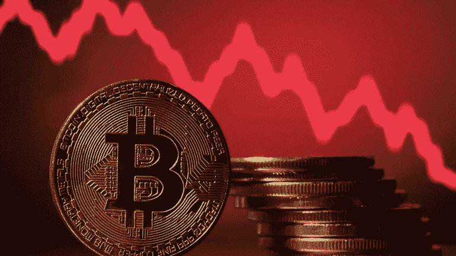

# 2022 年加密货币市场会继续跳水吗？

> 原文：<https://medium.com/coinmonks/will-the-cryptocurrency-market-continue-to-dip-in-2022-9ec85e446f8d?source=collection_archive---------66----------------------->

波动性和停滞的价格与奥米克龙新冠肺炎变种的新经济不确定性、美联储董事长杰罗姆·鲍威尔关于金融系统适用性的新声明、美国官员关于加密货币法的持续反馈以及哈萨克斯坦的互联网关闭保持快速发展。哈萨克斯坦是仅次于美国的第二大采矿点，导致比特币成本下降。

但这并不是比特币第一次从历史高点暴跌 50%以上。你还记得上一次比特币在 2021 年 4 月创下 53，260.3 美元的历史新高吗，到 2021 年 7 月，它突然失去了一半以上的价值，暴跌至 41，157.15 美元左右。而到了 2021 年 11 月，再次创下 61374.28 美元的历史新高。

Photo Source on Google

这只是一个例子，如果你看看过去 12 年的比特币图表，你会发现其他几个例子。

# **如果你是首次购买者**

有一句流行的中国谚语说:“种植一棵树的最佳时间是 20 年前。第二好的时机就是现在。”基本上，在今天投资比特币的背景下，如果你想要未来的成功和增长，最好的行动时间就是现在，并利用这次下跌。

# **如果你是现有的持有者**

你能做的最好的事情就是不去看它。像对待任何传统的长期投资账户一样忘记它。如果你让自己的情绪过于投入，那么你可能会做出错误的决定，然后后悔。

# 结果

加密比传统货币更不稳定，因此更容易崩溃，但加密配对也有问题。例如，如果有人投资比特币(而不是替代币)，那么当它崩溃时，他们将会看到不成比例的损失，因为他们的投资相对于其他人的投资来说价值更低。