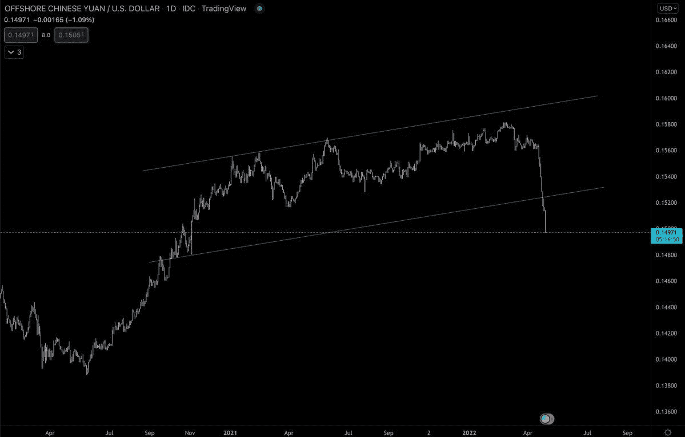
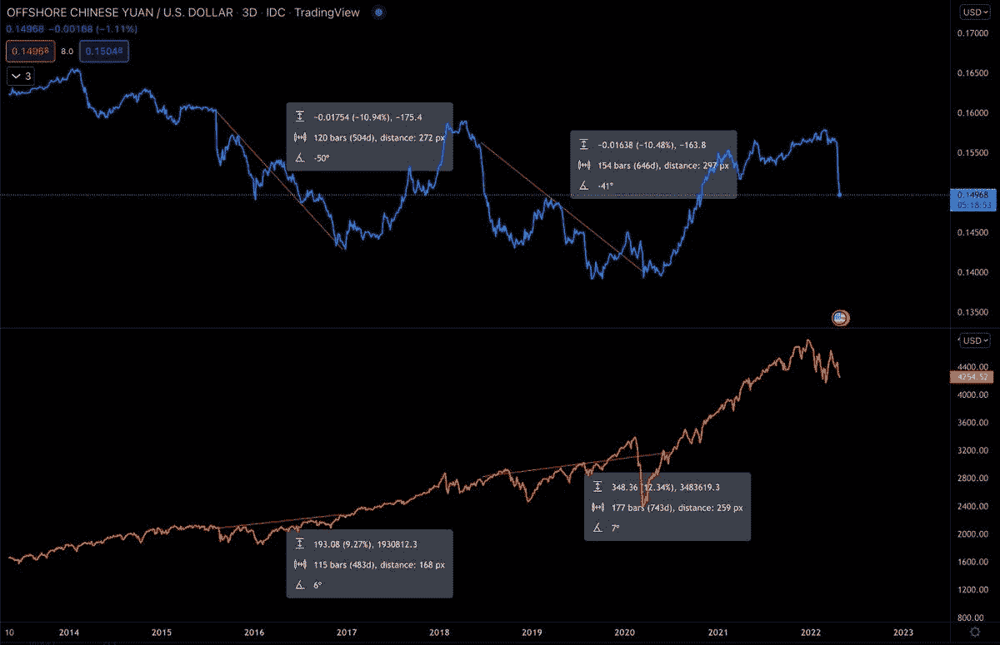
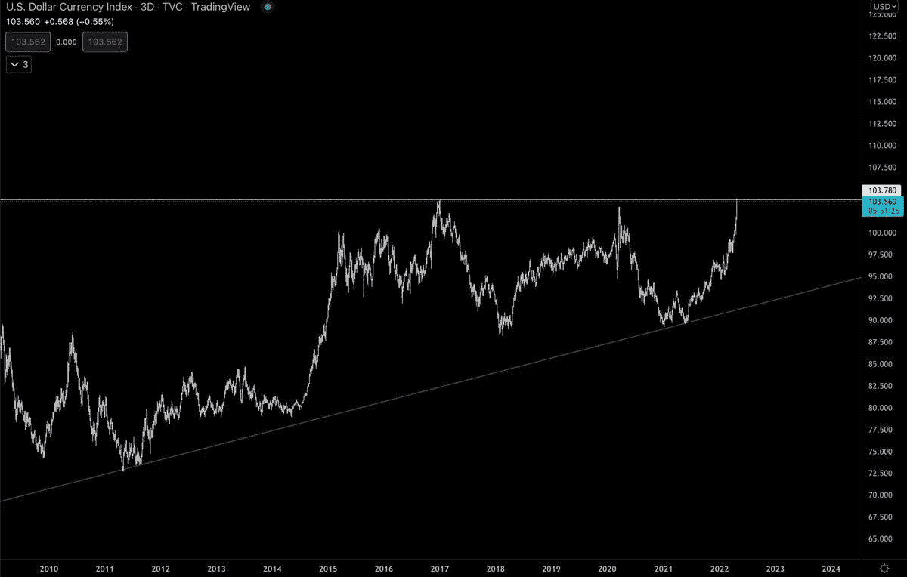

# 人民币贬值会为美国股市的下跌铺平道路吗？

> 原文：<https://medium.com/coinmonks/will-the-devaluation-of-the-yuan-pave-the-way-for-the-fall-of-crypto-and-the-us-equities-market-dae9fcbbc116?source=collection_archive---------65----------------------->

Chinese Yuan chart

不，这不是狗屎硬币，这是中国的人民币。自此前高点以来，该指数已下跌约 5.3%

上一次人民币贬值是在 2015 年和 2018 年。回顾历史，一旦人民币找到底部，就会引发美国市场的反弹。

The Chinese Yuan vs SPX chart

## 经济学

为什么一个国家会决定让自己的货币贬值？

*   战略性地降低本国货币的购买力
*   在全球贸易中获得竞争优势并减少主权债务
*   增加出口，减少进口

最终，这将导致经济增长加快，经常账户赤字减少。

引发财富效应。

对国家资本和住房市场产生积极影响，从而促进国内消费。

$DXY 一直在绝对撕裂，并在阻力。如果价格回撤，它可能会支持股票反弹的论点，这可能会延续到加密，因为我们看到此时$NQ 和$BTC 之间的相关性。

$DXY chart

> 加入 Coinmonks [电报频道](https://t.me/coincodecap)和 [Youtube 频道](https://www.youtube.com/c/coinmonks/videos)了解加密交易和投资

# 另外，阅读

*   [BigONE 交易所点评](/coinmonks/bigone-exchange-review-64705d85a1d4) | [电网交易 Bot](https://coincodecap.com/grid-trading)
*   [氹欞侊贸易评论](https://coincodecap.com/anny-trade-review) | [CoinSpot 评论](https://coincodecap.com/coinspot-review)
*   [新加坡十大最佳加密交易所](https://coincodecap.com/crypto-exchange-in-singapore) | [购买 AXS](https://coincodecap.com/buy-axs-token)
*   [投资印度的最佳加密软件](https://coincodecap.com/best-crypto-to-invest-in-india-in-2021) | [WazirX P2P](https://coincodecap.com/wazirx-p2p)
*   7 个最佳零费用加密交易平台
*   [最佳网上赌场](https://coincodecap.com/best-online-casinos) | [期货交易机器人](/coinmonks/futures-trading-bots-5a282ccee3f5)