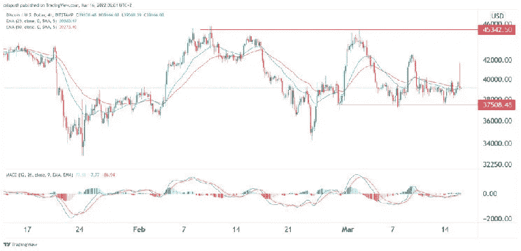

# 美联储加息会打压比特币价格吗？

> 原文：<https://medium.com/coinmonks/will-the-fed-rate-rise-crush-bitcoin-prices-65ed1bcb8780?source=collection_archive---------64----------------------->

Source photo TradingView.com

由于投资者等待美联储即将宣布的利率，比特币(BTC/美元)的价格在过去几天一直停滞不前。它现在的交易价是 39320 点，一周以来一直如此。这是对历史高点的巨大折扣。

# 美联储即将做出决定。