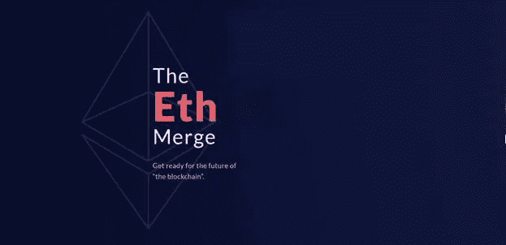
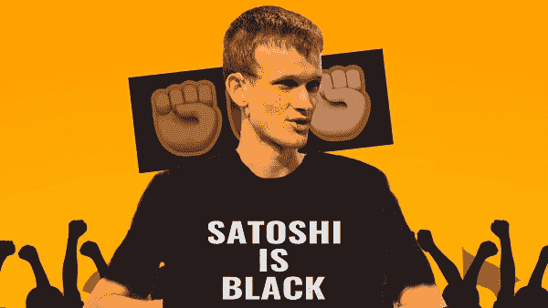
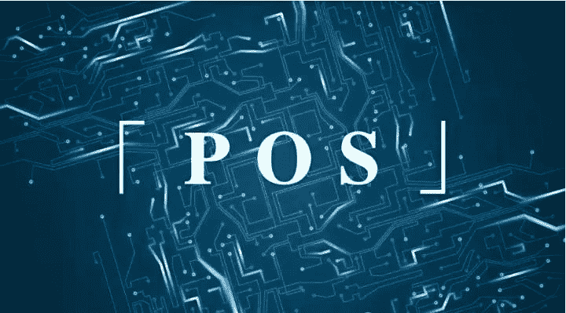
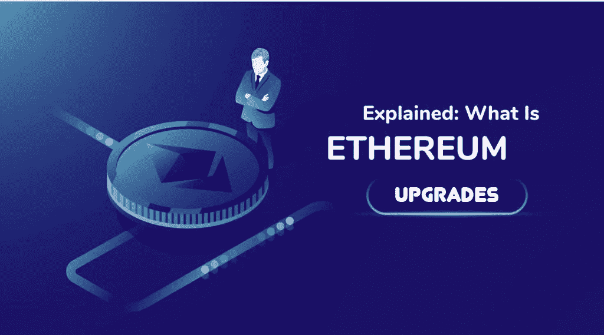
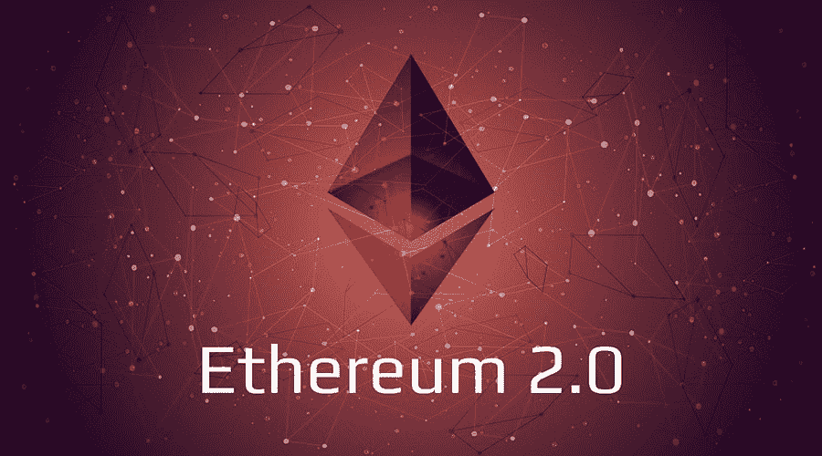
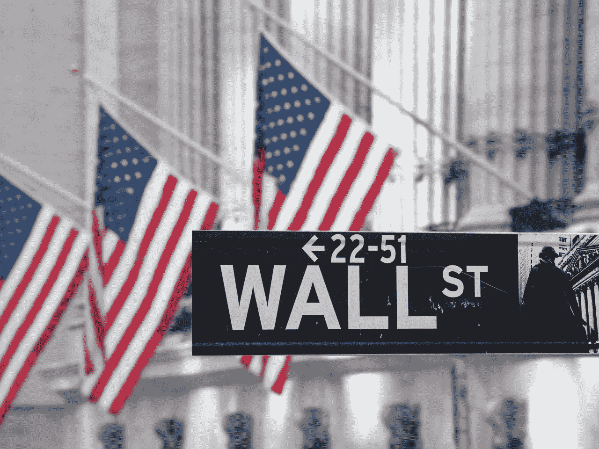
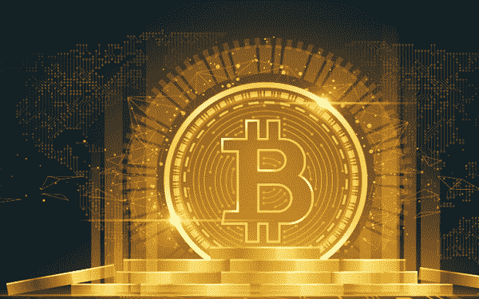

# 合并会引发加密牛市吗？

> 原文：<https://medium.com/coinmonks/will-the-merge-prompt-a-crypto-bull-market-a622374bdc90?source=collection_archive---------27----------------------->

2021 年，阿梅菲、新公共区块链和 NFT 病毒式传播，这在很大程度上延长了加密货币的牛市。以太坊的合并可能是 2022 年加密货币行业最值得期待的事件。

然而，在美联储加息和传统股市影响的“打击”下，加密货币市场的下行空间正在迅速显现。即使以太坊开发商设法在 2022 年实现合并，这似乎仍不足以对抗当前的低迷。

以太坊网络和生态在过去几年发展的如火如荼，但以太坊在可及性、可持续性、效率和安全性等方面仍然受到束缚。为了让以太坊超越那些障碍，Vitalik 受到启发“创造了以太坊 2.0”，一台世界性的计算机。

2021 年 12 月初，Vitalik Buterin 发表了一篇名为" Endgame "的博客，他在博客中提出了整个区块链最终将会融合的观点。与此同时，他还列出了以分散和抵制审查的方式进行块验证的工具。

简而言之，现在的以太坊信标链(PoS consensus)是从 mainnet (PoW consensus)中分离出来的。合并的最终目标是将两个系统合并在一起。当一切准备就绪时，以太坊主网将加入信标链，移动运行智能合同的能力，并将分类帐和当前状态导入 PoS-consensus 系统。

这一合并标志着以太坊 PoW 共识的终结。届时，验证过程将交给“验证者”，整个以太坊网络将不再需要 GPU 挖掘。熟悉以太坊人都知道，以太坊从能源密集型电力转换为 PoS 将使其摆脱高额燃气费的问题。

因此，以太坊 2.0(以太坊升级版)并不是一个新项目，它只是以太坊发展的又一大步。它旨在使以太坊更加可扩展、安全和可持续，最终能够服务于整个人类社会。

尽管以太坊的升级只是在最近几年才被大肆宣传，但事实上它已经被埋下了伏笔。2017 年 10 月的拜占庭升级，2019 年 2 月的君士坦丁堡升级，2019 年 12 月的伊斯坦布尔升级都为以太坊升级奠定了基础。**这些升级优化了智能合约编程，提升了安全性，部署了难度炸弹，调整了以太坊核心结构，使 PoS 过渡成为可能。**

**以太坊——升级即将来临。**

2022 年 3 月 26 日，以太坊核心开发者，合并负责人 Tim Beiko 总结了最新的核心开发者会议，总结内容包括窑测网进展、新难度炸弹、上海升级等。

虽然合并被推迟了——最初计划在 Q2 2022 年发货，现在计划在 2022 年底发货，但以太坊 2.0 的认捐额仍然创下了 1260 万英镑的历史新高。据 5 月 16 日报道，来自分析平台南森的数据显示，以太坊 2.0 质押量已超过 1260 万，占总发行量的 10.4%，创历史新高。丽都平台上的以太坊质押金额超过 410 万，占以太坊 2.0 总质押金额的 32.5%，也创下历史新高。可见以太坊-升级的热情并未减退。

以太坊研究工具 EthHub 的联合创始人安东尼·萨萨诺(Anthony Sassano)最近告诉 Block，mainnet 上的合并最早可能在 8 月份发生，但他强调这是他自己的猜测，没有提供官方时间表。以太坊的主要公共测试网 Ropsten 将于下月“合并”。

## 合并能给我们带来牛市吗？

从整个加密货币市场的低迷来看，**很可能不会**。同样值得一提的是，加密货币市场现在与传统股票市场密切相关。5 月 18 日，比特币伴随着美股的走弱表现疲软。美国市场迅速逆转了当天早些时候的涨幅，标准普尔 500 指数在交易的第一个小时下跌了 2%，纳斯达克 100 指数下跌了 2.3%。

美国股市的走势给加密投资者带来了很大的“压力”。受欢迎的交易者和分析师内布拉斯加州古纳说:“对我来说，这看起来像是一个全面崩溃。价格波动不定，但我们至少应该清除低点，打破低点，我们可能会看到 22，000 美元。低点保持不变，我们可以突破 30，000 美元。”

Cointelegraph 的撰稿人 Michal van de Poppe 同意内布拉斯加州 Gooner 的观点，称该地区 28，400 美元左右的价格“很有意思”。

随着美国股市低迷，以太坊升级不太可能给我们带来牛市。然而，以太坊无疑是加密货币行业的一个新时代，其中可以找到很多机会！

在这里我要推荐一个赚取免费 cryptos 的机会:LuckyHash 正在举办 5 月投资大赛，前 50 名投资者可以分享 35，000 USDT 的奖金池。一等奖 6000 USDT，二等奖 4000 USDT，三等奖 2000 USDT 等你来抢。比赛将于 5 月 24 日结束，[现在点击这里参加](https://m.luckyhash.com/activity/savingsrank?utm_source=english&utm_medium=official)。

还有，🌈这里有一个神奇的链接，注册可以获得 5 个金币

— — — — — — — — — — — — — — — — — — — — — — — — — — — —

# 关于 LuckyHash

LuckyHash 是全球领先的一站式加密资产管理平台。它提供免抵押采矿 hashrate 租赁和担保加密货币的利息产生计划。

[网站](https://m.luckyhash.com/?utm_source=english&utm_medium=official) | [推特](https://twitter.com/LuckyHash_) | [脸书](https://www.facebook.com/luckyhashofficial) | [电报](https://t.me/luckyhashgroup)|[LinkedIn](https://www.linkedin.com/company/76618197/)|[YouTube](https://www.youtube.com/channel/UCWSfe0OwBuD4D79sSjUoYBA)

# 机会

1.  [参与我们的免费活动，有机会赢得 300 TRX](http://t.ly/VKMe)
2.  [参与我们的抽奖活动，有机会赢得 500 TRX](http://t.ly/V0D3)

加入 Coinmonks [电报频道](https://t.me/coincodecap)和 [Youtube 频道](https://www.youtube.com/c/coinmonks/videos)了解加密交易和投资

# 另外，阅读

*   [如何在 FTX 交易所交易期货](https://coincodecap.com/ftx-futures-trading) | [OKEx vs 币安](https://coincodecap.com/okex-vs-binance)
*   [OKEx vs KuCoin](https://coincodecap.com/okex-kucoin) | [摄氏替代品](https://coincodecap.com/celsius-alternatives) | [如何购买 VeChain](https://coincodecap.com/buy-vechain)
*   [ProfitFarmers 回顾](https://coincodecap.com/profitfarmers-review) | [如何使用 Cornix Trading Bot](https://coincodecap.com/cornix-trading-bot)
*   [如何匿名购买比特币](https://coincodecap.com/buy-bitcoin-anonymously) | [比特币现金钱包](https://coincodecap.com/bitcoin-cash-wallets)
*   [瓦济里克斯 NFT 评论](https://coincodecap.com/wazirx-nft-review) | [比茨盖普 vs 皮奥克斯](https://coincodecap.com/bitsgap-vs-pionex) | [坦吉姆评论](https://coincodecap.com/tangem-wallet-review)
*   [如何使用 Solidity 在以太坊上创建 DApp？](https://coincodecap.com/create-a-dapp-on-ethereum-using-solidity)