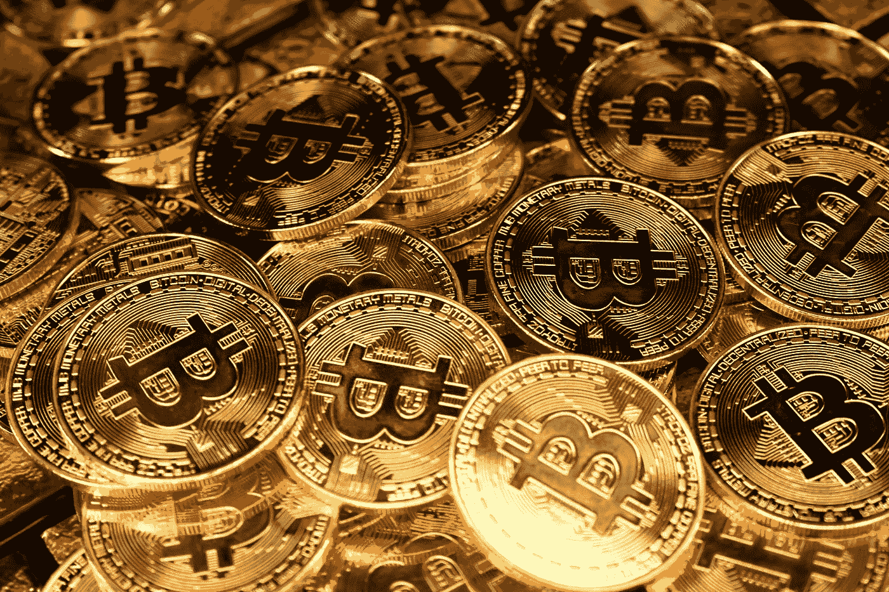

# 最著名的加密货币到年底会值 0.0000 吗？

> 原文：<https://medium.com/coinmonks/will-the-most-famous-cryptocurrency-be-worth-0-0000-by-the-end-of-the-year-7f7c934c9caf?source=collection_archive---------21----------------------->

据“Euro Pacific Capital”的投资者兼首席执行官彼得·希夫(Peter Schiff)称，这种最著名、最强大的加密货币可能在今年年底前失去所有价值。

Photo by [Kanchanara](https://unsplash.com/@kanchanara?utm_source=medium&utm_medium=referral) on [Unsplash](https://unsplash.com?utm_source=medium&utm_medium=referral)

密码怀疑论者彼得·希夫坚持认为比特币没有价值，数字代币正处于新的衰落边缘。他在推特上说，最好的加密货币正在跌至 1 万美元甚至更低。
“这是比特币的长期图表。”想象一下，当比特币跌破 3 万美元时，这张图表会有多糟糕，”希夫在推特上写道，并补充说:“跌至 1 万美元似乎是一个锁定，但没有理由认为这一水平将保持为一个永久的门槛。"如果这个双顶完成，真正的地板是零. "

Euro Pacific Capital 首席执行官希夫经常对加密货币持批评态度，认为比特币是一个巨大的投机泡沫，将会爆炸。
这位因预测 2008 年金融危机而闻名的经济学家两年前表示，在停止接受他的数字货币后，他无法使用他的比特币资金。注意到这并不是一个大悲剧，他说:“我知道拥有比特币是一个坏主意，我只是从来没有意识到它是如此糟糕！”

> 加入 Coinmonks [电报频道](https://t.me/coincodecap)和 [Youtube 频道](https://www.youtube.com/c/coinmonks/videos)了解加密交易和投资

# 另外，阅读

*   [CBET 评论](https://coincodecap.com/cbet-casino-review) | [库科恩 vs 比特币基地](https://coincodecap.com/kucoin-vs-coinbase) | [拜比特 vs 比特币基地](https://coincodecap.com/bybit-vs-coinbase)
*   [折叠 App 回顾](https://coincodecap.com/fold-app-review) | [本地比特币回顾](/coinmonks/localbitcoins-review-6cc001c6ed56) | [Bybit vs 币安](https://coincodecap.com/bybit-binance-moonxbt)
*   [加密保证金交易交易所](/coinmonks/crypto-margin-trading-exchanges-428b1f7ad108) | [赚取比特币](/coinmonks/earn-bitcoin-6e8bd3c592d9) | [Mudrex 投资](https://coincodecap.com/mudrex-invest-review-the-best-way-to-invest-in-crypto)
*   [WazirX vs coin dcx vs bit bns](/coinmonks/wazirx-vs-coindcx-vs-bitbns-149f4f19a2f1)|[block fi vs coin loan vs Nexo](/coinmonks/blockfi-vs-coinloan-vs-nexo-cb624635230d)
*   [比斯勒评论](https://coincodecap.com/bitsler-review)|[WazirX vs coin switch vs coin dcx](https://coincodecap.com/wazirx-vs-coinswitch-vs-coindcx)