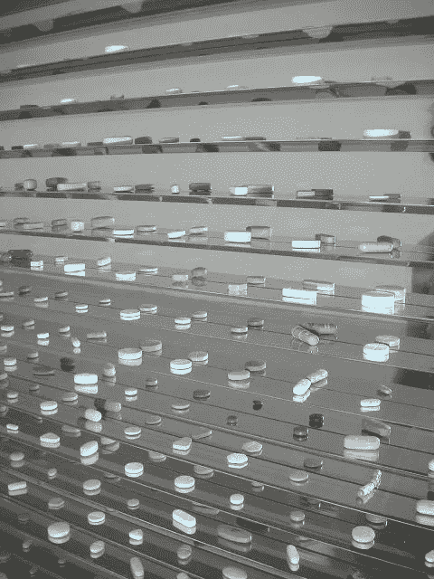

# NFT 艺术界会反映当代艺术界吗？

> 原文：<https://medium.com/coinmonks/will-the-nft-art-world-mirror-the-contemporary-art-world-bb394af116e8?source=collection_archive---------48----------------------->

*原载于**[*航程*](https://web3voyage.substack.com/p/no-17-will-the-nft-art-world-mirror?s=w)*[*迅*](https://web3voyage.substack.com/p/no-17-will-the-nft-art-world-mirror?s=w)**2022 年 4 月 7 日。****

# **NFT 艺术界会是当代艺术界的翻版吗？**

**当代艺术令人生畏。它是由概念而不是美学驱动的，定价没有任何意义。**

**一个[钢铁兔子雕塑](https://www.christies.com/features/Jeff-Koons-Rabbit-Own-the-controversy-9804-3.aspx)怎么会值 9100 万美元？还是一个装满价值 1900 万美元的彩绘药丸的[钢铁玻璃柜？](http://www.artnet.com/artists/damien-hirst/lullaby-spring-RniFc32zkXo6NNU5Mob0Yw2)**

****

**[Source](https://www.flickr.com/photos/mariabruna/147511307/)**

**当然，你可以问一个关于 NFTs 的更荒谬的问题，一个任何人都可以公开下载价值 6900 万美元的 jpeg 文件[？](https://onlineonly.christies.com/s/beeple-first-5000-days/beeple-b-1981-1/112924)**

**在过去一周左右的时间里，我听了两本关于当代艺术的有声读物:莎拉·桑顿的《艺术世界的七天》和唐·汤普森的《价值 1200 万美元的填充鲨鱼:当代艺术的奇妙经济学》。**

**桑顿的书强调了当代艺术舞台上的不同演员，汤普森的书则是关于当代艺术的荒谬定价。只是在过去的 20 年里，我们才看到活着的艺术家以以前由已故艺术家持有的记录出售艺术。**

**艺术界是复杂的。桑顿强调了三个群体——艺术界(学者和评论家)、买家和卖家(经销商、收藏家和拍卖行)以及艺术家。**

**当代艺术界已经为比以往更多的自称为艺术家的人搭建了舞台。Web3 和 NFTs 的引入将会成倍地增加这个数字，如果在短短几年内还没有增加的话。**

**在桑顿的描述中，我最感兴趣的是这些群体之间和内部的动态。对收藏家来说，拥有一件艺术品是身份的象征。购买往往是由自我和声望驱动的。拍卖行知道这一点，并迎合买家的自尊心。**

**收藏家在购买前往往连作品都不看一眼。他们依靠经销商来做决定。经销商将向收藏家列出作品的属性和描述。他们相应地购买。**

**艺术家经常，但肯定不总是，将资本和金钱视为艺术的腐败。他们理解艺术价格有些异想天开，并不直接与质量挂钩。但是他们当然要吃饭，要谋生。**

**还有像杰弗·昆斯和达明安·赫斯特这样的艺术家，他们知道品牌和营销的价值。杰弗·昆斯在 20 世纪 80 年代从事大宗商品交易，他公开谈论自己的作品时使用了市场份额等让艺术界感到恐惧的术语。**

**如果你有兴趣更详细地探索艺术领域，我强烈建议你读一读或听听这些书。**

**我想知道这在 Web3 中会如何发展。**

**NFT 让艺术家和他们的收藏家有了直接的联系。在 Web3 中，最接近中间商的是市场。有几个，像[基金会](https://foundation.app/)和[超级稀有](https://superrare.com/)，提供了一个选择性的过程来保持质量和排他性，但大多数其他艺术家提供了一个简单的斜坡，让任何艺术家铸造和出售他们的作品。**

**NFT 或不可替代的代币通过区块链的交换和交易与金融价值有着内在的联系。现在，每当艺术家的作品被转卖，他们都会收取版税。**

**毫无疑问，Web3 艺术领域是年轻而成熟的。大多数情况下，高滚动收藏家是那些通过购买和交易加密货币赚钱的人，他们现在正在购买和交易加密货币。**

**那么这个空间会如何演变呢？我们会有一个崛起的时尚引领者群体吗？例如艺术品经销商、评论家和学者，他们提升了某些艺术家和艺术品的价值。利用震撼价值和创意概念的艺术将主导市场的上层，还是会是完全不同的东西？**

# ****传统艺术正在走向网络 3****

**早在二月底，我在推特上目睹了一位才华横溢的现实主义画家杰里米·李普金拍卖他的第一幅油画。**

**Lipking 创作了 25 幅他的油画[漂流](https://objkt.com/asset/KT1Fry9ijpYkxYbEtgF1yRYjcGkTZNhZK33g/0)，这是一幅他女儿的照片般逼真的画，呼应了[约翰·埃弗里特·米莱斯的奥菲莉亚](https://en.wikipedia.org/wiki/Ophelia_(painting))的精致之美。**

**这件作品在 Objkt 市场上被现场拍卖给前 25 名竞拍者。**

**这不是第一位进入非传统艺术家行列的传统艺术家，当然也不会是最后一位。我预计今年会有很多这样的事情发生。**

**二月早些时候，凯文·罗斯邀请著名艺术收藏家亚当·林德曼在他的播客中讲述他进军 NFT 世界的经历。**

**林德曼谈到了他在 20 世纪 80 年代进入艺术界的经历。他漫不经心地提到了他和安迪·沃霍尔一起闲逛和遇见巴斯奎特的时光。很明显，他是个不小的时间收藏家。**

**在播客中，他分享了他对一些最卖座的 NFT 项目的想法，包括[crypto punk](https://www.larvalabs.com/cryptopunks)、 [BAYC](https://boredapeyachtclub.com/#/) 和 [Chromie Squiggles](https://chromie-squiggles.com/) 。**

**我还观察了其他传统艺术家和收藏家的网站，比如 NFT 艺术展**

**NFT 最高档的超市 SuperRare 正在举办他们的 NFT 实物展览，每天都有很多其他的东西涌现出来。**

**这些场合不仅仅是扩大曝光度，而是使 Web3 和 NFT 正常化。**

# **开放和自由组合的艺术有阴暗面吗？**

**在上周的时事通讯中，我讨论了 Web3 中可组合性的概念。**

**可组合性是我对 Web3 感到兴奋的原因。然而，我最近看到一条推文，说明了 Web3 的这种质量并不总是一件好事。**

**CC0 在推文中特别提到了开放式知识共享许可，本质上意味着“不保留任何权利”在此期间，我开始探索 NFTs。**

**如果你这段时间一直在 NFT 市场，你会注意到 feeds 充斥着衍生的 pfp 项目。**

**不过，正如 [Cozomo de'Medici](https://twitter.com/CozomoMedici) 在回复推文时所指出的，由于 CC0 出现了一些有趣的项目，具体来说， [XCOPY 的*右击并另存为盖伊*T5。如果你向下滚动到第 4 分钟，这期《科佐莫·美第奇》时事通讯](https://superrare.com/artwork/right-click-and-save-as-guy-1154)，你会看到一些很棒的衍生作品。**

**但不管怎样，虽然可组合性可能会增加空间中的噪音量，但它也创造了新的合作类型，并继续提高原始工作的价值。**

**右键另存为盖伊的质量衍生物，增加原作品的价值。受人尊敬的艺术家可以向他们崇拜的艺术家致敬。**

***这个帖子是用* [*类型共享*](https://typeshare.co?ref=) 创建的**

> **加入 Coinmonks [电报频道](https://t.me/coincodecap)和 [Youtube 频道](https://www.youtube.com/c/coinmonks/videos)了解加密交易和投资**

# **另外，阅读**

*   **[分散交易所](https://coincodecap.com/what-are-decentralized-exchanges) | [比特 FIP](https://coincodecap.com/bitbns-fip) | [宾邦评论](https://coincodecap.com/bingbon-review)**
*   **[用信用卡购买密码的 10 个最佳地点](https://coincodecap.com/buy-crypto-with-credit-card)**
*   **[加拿大最佳加密交易机器人](https://coincodecap.com/5-best-crypto-trading-bots-in-canada) | [Bybit vs 币安](https://coincodecap.com/bybit-binance-moonxbt)**
*   **[阿联酋 5 大最佳加密交易所](https://coincodecap.com/best-crypto-exchanges-in-uae) | [SimpleSwap 评论](https://coincodecap.com/simpleswap-review)**
*   **购买 Dogecoin 的 7 种最佳方式 | [ZebPay 评论](https://coincodecap.com/zebpay-review)**