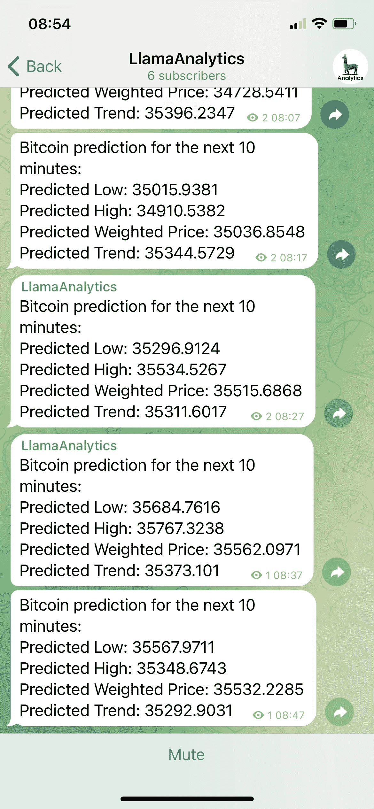

# 这将是比特币市场的变化吗

> 原文：<https://medium.com/coinmonks/will-this-be-the-change-in-bitcoin-market-e07fb3c192a9?source=collection_archive---------5----------------------->

在以前的文章中，我讨论了我们构建的模型以及如何使用它。最近几个月，我们一直在关注模型预测的结果和趋势模型。

周六(2022 年 1 月 22 日)从 2021 年 11 月 13 日开始每日运行模型以来，我们看到了一件有趣的事情；我们看到加权价格持续低于趋势价格。这可能意味着，根据我们的模型趋势和加权价格预测，比特币市场可能会从整体下降趋势转为上升趋势。

我可能是错的，也可能是对的(预测并不容易！)，因为我们需要根据我们所看到的进行更多的历史模型分析。然而，我想我应该让我的读者知道接下来的几周可能会很有趣！价格走势可能会从我们刚刚看到的阶段进入一个新的阶段。

没有人是先知(好吧，我不是先知)，模型确实会犯一些错误；然而，我认为我们可能会看到市场的变化，所以我想我会写下来，给我的小读者群一些我们在我们的模型上看到的额外信息。

> 加入 Coinmonks [电报频道](https://t.me/coincodecap)和 [Youtube 频道](https://www.youtube.com/c/coinmonks/videos)了解加密交易和投资

# 另外，阅读

*   [如何匿名购买比特币](https://coincodecap.com/buy-bitcoin-anonymously) | [比特币现金钱包](https://coincodecap.com/bitcoin-cash-wallets)
*   [币安 vs FTX](https://coincodecap.com/binance-vs-ftx) | [最佳(SOL)索拉纳钱包](https://coincodecap.com/solana-wallets)
*   [比诺莫评论](https://coincodecap.com/binomo-review) | [斯多葛派 vs 3Commas vs TradeSanta](https://coincodecap.com/stoic-vs-3commas-vs-tradesanta)
*   [Capital.com 评论](https://coincodecap.com/capital-com-review) | [香港的加密借贷平台](https://coincodecap.com/crypto-lending-hong-kong)
*   如何在 Uniswap 上交换加密？ | [A-Ads 评论](https://coincodecap.com/a-ads-review)
*   [WazirX vs coin dcx vs bit bns](/coinmonks/wazirx-vs-coindcx-vs-bitbns-149f4f19a2f1)|[block fi vs coin loan vs Nexo](/coinmonks/blockfi-vs-coinloan-vs-nexo-cb624635230d)
*   [本地比特币审核](/coinmonks/localbitcoins-review-6cc001c6ed56) | [加密货币储蓄账户](https://coincodecap.com/cryptocurrency-savings-accounts)