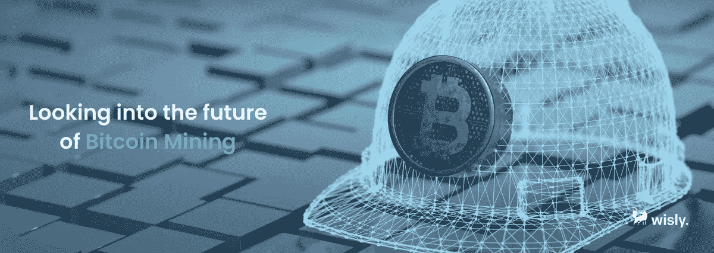

# #WislyWrapUp:比特币 2022 迈阿密

> 原文：<https://medium.com/coinmonks/wislywrapup-bitcoin-2022-miami-cff3b69206e4?source=collection_archive---------44----------------------->

#WislyWrapUp: Bitcoin 2022 Miami

备受期待的比特币 2022 迈阿密会议最近在一片喧嚣中结束，估计有 35，000 名来自全球的比特币爱好者来到迈阿密海岸参加最新一期的比特币周。

对于那些对最新行业发展感兴趣的人来说，比特币 2022 迈阿密是加密世界的一个重要年度活动，同时也是促进和进一步提高比特币和相关加密网络的效用、空间和意识的思想融合。

迈阿密海滩肯定充斥着以加密为主题的弹出窗口，让人误以为迈阿密是比特币文化运动的发源地。迈阿密市长弗朗西斯·苏亚雷斯(Francis Suarez)甚至揭幕了一座 3000 磅重的充电公牛雕像，希望吸引成群结队的比特币爱好者。也许组织者认为将比特币的力量提升到更主流的受众是合适的——考虑到 BTC 在全球的采用速度有多快。

世界上最著名的加密货币在过去两年里达到了前所未有的高点，吸引了一群对 BTC 的未来充满渴望的人。出席会议的许多加密政要包括杰克·多西(Block 的首席执行官)、赛费丁·阿摩斯(比特币标准的作者)和迈克尔·塞勒(Microstrategy 的首席执行官)，他们都是今年活动的主要发言人。后者列举了自疫情以来密码空间发展的许多不同方式。

尽管如此，在之前的比特币活动中，比特币采矿业作为加密伴娘，在今年的会议上占据了中心舞台。

# 展望比特币采矿的未来

Looking into the future of Bitcoin Mining

比特币挖掘是比特币 2022 迈阿密大会上人们谈论最多的话题，大会上几乎一半的展览面积都用于加密领域的这个小众方面。会议上有许多关于比特币开采轨迹的热烈讨论，让成千上万热切的加密爱好者着迷并充满希望。

此外，在整个比特币周会议期间，新的和创新的比特币采矿平台被揭开面纱——这让那些想探索加密采矿活动的人非常高兴。BTC 矿业服务公司的许多展位前都有长长的参观者队伍，许多公司表示，由于人们的兴趣，他们预计会有大量的业务。

为了加剧会议上的比特币挖矿热，华尔街投资公司和金融机构，如 B. Riley、HC Wainwright 和 BNY 梅隆大学(BK)举办了专门针对 BTC 矿工的 BTC 矿业活动，与会者从资金池到风险资本家都充分利用了这一机会。

如果这还不足以让比特币 2022 迈阿密开始，在这个激动人心的比特币周期间，一些令人难以置信的交易也宣布了。其中两个值得注意的是应用区块链申请矿业首次公开募股(IPO)和核心科学公司(Core Scientific)惊人的 7500 万美元债务交易——这些项目让与会者惊讶不已。

人们看到 Hive Blockchain (HIVE)等公司在大会上搜寻，希望达成一些好交易，Hive 执行董事长弗兰克·霍姆斯(Frank Holmes)将大会描述为“真正的交易中心”。

采矿钻机制造商在比特币 2022 迈阿密大会上大出风头，比特大陆、MicroBT 和迦南拥有充足的场地来展示最新的设备——为优化 BTC 采矿设计的更高效、更强大的钻机。比特大陆走得更远，展示了其可以容纳多达 180 台机器的巨型移动蚁箱集装箱——对于不必自己创建昂贵设备的矿工来说，这是一个受欢迎的缓刑。

这就是展出的 BTC 采矿设备的水平，Compass Mining 的首席执行官 Whit Gibbs 印象特别深刻，他说:“当谈到硬件方面时，来自不同供应商的存在比我以前在会议上见过的更多。”然而，他确实表达了一些怀疑，他说，“我认为我们这里有些人在推销未经证实的产品，所以这可能会给有兴趣购买它们的人带来风险。”

不管他的想法如何，从与会者的反应和兴趣来看，BTC 采矿设备展览会似乎受到了大多数人的欢迎。

# 最后的想法

在比特币爱好者的脑海中，比特币 2022 迈阿密仍然记忆犹新，许多人都想知道 BTC 在会议开始、持续和结束后的实际表现如何。

许多分析师预计，随着大会的临近，BTC 的价值会飙升，行业情绪认为，重大声明将把 BTC 推向另一个水平。然而，这次会议在这方面表现平平，更多地关注采矿方面，很少关注更大程度的主流采纳。

事实上，本周早些时候，比特币跌至 41，000 美元以下——随着熊市宏观逆风盛行，这是下跌趋势的延续，BTC 收盘下跌约 7%。导致 BTC 近期下滑缓慢的另一个因素是乌克兰的冲突。在乌克兰，欧盟将加密钱包作为对俄罗斯制裁的一部分，以堵塞漏洞——此举对整个加密市场产生了负面影响。

尽管情况可能如此，但比特币周的参与者称其取得了巨大成功，名人演讲者对比特币的未来充满信心，并给加密社区注入了急需的信心。

接下来的几个月将揭示比特币 2022 迈阿密到底有多有影响力。一如既往，Wisly 将为您提供最新动态！

> 加入 Coinmonks [电报频道](https://t.me/coincodecap)和 [Youtube 频道](https://www.youtube.com/c/coinmonks/videos)了解加密交易和投资

# 另外，阅读

*   [Bookmap 点评](https://coincodecap.com/bookmap-review-2021-best-trading-software) | [美国 5 大最佳加密交易所](https://coincodecap.com/crypto-exchange-usa)
*   最佳加密[硬件钱包](/coinmonks/hardware-wallets-dfa1211730c6) | [Bitbns 评论](/coinmonks/bitbns-review-38256a07e161)
*   [新加坡十大最佳加密交易所](https://coincodecap.com/crypto-exchange-in-singapore) | [购买 AXS](https://coincodecap.com/buy-axs-token)
*   [红狗赌场评论](https://coincodecap.com/red-dog-casino-review) | [Swyftx 评论](https://coincodecap.com/swyftx-review) | [CoinGate 评论](https://coincodecap.com/coingate-review)
*   [投资印度的最佳密码](https://coincodecap.com/best-crypto-to-invest-in-india-in-2021)|[WazirX P2P](https://coincodecap.com/wazirx-p2p)|[Hi Dollar Review](https://coincodecap.com/hi-dollar-review)