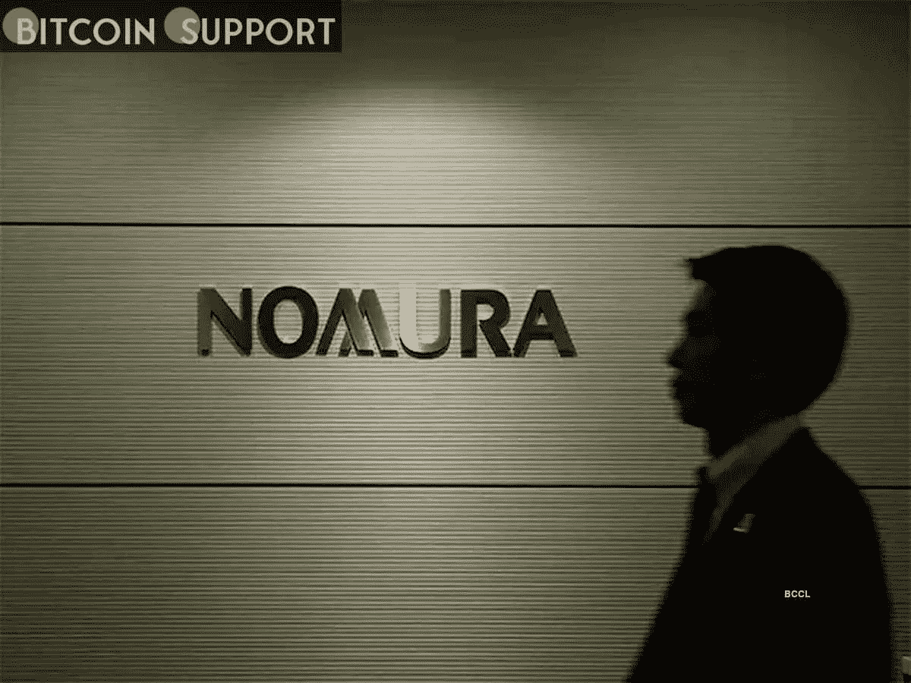

# 日本财富管理公司野村证券(Nomura)将成立一个新的部门，调查加密和非金融交易

> 原文：<https://medium.com/coinmonks/with-a-new-unit-nomura-a-japanese-wealth-manager-will-investigate-crypto-and-nfts-e6a77f16059c?source=collection_archive---------65----------------------->

**Visit our website:-** [**https://bitcoinsupports.com/**](https://bitcoinsupports.com/)

作为重组的一部分，该公司宣布成立一家新的数字公司，该公司将于 4 月开始运营。野村控股宣布成立一个新的数字资产团队，以调查该资产类别的潜在前景，这可能表明机构对加密货币和 NFT 的兴趣增加。这家财富管理公司表示，其未来的创新公司将重组为一家新的数字公司，并将于 4 月开始运营。新公司的主要目标是促进客户对数字资产的使用，同时提供相关服务。野村集团总裁兼首席执行官健太郎·奥田说:

## **“新的数字公司将促进内部和外部利益相关方之间更紧密的合作，加快我们对数字技术的使用，并改善我们的客户服务，”**

首席执行官说。这家管理着 6，410 亿美元资产的财富管理公司表示，它希望在其所有业务中加强数字化的使用。据报道，这个新部门将研究加密货币和 NFT，以及其他数字资产。尽管日本拥有世界上最严格的加密法规，但 NFTs 在日本越来越受欢迎。日本金融服务公司野村控股(Nomura Holdings)是调查该国非金融交易的最新重要参与者。日本大型电子商务公司乐天上周宣布推出自己的 NFT 交易平台乐天 NFT。日本最大的金融集团三菱 UFJ 金融集团(MUFG)上个月表示，它将结束长达三年的区块链支付试验，专注于稳定的收入。

**访问我们的网站:-**[**https://bitcoinsupports.com/**](https://bitcoinsupports.com/)

**免责声明:以上为作者观点，不应视为投资建议。读者应该自己做研究。**

> 加入 Coinmonks [电报频道](https://t.me/coincodecap)和 [Youtube 频道](https://www.youtube.com/c/coinmonks/videos)了解加密交易和投资

# 另外，阅读

*   [OKEx vs KuCoin](https://coincodecap.com/okex-kucoin) | [摄氏替代品](https://coincodecap.com/celsius-alternatives) | [如何购买 VeChain](https://coincodecap.com/buy-vechain)
*   [币安期货交易](https://coincodecap.com/binance-futures-trading)|[3 commas vs Mudrex vs eToro](https://coincodecap.com/mudrex-3commas-etoro)
*   [如何购买 Monero](https://coincodecap.com/buy-monero) | [IDEX 评论](https://coincodecap.com/idex-review) | [BitKan 交易机器人](https://coincodecap.com/bitkan-trading-bot)
*   [CoinDCX 评论](/coinmonks/coindcx-review-8444db3621a2) | [加密保证金交易交易所](https://coincodecap.com/crypto-margin-trading-exchanges)
*   [红狗赌场评论](https://coincodecap.com/red-dog-casino-review) | [Swyftx 评论](https://coincodecap.com/swyftx-review) | [CoinGate 评论](https://coincodecap.com/coingate-review)
*   [Bookmap 点评](https://coincodecap.com/bookmap-review-2021-best-trading-software) | [美国 5 大最佳加密交易所](https://coincodecap.com/crypto-exchange-usa)
*   [如何在 FTX 交易所交易期货](https://coincodecap.com/ftx-futures-trading) | [OKEx vs 币安](https://coincodecap.com/okex-vs-binance)
*   [CoinLoan 审查](https://coincodecap.com/coinloan-review) | [YouHodler 审查](/coinmonks/youhodler-4-easy-ways-to-make-money-98969b9689f2) | [BlockFi 审查](https://coincodecap.com/blockfi-review)
*   [XT.COM 评论](https://coincodecap.com/profittradingapp-for-binance)币安评论 |