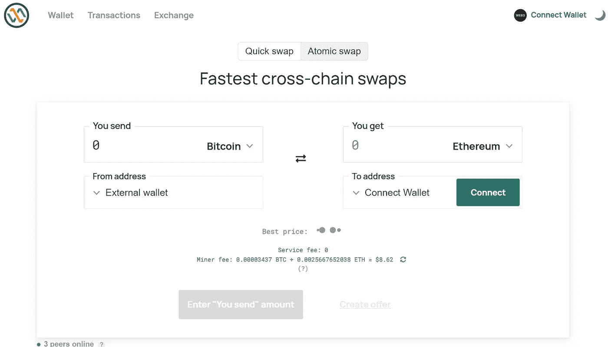

# 和 INCI 一起。融资你选择交易，互换和过桥

> 原文：<https://medium.com/coinmonks/with-inci-finance-you-chose-to-trade-swap-and-cross-bridge-d1a7b8022e13?source=collection_archive---------53----------------------->

好的，现在我将给出一些关于平台如何工作和被操作的基本叙述。我知道你们中的许多人一直在想这可能是什么，为什么，这怎么可能！

首先，也是最重要的一点，我希望你能对 [**INCI 有所了解。金融:**](https://inci.finance/) INCI。金融专家，团队成员在商业投资和房地产投资方面经验丰富。不仅仅限于此，而且在几年内，他们已经迅速增加了他们的投资者的财富，单独指出了可靠的，可珍惜的和可增值的房地产投资以及商业投资。
此外，他们的团队了解业务，他们能够通过对项目的完整和可靠的了解来降低风险，他们降低了风险，并且所有的回报都是复合的。

**为什么你需要与 INCI 交往。金融**
拥有[多股流](https://inci.finance/)当你与 INCI 扯上关系时，这是每个人的梦想和人生追求。通过投资商业或房地产融资，你会有现金流和利润。他们投资于现金流和利润强劲的业务。他们坚信，现金流是投资的本质，我们人类需要这样的企业在家里，而我们的钱为我们俩工作。尝试和大胆地与 INCI 合作。无悔融资。

**INCI 是什么网络。财政建立在**INCI
之上。金融被构建并部署到基于币安智能链的令牌中，该令牌实现了轻松访问并降低了交易方面的燃气费成本，而不会因以太坊网络上的燃气价格突然上涨而产生压力或不安，从而使投资者感到恐慌和不安。INCI 令牌是后台与真实的资产和真实的利润，你没有什么可以失去在这个时间点。
这些品质显示了更多关于 INCI 的情况。金融；他们持有盈利企业的股份，因此，他们将继续投资于这种盈利/利润丰厚的企业。他们持有房地产的收益，他们也购买或购买更便宜的房地产，以获得良好的回报，以及加密控股，流动性池农业，NFT 控股公司，包括种子投资等等。INCI。金融是一个[安全令牌](https://inci.finance/)

**令牌信息** 令牌名称:INCI 金融
令牌符号:INCI
令牌小数:18
令牌类型:BEP-20，币安智能链。
总供应量:1，000，000，000
当前发行量:25，237，031.22
合同:[0x 4 cf 96 c 829 bee cbcc 4 f 58 bb 338 c 8508 C5 f 9d 18d 9 c](https://bscscan.com/token/0x4cf96c829beecbcc4f58bb338c8508c5f9d18d9c)

如何使用 INCI？金融钱包和互换。
INCI。财务团队确实尽了最大努力，通过提供钱包和 DEX 来确保他们促进项目，并为投资者带来轻松的步骤，您可以选择一个用于投资的钱包，并在货币之间进行互换，而不必在开始投资之旅之前去外部交易所或 DEX 进行转换。
1。首先，首次访问此处以将您的钱包连接到他们的 [DEX](https://inci.finance/wallet/#/createWallet) 上，创建一个钱包并存储种子短语。

2.您可以连接您的旧钱包或基金创建钱包地址，并在您希望投资的货币之间进行互换。

3.对于跨链或桥接，您可以从旧钱包中进行选择，即您希望桥接哪个网络，下图让您对此有一个清晰的了解。你猜怎么着？
服务费最低。

INCI 带来的好处还不止这些。财务，我希望你能对这个平台有一个相对的看法，我将基本上放弃他们的社交媒体句柄，以便于项目所有者和团队成员，包括项目的设计师。

[网站](https://inci.finance/)|[litepape](https://inci.finance/inci-finance-2/)|[电报](http://t.me/incifinance) | [推特](https://twitter.com/incifinance)|[Youtube](https://youtube.com/Inci.finance)|[insta gram](https://instagram.com/incifinance)|[用户:rig money](https://bitcointalk.org/index.php?action=profile;u=3380226)|[POA](https://bitcointalk.org/index.php?topic=5392829.msg59740905#msg59740905)$ INCI # inci finance @ inci finance

> 加入 Coinmonks [电报频道](https://t.me/coincodecap)和 [Youtube 频道](https://www.youtube.com/c/coinmonks/videos)了解加密交易和投资

# 另外，阅读

*   [ProfitFarmers 回顾](https://coincodecap.com/profitfarmers-review) | [如何使用 Cornix 交易机器人](https://coincodecap.com/cornix-trading-bot)
*   [如何匿名购买比特币](https://coincodecap.com/buy-bitcoin-anonymously) | [比特币现金钱包](https://coincodecap.com/bitcoin-cash-wallets)
*   [瓦济里克斯 NFT 评论](https://coincodecap.com/wazirx-nft-review)|[Bitsgap vs Pionex](https://coincodecap.com/bitsgap-vs-pionex)|[Tangem 评论](https://coincodecap.com/tangem-wallet-review)
*   [如何使用 Solidity 在以太坊上创建 DApp？](https://coincodecap.com/create-a-dapp-on-ethereum-using-solidity)
*   [币安 vs FTX](https://coincodecap.com/binance-vs-ftx) | [最佳(索尔)索拉纳钱包](https://coincodecap.com/solana-wallets)
*   [如何在 Uniswap 上交换加密？](https://coincodecap.com/swap-crypto-on-uniswap) | [A-Ads 评论](https://coincodecap.com/a-ads-review)