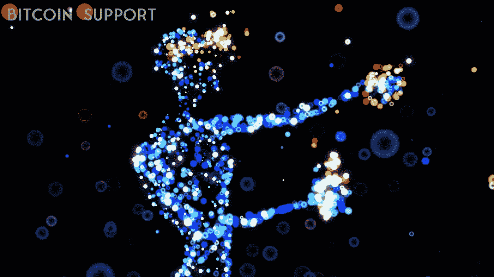

# NFT 为内容创作的新时代铺平了道路

> 原文：<https://medium.com/coinmonks/with-nfts-content-creators-are-establishing-a-new-paradigm-9795d0b91bec?source=collection_archive---------19----------------------->

**Visit our website:-** [**https://bitcoinsupports.com/**](https://bitcoinsupports.com/)

通过 NFTs 获得对其品牌的控制，艺术家和内容制作人正在推动创作者经济越过 1000 亿美元的障碍。不可兑现的代币(NFT)使艺术家们能够收回他们作品的所有权和资金。专家认为，艺术家和创作者将他们的作品符号化并作为非功能性作品发行，消除了对第三方中间人的需求。

虽然历史上画廊一直在寻找买家，但随着更实惠的分散化应用程序(DApps)使投资者能够直接接触他们最喜爱的艺术家，它们的效用正在减少。这导致了由非技术创新驱动的创意经济新范式的出现。

根据市场追踪机构 DappRadar 的数据，现在创作者的经济价值超过 1000 亿美元，有很大的增长空间，NFT 市场 OpenSea 和 looks 日交易量超过 1 亿美元，创作者弄清楚如何最大化他们作品的价值是非常有意义的。澳大利亚 NFT 艺术家丹妮尔·韦伯(Danielle Weber)认为，更多的艺术家应该将他们的作品符号化，并负责他们的个人品牌。这位 10 年的艺术家详细描述了她在传统艺术市场上看到的众多缺陷，以及非传统艺术如何使她能够规避这些缺陷。她直言不讳地支持将 NFTs 作为一种新颖的工具提供给制造商。

**“我强烈建议所有艺术家将他们的绘画符号化。吸引我参与 NFT 艺术界的想法是，它让每个人都更容易接触到艺术。”对于艺术家来说，可访问性是至关重要的，因为当更多的人观看时，它会增加他们出售作品的机会。没有使用中介，NFT 的环境使艺术家和粉丝之间直接接触。这导致了韦伯所说的“美丽循环”。博客平台 Medium 的前首席程序员 Julien Genestoux 认为，艺术家和内容创作者应该通过 NFTs 来控制他们的产品，包括粉丝的参与，他表示，NFT 空间有助于“消除艺术家和追随者之间的任意护城河”。Genestoux 认为，创作者有自由推销自己，无论他们想要什么，但这样做强加了一个额外的责任。他表示，在创作者在他们的平台上扮演自己的经理角色之前，“他们应该考虑他们想要与观众的关系以及他们可以提供的独特服务。”

**“一旦你确定了自己能提供什么，就把非功能性交易作为一份你能控制的合同。”他同意，虽然像 YouTube 和脸书这样的成熟渠道更容易使用，并且比小型网站提供更大的分销优势，但他认为与追随者的直接联系更为重要。

**“我相信，你应该建立自己的平台。这是与你的支持者保持独立关系的好处之一。”Genestoux 强调，创作者的非金融交易(NFTs)并不局限于艺术家。截至 2 月，艺人使用唯一的粉丝社交网络应用程序可以发布 NFT 的个人资料图片。该公司的首席执行官 Amrapali Gan 表示，新功能只是“研究 NFTs 在我们的平台上可以发挥的作用的第一步。”

**访问我们的网站:-**[**https://bitcoinsupports.com/**](https://bitcoinsupports.com/)

**免责声明:以上为作者观点，不应视为投资建议。读者应该自己做研究。********

> 加入 Coinmonks [电报频道](https://t.me/coincodecap)和 [Youtube 频道](https://www.youtube.com/c/coinmonks/videos)了解加密交易和投资

# 另外，阅读

*   [AscendEx Staking](https://coincodecap.com/ascendex-staking)|[Bot Ocean Review](https://coincodecap.com/bot-ocean-review)|[最佳比特币钱包](https://coincodecap.com/bitcoin-wallets-india)
*   [霍比审核](https://coincodecap.com/huobi-review) | [OKEx 保证金交易](https://coincodecap.com/okex-margin-trading) | [期货交易](https://coincodecap.com/futures-trading)
*   [网格交易机器人](https://coincodecap.com/grid-trading) | [Cryptohopper 审查](/coinmonks/cryptohopper-review-a388ff5bae88) | [Bexplus 审查](https://coincodecap.com/bexplus-review)
*   [7 个最佳零费用加密交易平台](https://coincodecap.com/zero-fee-crypto-exchanges)
*   [氹欞侊贸易评论](https://coincodecap.com/anny-trade-review) | [霍比保证金交易](/coinmonks/huobi-margin-trading-b3b06cdc1519)
*   [分散交易所](https://coincodecap.com/what-are-decentralized-exchanges) | [比特 FIP](https://coincodecap.com/bitbns-fip) | [Pionex 评论](https://coincodecap.com/pionex-review-exchange-with-crypto-trading-bot)