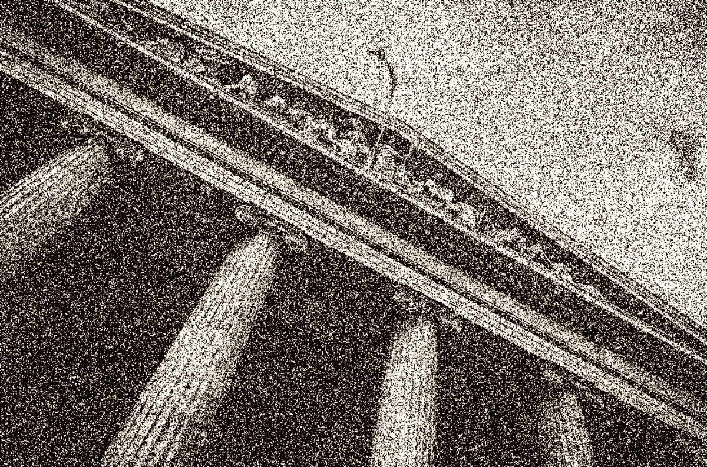

# 莎拉·布鲁姆·拉斯金(Sarah Bloom Raskin)将出任美联储主席，监管会转向反对比特币吗？

> 原文：<https://medium.com/coinmonks/with-sarah-bloom-raskin-up-for-big-fed-role-will-regulation-turn-against-bitcoin-aadca3bc16cf?source=collection_archive---------41----------------------->

随着即将被确认为该国最高银行监管者，莎拉·布鲁姆·拉斯金会在美联储监管中实施比特币偏见吗？

*Sarah Bloom Raskin.* [*Source*](https://www.gfmag.com/magazine/february-2022/fed-vice-chair-nominee-may-wield-heavy-hand)*.*

本月早些时候，进步宠儿莎拉·布鲁姆·拉斯金在国会参议院银行委员会听证会上作证，确认她为美国最高银行监管人。投票将于明天在美国参议院进行。证词的要点详述如下。

拉斯金是美联储理事会重要副主席和监管负责人的人选。这是美联储一个相对较新的职位，由国会在 2010 年大金融危机后设立。监管负责人为银行要求的资本水平和资产负债表流动性制定规则，并监督规则的遵守情况。就可能适用于美国银行的比特币新规而言，这也是一个重要的立场。

这一提名表明，政府可能倾向于更严格的金融监管，并希望有人能够利用美联储的权力来推进具体的政治举措。

# 有争议的选择

拉斯金对华盛顿的高级职位并不陌生，但她以前的任命从未面临过任何反对，这表明华盛顿正在发生变化。这一次，她可能会面临一个非常狭窄的投票，但预计将得到确认。

在奥巴马总统的第二个任期内，拉斯金从 2014 年到 2017 年 1 月任期结束时担任财政部副部长。在美国财政部担任这一职务之前，她是美联储的一名州长，并在联邦公开市场委员会(FOMC)任职。

宾夕法尼亚州参议员 Pat Toomey 在**华盛顿* *邮报*报道的[声明](https://www.washingtonpost.com/us-policy/2022/02/03/sarah-bloom-raskin-fed-climate/)中简洁地总结了围绕她的任命的争议，他说:“我非常担心她会滥用美联储在货币政策和银行监管方面狭窄的法定授权，让中央银行积极参与资本配置。这种行为不仅威胁到美联储的独立性和有效性，还会削弱经济增长。”*

*美国商会一反常态地写了一封公开信反对拉斯金的任命:*

*拉斯金女士一直批评美联储允许石油和天然气公司在新冠肺炎疫情期间使用应急设施。她还在自己的文章和公开评论中倡导联邦监管机构将融资从化石燃料行业转移出去。*

*国会中散布的恐惧未能令人满意地推进进步的气候议程。或许一个新的策略正在酝酿中，即利用美联储对银行监管的权力，通过非选举产生的官僚来“影响”银行参与选择性信贷准入。*

*拉斯金在 2020 年 3 月告诉立法者，“如果我们忽视气候变化，我们实际上是在破坏经济。”*

*这种观点重复了欧洲央行和英格兰银行的全球主义者达沃斯谈话要点，它们通常使用气候风险和系统性风险之间的虚假等值。从另一个角度来看，像气候变化这样的问题正是市场最擅长适应的，而不灵活和严厉的监管将使市场无法适应哪怕是微小的变化。*

*许多国会议员担心拉斯金不会严格遵守美联储的双重使命，将它带入影响资本配置和间接挑选赢家和输家的领域。*

# *拉斯金对比特币的看法*

*拉斯金直接对央行数字货币(CBDCs)和比特币的看法就不那么明确了。她更关注黑客等“网络”威胁。然而，我们可以假设她对稳定硬币、比特币和 CBDCs 的观点与朋友和比特币的强烈反对者参议员伊丽莎白·沃伦(T3)以及其他来自欧洲的全球主义央行行长的观点一致。*

*拉斯金的丈夫杰米·拉斯金(Jamie Raskin)是来自马里兰州的进步众议员，他最近[支持沃伦连任](https://twitter.com/jamie_raskin/status/1220017070118776832)，发起并撰写了许多进步法案[，并管理了第二次特朗普总统弹劾听证会](https://abcnews.go.com/Politics/read-democrat-jamie-raskins-closing-argument-impeachment-trial/story?id=75878802)(在特朗普离任后进行)。这段历史和更多的事实表明，这是一个超党派的家庭。*

*这些观点将使莎拉·拉斯金与美联储主席杰罗姆·鲍威尔在 CBDCs、stablecoins 和比特币监管方面的立场形成直接对立。作为监督负责人，她将对美联储的职能产生影响，但不确定这是否足以超越鲍威尔领导下的美联储在这方面严格的非政治立场。*

*还必须承认，作为副主席，拉斯金将是四年后美联储主席一职的竞争者。这可能会使美联储变成一个更加政治化的机构。希望到时候比特币大到连打都不敢想。*

# *拉斯金对比特币的潜在影响*

*拉斯金在美国的气候行动主义对比特币行业的重要性显而易见。拉斯金的进步同行传播了关于比特币采矿的环境影响的错误信息，但无法在将其转化为实际立法方面取得进展。事实上，比特币正在增强能源网和能源公司应对异常市场事件的能力。*

*拉斯金被提名接替的人[兰德尔·夸尔斯](https://www.nytimes.com/2021/11/08/business/randal-quarles-fed.html)，在 2021 年 5 月做了一次[演讲](https://www.federalreserve.gov/newsevents/speech/quarles20210526a.htm)，在演讲中，他表现出对 CBDCs 的复杂性和危险性以及比特币的独特性有着非同寻常的强烈理解。他是美联储反对大部分全球主义 CBDC 议程的堡垒。用一个持相反观点的人取代他，可能会极大地改变美联储的平衡。*

*拉斯金似乎很可能会通过银行监管来追踪比特币。那也不全是坏事。如果她把它变成一场十字军东征，它将提升比特币在全球货币对话中的地位，打开 [Overton 窗口](https://en.wikipedia.org/wiki/Overton_window#:~:text=The%20Overton%20window%20is%20the,as%20the%20window%20of%20discourse.)。*

# *拉斯金证词重点*

*观看从 1:03:30 开始的国会证词，可以看到参议员图米抱着拉斯金的脚站在火边。图米用她自己的话说，美联储应该“影响”银行的资本配置决策。她对他的问题的回答并不直截了当，她重申，她认为美联储不应该也不能做出资本配置的决定。那回避了问题。*

*另一个有趣的来回发生在 1:33:20 标记，路易斯安那州的参议员约翰·肯尼迪部署他的典型风格。她的回答和肢体语言令人不快且自负。她再次重申，美联储不应该挑选赢家或输家，但没有说美联储不应该“影响”银行的资本配置决策。*

*真正的焰火开始于 1 点 55 分 50 秒，当时比特币的朋友、怀俄明州参议员辛西娅·卢米斯(Cynthia Lummis)拿起麦克风，彻底盘问了拉斯金关于美联储主账户的访问，以及她与唯一一家拥有主账户的金融科技公司可能存在的不正当联系，这家公司在拉斯金 2018 年担任董事会成员时获得了主账户。*

*卢米斯提出了令人信服的间接证据，即拉斯金在 2010 年至 2014 年期间在美联储任职，然后在 2014 年至 2017 年期间在财政部任职。在政府任职后，她加入了科罗拉多州储备信托委员会(board of Reserve Trust)，该委员会在 2017 年被拒绝开设主账户，但在拉斯金代表该委员会致电圣路易斯美联储后，她获得了主账户。*

*同样，值得注意的是，它是唯一一家获此殊荣的非银行机构，尽管在 Lummis 的家乡怀俄明州，有数十家银行在过去两年半中未能取得进展。在获得主账户一年后，拉斯金离开了董事会，以 150 万美元的价格买断了股份。麦克风掉落。*

*这是安塞尔·林德纳的客座博文。所表达的观点完全是他们自己的，不一定反映 BTC 公司或比特币杂志*的观点。**

**原载于 2022 年 2 月 14 日 https://bitcoinmagazine.com***。***

> **加入 Coinmonks [电报频道](https://t.me/coincodecap)和 [Youtube 频道](https://www.youtube.com/c/coinmonks/videos)了解加密交易和投资**

# **另外，阅读**

*   **[最佳加密分析或链上数据](https://coincodecap.com/blockchain-analytics) | [Bexplus 评论](https://coincodecap.com/bexplus-review)**
*   **[NFT 十大市场造币集锦](https://coincodecap.com/nft-marketplaces)**
*   **[AscendEx Staking](https://coincodecap.com/ascendex-staking)|[Bot Ocean Review](https://coincodecap.com/bot-ocean-review)|[最佳比特币钱包](https://coincodecap.com/bitcoin-wallets-india)**
*   **[Bitget 回顾](https://coincodecap.com/bitget-review)|[Gemini vs block fi](https://coincodecap.com/gemini-vs-blockfi)|[OKEx 期货交易](https://coincodecap.com/okex-futures-trading)**
*   **[美国最佳加密交易机器人](https://coincodecap.com/crypto-trading-bots-in-the-us) | [不断回顾](https://coincodecap.com/changelly-review)**
*   **[在印度利用加密套利赚取被动收入](https://coincodecap.com/crypto-arbitrage-in-india)**