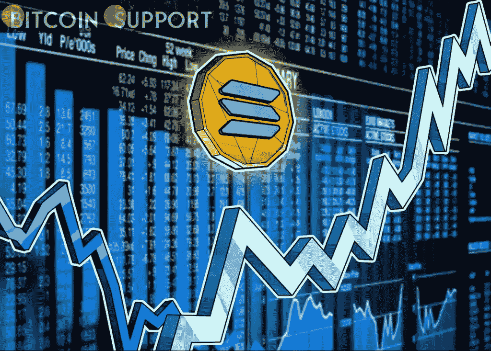
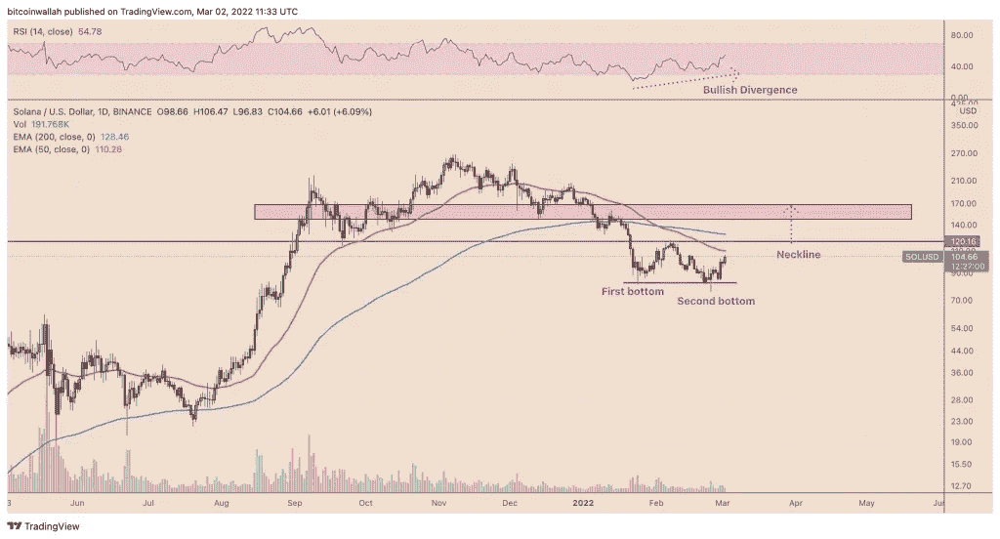
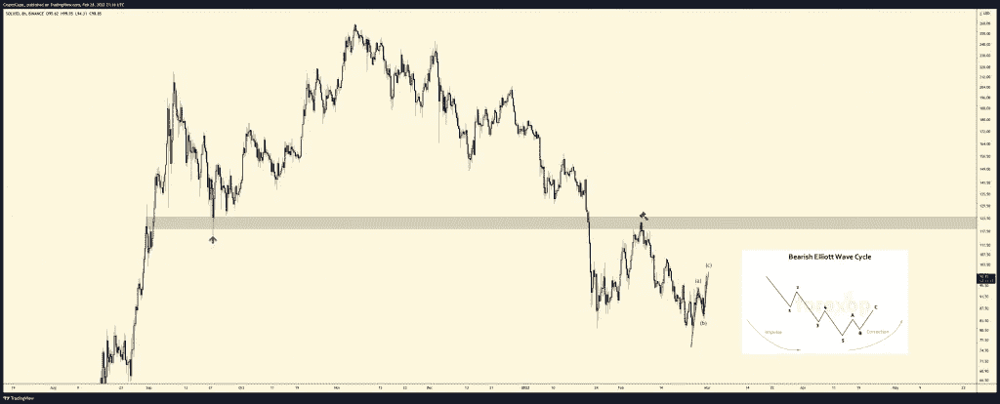
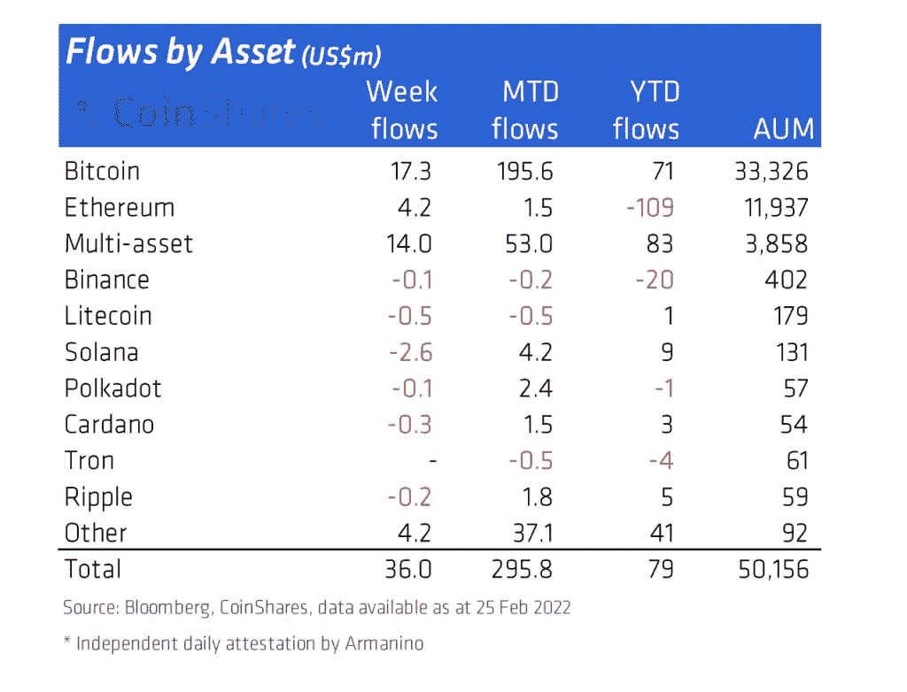

# 随着 SOL 本周上涨 25%，出现“二次探底”是可能

> 原文：<https://medium.com/coinmonks/with-sol-up-25-this-week-a-double-bottom-is-possible-29708eea3f35?source=collection_archive---------73----------------------->

**Visit our website:-** [**https://bitcoinsupports.com/**](https://bitcoinsupports.com/)

尽管大量资金从 SOL 的金融产品中撤出，SOL 的积极潜力还是出现了。在接下来的几周，索拉纳(SOL)的价格可能会飙升 45%以上，因为加密货币的目标是完成对美元的双底图表模式。

**有没有 150 美元的索尔？**

当下跌趋势结束时，价格跌至低点，反弹，回到前一低点附近的水平，这就是所谓的双底。当空头无法将市场推向新低时，卖出情绪减弱，导致快速的上涨回撤和随后的突破性上涨。自 1 月 24 日以来，SOL 一直遵循着类似的轨迹，特别是在延续其涨势后，本周迄今(WTD)上涨 25%，超过 100 美元。

Solana token 价格和相对强弱指数(RSI)趋势之间明显的看涨背离也暗示着双底突破的可能性很大。

**Visit our website:-** [**https://bitcoinsupports.com/**](https://bitcoinsupports.com/)

然而，如果 SOL 的价格突破 120 美元附近的双底颈线，并且交易量增加，牛市可能会出现。实际上，索拉纳令牌的上涨目标可能是双底形态的最低点和颈线之间的最大距离。这将使索尔回到至少 150 美元的轨道上，并有机会继续朝着 170 美元的积极趋势发展，如上图中红色部分所示。

**牛市陷阱危险**

随着双底预测 SOL 在 150 美元或更高，流行的市场分析师“Capo”警告说，Solana 市场可能会出现牛市陷阱，预测 altcoins 将恢复总体下降趋势。匿名分析师将 120 美元的双底颈线描绘为一个重要的阻力位，这肯定会限制 SOL 正在进行的上行回撤。他还用艾略特波浪理论预测了索拉纳的下一个熊市周期的开始，在下图中标为“c”。

**Visit our website:-** [**https://bitcoinsupports.com/**](https://bitcoinsupports.com/)

“在所有看涨的 MS +修正上升趋势被打破后，我很难在这里看涨，”Capo 在 3 月 1 日表示。

**“趁 LTF 高跟鞋还能穿，好好享受吧，但不要穿得太舒服了。”这一黯淡的预测与上周发布的 CoinShares 分析不谋而合，该分析显示，主要的 altcoin 投资工具，包括币安硬币(BNB)、波尔卡多特(dot)、卡尔达诺(ADA)、Ripple (XRP)和莱特币(Litecoin)，正在经历负面的投资者情绪(LTC)。**

**Visit our website:-** [**https://bitcoinsupports.com/**](https://bitcoinsupports.com/)

索拉纳也遭受了损失，SOL investment products 在截至 2 月 25 日的一周内因资本外流损失了 260 万美元。相比之下，所有数字资产投资产品在同一时期共吸引了 3600 万美元，其中多资产投资组合吸引了最多的资金——1400 万美元——其次是比特币的 1730 万美元。

**访问我们的网站:-**[**https://bitcoinsupports.com/**](https://bitcoinsupports.com/)

**免责声明:以上为作者观点，不应视为投资建议。读者应该自己做研究。**

> *加入 Coinmonks* [*电报频道*](https://t.me/coincodecap) *和* [*Youtube 频道*](https://www.youtube.com/c/coinmonks/videos) *了解加密交易和投资*

# 另外，阅读

*   [Bookmap 评论](https://coincodecap.com/bookmap-review-2021-best-trading-software) | [美国 5 大最佳加密交易所](https://coincodecap.com/crypto-exchange-usa)
*   最佳加密[硬件钱包](/coinmonks/hardware-wallets-dfa1211730c6) | [Bitbns 评论](/coinmonks/bitbns-review-38256a07e161)
*   [新加坡十大最佳加密交易所](https://coincodecap.com/crypto-exchange-in-singapore) | [购买 AXS](https://coincodecap.com/buy-axs-token)
*   [红狗赌场评论](https://coincodecap.com/red-dog-casino-review) | [Swyftx 评论](https://coincodecap.com/swyftx-review) | [CoinGate 评论](https://coincodecap.com/coingate-review)
*   [投资印度的最佳密码](https://coincodecap.com/best-crypto-to-invest-in-india-in-2021)|[WazirX P2P](https://coincodecap.com/wazirx-p2p)|[Hi Dollar Review](https://coincodecap.com/hi-dollar-review)
*   [加拿大最好的加密交易机器人](https://coincodecap.com/5-best-crypto-trading-bots-in-canada) | [库币评论](https://coincodecap.com/kucoin-review)
*   [用于 Huobi 的加密交易信号](https://coincodecap.com/huobi-crypto-trading-signals) | [HitBTC 审核](/coinmonks/hitbtc-review-c5143c5d53c2)
*   [如何在 FTX 交易所交易期货](https://coincodecap.com/ftx-futures-trading) | [OKEx vs 币安](https://coincodecap.com/okex-vs-binance)