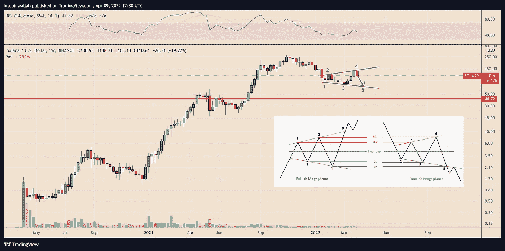
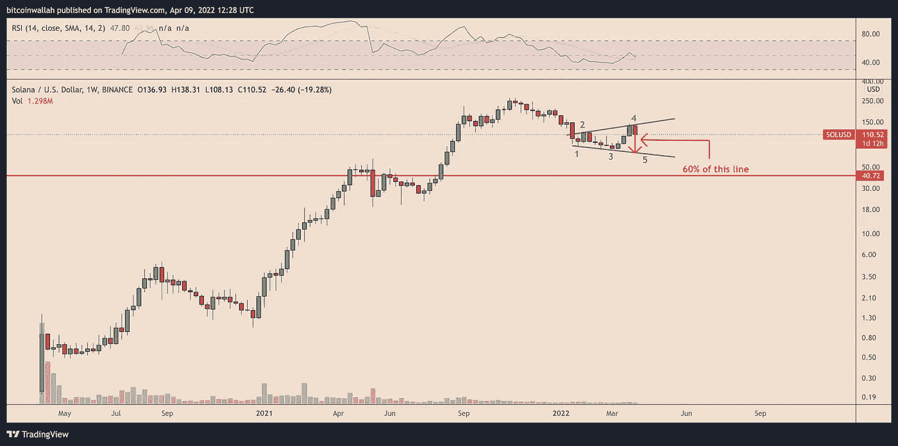
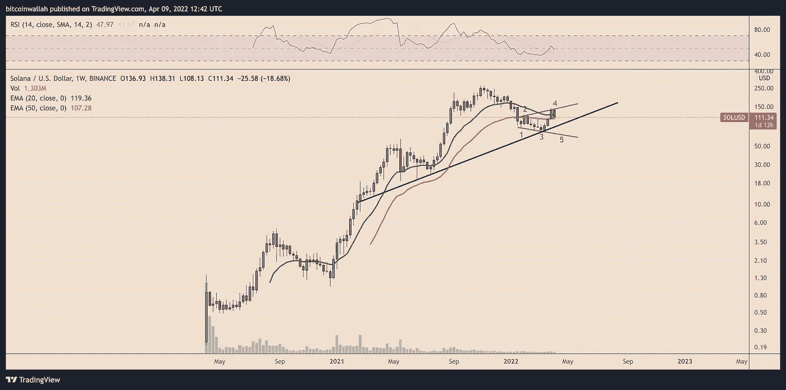
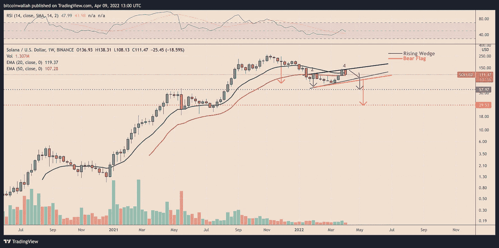

# 索拉纳遭受了 35%的降价，因为 SOL 价格图表上的“扩音器”模式

> 原文：<https://medium.com/coinmonks/with-themegaphone-pattern-on-the-sol-price-chart-solana-faces-a-35-percent-price-drop-64fc10c87443?source=collection_archive---------40----------------------->

**Visit our website for full blog:-** [**https://bitcoinsupports.com/with-themegaphone-pattern-on-the-sol-price-chart-solana-faces-a-35-percent-price-drop/**](https://bitcoinsupports.com/with-themegaphone-pattern-on-the-sol-price-chart-solana-faces-a-35-percent-price-drop/)

如果索拉纳市场跌破其重要的 50 周移动平均线，它将面临一系列熊市。随着接近描绘所谓的“扩音器”图案，索拉纳(SOL)在接下来的几天里面临 35%的下跌。

**SOL 定价模式“扩音器”**

扩音器设置是在市场极度波动期间形成的，至少由两个较低的低点和两个较高的高点组成。然而，这些形态通常包括五次连续的摆动，最后一次是突破信号。自 2022 年初以来，SOL 一直在绘制类似的模式，货币在测试扩音器的上趋势线 140 美元附近作为阻力后回调——第四翼。

**Visit our website for full blog:-** [**https://bitcoinsupports.com/with-themegaphone-pattern-on-the-sol-price-chart-solana-faces-a-35-percent-price-drop/**](https://bitcoinsupports.com/with-themegaphone-pattern-on-the-sol-price-chart-solana-faces-a-35-percent-price-drop/)

由于这种模式，索拉纳令牌可能会继续下跌，测试扩音器的较低趋势线，作为 65 美元附近的支持，比今天的价格低约 35%。

**SOL 有没有可能更崩溃？**

如果这种情况发生，SOL 在完成其当前扩音器构造的第五次摆动后可能会暴跌得多。虽然在突破时确定一个完美的下跌目标可能很困难，但交易者通常通过测量两条趋势线之间的距离来选择一个目标，当价格达到该距离的 50-60%时获利。

**Visit our website for full blog:-** [**https://bitcoinsupports.com/with-themegaphone-pattern-on-the-sol-price-chart-solana-faces-a-35-percent-price-drop/**](https://bitcoinsupports.com/with-themegaphone-pattern-on-the-sol-price-chart-solana-faces-a-35-percent-price-drop/)

在接下来的几周，负面突破可能会将 SOL 的价格推至大约 40 美元。

**有退路的情况**

另一方面，SOL 的看跌扩音器设置可能达不到其突破目标，因为其价格仍在一系列具体支撑位之上。如下图所示，这些级别包括 SOL 的 50 周指数移动平均线(50 周均线；红色波浪)和向上倾斜的趋势线(黑线)，它们是交易者的聚集区。因此，从 50 周均线的早期回调可能会让扩音器的场景成为泡影。

**Visit our website for full blog:-** [**https://bitcoinsupports.com/with-themegaphone-pattern-on-the-sol-price-chart-solana-faces-a-35-percent-price-drop/**](https://bitcoinsupports.com/with-themegaphone-pattern-on-the-sol-price-chart-solana-faces-a-35-percent-price-drop/)

假设价格跌破 50 周均线，却发现上升趋势线有支撑。在这种情况下，它可能会证实“上升楔形”或“熊市旗”形态的存在，结合扩音器形态的上趋势线，确认该形态的熊市性质。

**Visit our website for full blog:-** [**https://bitcoinsupports.com/with-themegaphone-pattern-on-the-sol-price-chart-solana-faces-a-35-percent-price-drop/**](https://bitcoinsupports.com/with-themegaphone-pattern-on-the-sol-price-chart-solana-faces-a-35-percent-price-drop/)

从 100 美元附近的可能突破点减去上升楔形的上下趋势线之间的最大距离(大约 40 美元)，上升楔形的下行目标似乎是 60 美元附近。与此同时，在从 90 美元的可能突破点减去之前上涨趋势的高度(约 60 美元)后，熊市的下行目标在 30 美元附近。

**访问我们的网站获取完整博客:-**[**https://bitcoinsupports . com/with-themephone-pattern-on-the-sol-price-chart-Solana-faces-a-35-percent-price-drop/**](https://bitcoinsupports.com/with-themegaphone-pattern-on-the-sol-price-chart-solana-faces-a-35-percent-price-drop/)

**免责声明:以上为作者观点，不应视为投资建议。读者应该自己做研究。**

> 加入 Coinmonks [电报频道](https://t.me/coincodecap)和 [Youtube 频道](https://www.youtube.com/c/coinmonks/videos)了解加密交易和投资

# 另外，阅读

*   [BigONE 交易所评论](/coinmonks/bigone-exchange-review-64705d85a1d4) | [电网交易机器人](https://coincodecap.com/grid-trading)
*   [氹欞侊贸易评论](https://coincodecap.com/anny-trade-review) | [硬币现场评论](https://coincodecap.com/coinspot-review)
*   [新加坡十大最佳加密交易所](https://coincodecap.com/crypto-exchange-in-singapore) | [购买 AXS](https://coincodecap.com/buy-axs-token)
*   [投资印度的最佳加密软件](https://coincodecap.com/best-crypto-to-invest-in-india-in-2021) | [WazirX P2P](https://coincodecap.com/wazirx-p2p)
*   [7 个最佳零费用加密交易平台](https://coincodecap.com/zero-fee-crypto-exchanges)
*   [最佳网上赌场](https://coincodecap.com/best-online-casinos) | [期货交易机器人](/coinmonks/futures-trading-bots-5a282ccee3f5)