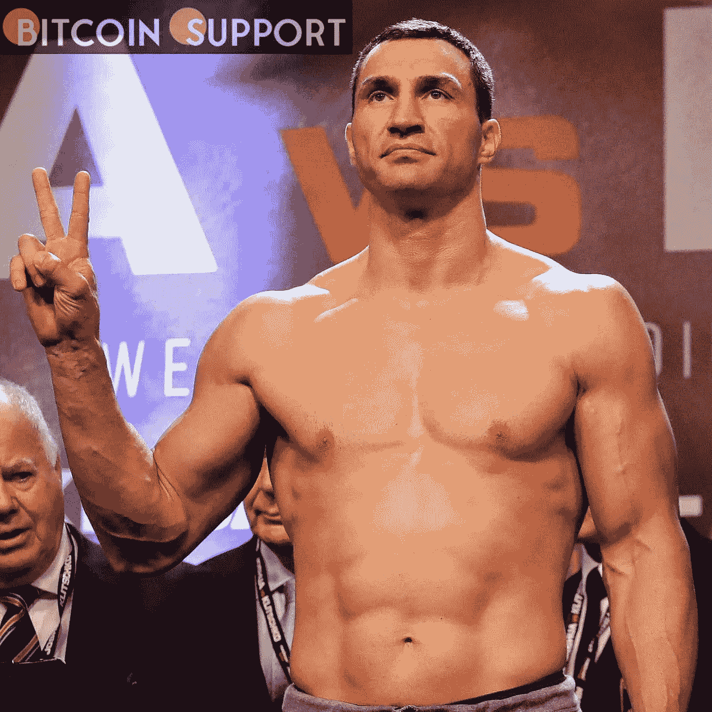

# 乌克兰弗拉基米尔·克里钦科发放 NFT 藏品以援助救灾工作

> 原文：<https://medium.com/coinmonks/wladimir-klitschko-of-ukraine-releases-nft-collection-to-aid-with-relief-efforts-52bd509f56d0?source=collection_archive---------55----------------------->

**Visit our website:-** [**https://bitcoinsupports.com/**](https://bitcoinsupports.com/)

随着俄罗斯入侵的继续，所有收入将捐赠给乌克兰红十字会和联合国儿童基金会。乌克兰拳击明星、两届重量级世界冠军弗拉基米尔·克里钦科推出了一系列不可替代的代币(NFT ),为乌克兰的战争努力筹集资金。

募捐所得将捐给乌克兰红十字会和联合国儿童基金会。该系列名为“Vandalz for Ukraine: WhIsBe x 弗拉基米尔·克里钦科”，是与艺术家 WhIsBe 合作创作的，将在 mint 以三种价格出售:100 美元、1000 美元和 10000 美元。克利钦科在一份声明中说:“这是一个伟大的想法，通过艺术表达对那些需要帮助的人的支持。”。“当艺术被用来造福人类时，它可能在很多层面上都是可爱的。”克利钦科和他的兄弟维塔利，后者既是前拳击冠军，也是现任基辅市长，已经成为该国军事抵抗的代言人，尽管他们有着名人的身份，他们还是选择了战斗在前线。

[https://twitter.com/therecount/status/1499420915364511751](https://twitter.com/therecount/status/1499420915364511751)

该系列是最近几周为支持乌克兰而发布的一系列 NFT 相关项目之一。

3 月 2 日，一枚乌克兰国旗的 NFT 以 675 万美元的价格售出，使战争期间通过加密货币为乌克兰贡献的总金额超过 5000 万美元。惠斯贝在一份声明中表示:“我很感激有机会为更大的利益做出贡献。”。“能够使用我的工作和这项不断发展的技术来帮助那些需要帮助的人，并向地球上的任何地方提供快速救济，这真是太棒了。”

**访问我们的网站:-**[**https://bitcoinsupports.com/**](https://bitcoinsupports.com/)

**免责声明:以上为作者观点，不应视为投资建议。读者应该自己做研究。**