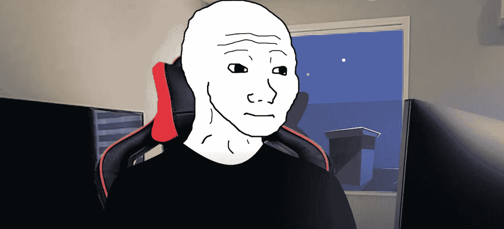

# 沃杰克和波格丹诺夫——我们喜爱的强大迷因

> 原文：<https://medium.com/coinmonks/wojak-and-the-bogdanoffs-the-powerful-meme-we-loved-a78eb4430154?source=collection_archive---------3----------------------->

***Source:*** [***YouTube***](https://www.youtube.com/watch?v=7efVSu92khY)

你可能听说过 Wojak！也许你已经看到了在互联网上流传了一段时间的迷因。Wojak 迷因并不是一个新的迷因，当它被创造出来的时候也不是与密码相关的。

Wojak 是一个波兰语单词，翻译过来就是 fighter，而[这个迷因](https://en.wikipedia.org/wiki/Wojak)起源于 2009 年，当时它首次出现在一个名为“vichan”的波兰论坛上。