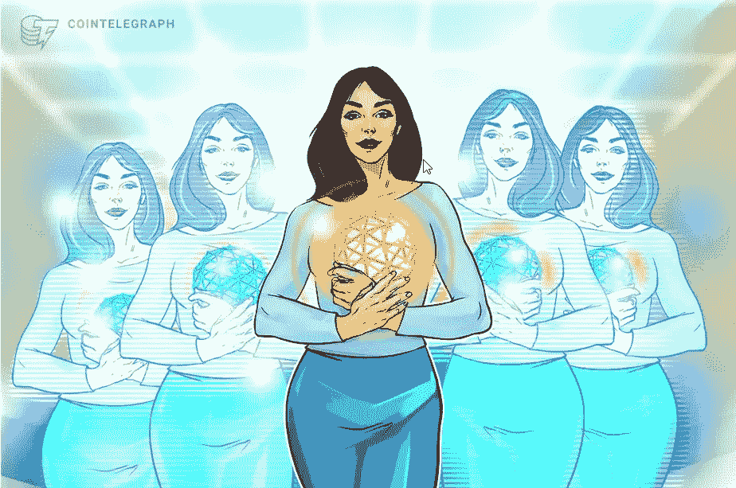
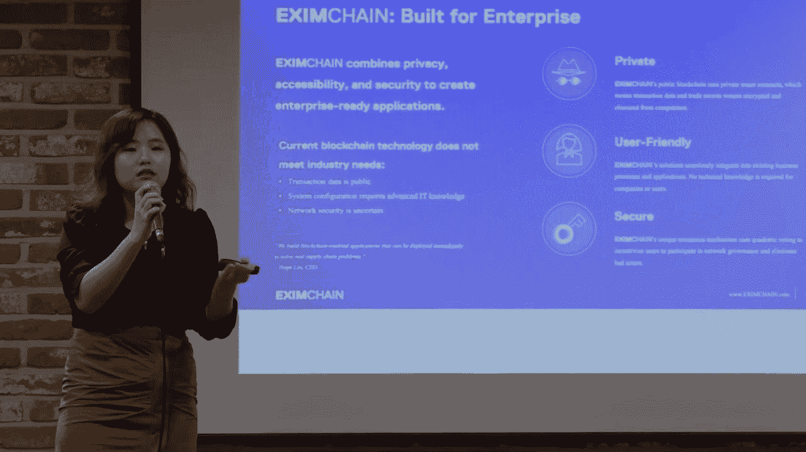

# 区块链中的女性:打破差距

> 原文：<https://medium.com/coinmonks/women-in-blockchain-breaching-the-disparity-gap-f78135dc8a00?source=collection_archive---------41----------------------->

Credit: Cointelegraph

女性在区块链空间的代表性不足，可以从字面上解释为其男性同行在科学、技术、工程和金融行业的历史主导地位和边缘化。目前，女性约占总劳动力的 10-30 %,这还远远没有达到平等。

在 2018 年之前，区块链行业中女性的比例相对较低。进出口连锁的创始人刘(Hope Liu)在接受采访时表示，同年她在日本参加的一次会议时，42 名发言人中只有两名是女性。

然而，近年来，我们记录了妇女在区块链世界中的参与激增，因为一份报告显示，在过去两年中，区块链技术领域的妇女人数从 [8%增长到了](https://swissborg.com/blog/women-in-crypto#:~:text=In%20the%20past%20two%20years,%2C%20with%20women%20representing%2022%25.)12%。妇女现在在新项目中担任战略职位和关键决策角色。领先的公司如[币安和宾科尔也支持多元化运动，因为他们大约 40-50%](https://cointelegraph.com/news/women-in-crypto-has-gender-consensus-come-to-the-market)的员工是女性。

**另见:** [**怪异、狂野和精彩:元宇宙的性别平等**](/@Uthaymeen/the-weird-the-wild-and-the-wonderful-gender-equality-in-the-metaverse-edf4d135c8d1?source=user_profile---------1-------------------------------)

世界知名女性也在全球范围内为区块链行业的性别平等做出贡献，例如 [Olayinka Odeniran，她在参加了 2018 年在迈阿密举行的北美比特币大会后，于 2018 年创立了区块链黑人女性](https://www.cnbc.com/2022/02/15/these-women-are-investing-to-fix-cryptos-diversity-problem.html)。另一位女性是 [Manasi Vora，Blockchian](https://www.cnbc.com/2022/02/15/these-women-are-investing-to-fix-cryptos-diversity-problem.html) 妇女组织的创始人，她在 2017 年离职，全职从事加密工作，之后她创办了一个组织，专注于通过提供教育资源来增加加密领域的多样性。

最近的一项研究显示，女性持有约 8.3%的储蓄(男性只有 7.9%)，这表明女性有更多的权力将投资分散到加密货币等回报更高的资产上。女性是社区的建设者和变革者，我们已经看到了很多表现，我们需要做的就是鼓励和支持她们，我们需要庆祝和强调那些已经在这个领域领先的女性，以激励其他人加入进来。

**最终想法**

区块链和 Web3 仍处于起步阶段，早期采用者有无限的机会。如果女性敢于要求自己的空间，她们现在就有黄金机会来塑造自己喜欢的空间，消除性别差异。

> 加入 Coinmonks [电报频道](https://t.me/coincodecap)和 [Youtube 频道](https://www.youtube.com/c/coinmonks/videos)了解加密交易和投资

# 另外，阅读

*   [阿联酋 5 大最佳加密交易所](https://coincodecap.com/best-crypto-exchanges-in-uae) | [SimpleSwap 评论](https://coincodecap.com/simpleswap-review)
*   [购买 Dogecoin 的 7 种最佳方式](https://coincodecap.com/ways-to-buy-dogecoin) | [ZebPay 评论](https://coincodecap.com/zebpay-review)
*   [最佳期货交易信号](https://coincodecap.com/futures-trading-signals) | [流动性交易所评论](https://coincodecap.com/liquid-exchange-review)
*   [火币的加密交易信号](https://coincodecap.com/huobi-crypto-trading-signals) | [Swapzone 审查](/coinmonks/swapzone-review-crypto-exchange-data-aggregator-e0ad78e55ed7)
*   最佳[密码交易机器人](https://coincodecap.com/best-crypto-trading-bots) | [购买索拉纳](https://coincodecap.com/buy-solana) | [矩阵导出评论](https://coincodecap.com/matrixport-review)