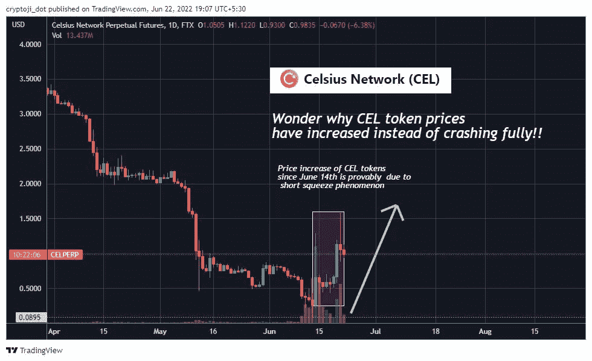
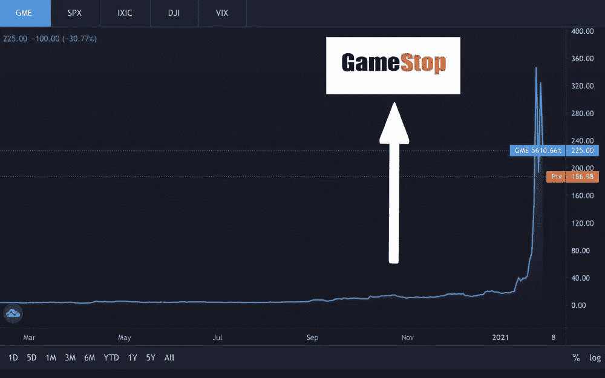
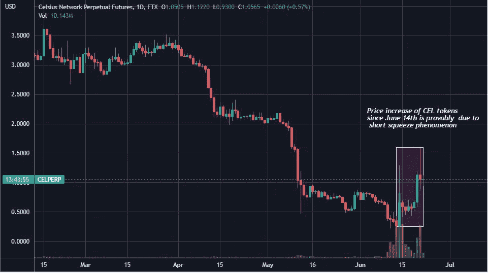
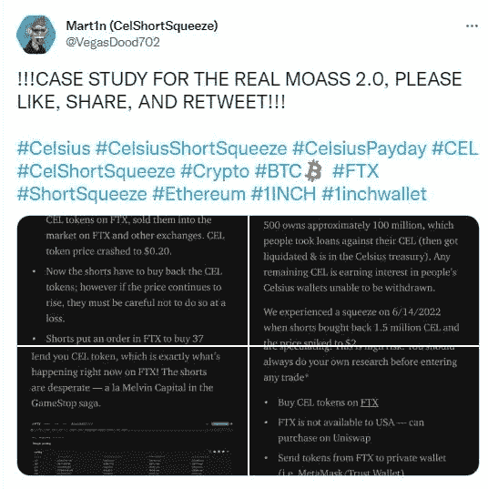
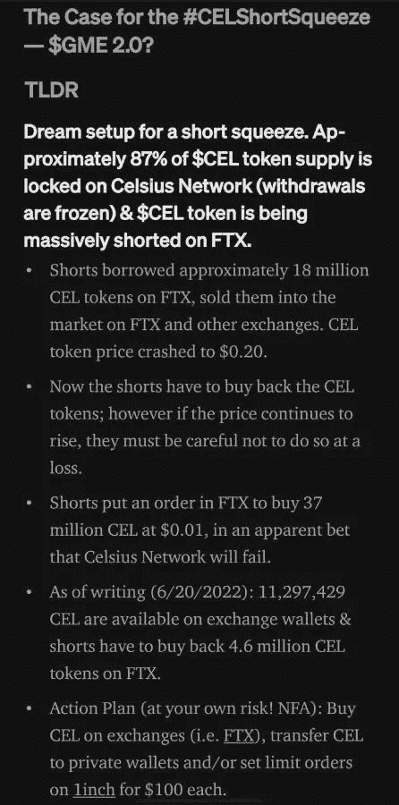
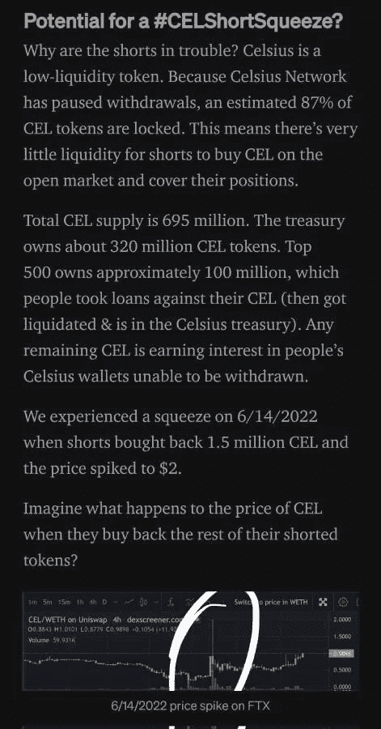
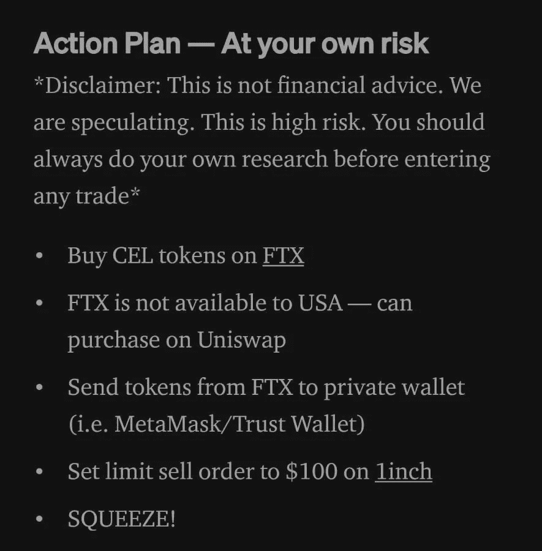
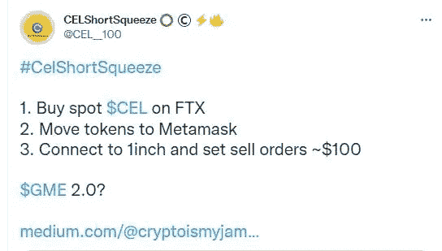

# 想知道为什么 CEL 令牌价格增加，而不是完全崩溃！！

> 原文：<https://medium.com/coinmonks/wonder-why-cel-token-prices-have-increased-instead-of-crashing-fully-e584f84e5f1f?source=collection_archive---------41----------------------->

# 所有人都预计 CEL token 会随着 Celsius 成为资不抵债的头条新闻而崩溃

当考虑 CEL token 的基本面时，显然直接的投资者会说它将兑现，因为贷款平台 Celsius(其 token 为 CEL)一直在制造头条新闻，称加密贷款公司已经破产，没有流动性和资金偿还其储户。

由于 Celsius 已经冻结了其在该平台的所有储户账户，并暂停了储户的代币取款和转账，这引起了人们对 Celsius 平台流动性和可能出现的资不抵债情况的担忧。

因此，出于这个原因，每个人都直截了当地预计 CEL token 价格将会暴跌。因此，许多交易者在 FTX 交易所等平台做空 CEL 令牌。

# CEL 卖空者预计会获利，但最近情况并不那么明朗

当交易员做空一项资产时，他们押注其价格会进一步下跌，他们通过利用杠杆来实现这一点。这意味着在这种情况下，交易者借入 CEL 代币，卖出，然后做空。随着 CEL 代币价格下跌，这些卖空者将回购代币，从他们的获胜赌注中获利，然后结清他们的借入头寸。

从理论上讲，这听起来是一种聪明的赚钱方式，但最近大多数被做空的资产都被散户投资者盯上了，以推高被做空资产的价格，引发了一种做空挤压现象，卖空者因此遭受损失，散户投资者从中受益。

# 还记得与/r/WallStreetBets 集团有关的 GME 股价泵事件吗？

[Source](https://peakd.com/post/@mintymile/the-gme-stock-price-boom)

当然，这对于那些喜欢游戏停止(GME)股票戏剧的人来说是熟悉的，在那里，尽管缺乏基本面，但 GME 股票的价格飙升，因为来自/r/WallStreetBets reddit group 的一群散户投资者发起了对 GME 的做空，推高了 GME 股票的价格，这些股票支持了华尔街的大型对冲基金公司，如 Malvin Capital，他们预计通过做空 GME 股票获得巨大收益。

全世界的散户投资者都在庆祝这一滑稽的插曲，因为他们让那些华尔街巨头们尝到了他们自己的药。

你可以在这里阅读臭名昭著经典 GME/r/华尔街的短篇小说:

[GME 股价暴涨，华尔街巨头在交易游戏中失利](https://peakd.com/post/@mintymile/the-gme-stock-price-boom)

# 直截了当的投资者感到惊讶，因为 CEL 代币价格上涨，而不是下跌！！

好吧，让我们看看 CEL token 的价格…

[Trading view](https://www.tradingview.com/x/qxG0gOcM/)

*OMG，价格居然从 6 月 13 日的 0.0950 美元涨到了 6 月 21 日的 1.5 美元。*

CEL token 在 5 月 4 日超过 2 美元，在 5 月 31 日跌至 0.8 美元美分，然后在 6 月 13 日跌至最近的历史低点 0.09 美元美分，然后由于[空头挤压](https://cryptobriefing.com/celsius-token-up-65-traders-pull-short-squeeze/)现象的出现，CEL token 价格上涨，这变得有趣。这就是为什么在 6 月 14 日会有这样一个细长的蜡烛头，因为 CEL 由于短缺而价格飙升。

【CelShortSqueeze】标签自 6 月 14 日以来一直在 twitter 上流行，散户投资者在得到像 [@VegasDood702](http://twitter.com/VegasDood702) 这样的#CelShortSqueeze 趋势影响者的鼓励后，可能一直在引领这场[做空](https://cryptobriefing.com/celsius-token-up-65-traders-pull-short-squeeze/)。

[@VegasDood702](http://twitter.com/VegasDood702) 在这篇[推文](https://twitter.com/VegasDood702/status/1539183410740047873?s=20&t=ZL6SwxJYRwiFgPd0qd42ag)中解释了为什么 CEL token 是做空和获利的理想令牌，并附有精美的信息附件。

[Tweet](https://twitter.com/VegasDood702/status/1539183410740047873?s=20&t=ZL6SwxJYRwiFgPd0qd42ag)

是的，CEL token 应该会进一步崩溃，显然预期到这一点，交易商在 FTX 交易所做空 CEL token。然而，另一方面，CEL token 目前的令牌组学使其成为启动[做空](https://cryptobriefing.com/celsius-token-up-65-traders-pull-short-squeeze/)并赚钱的梦想令牌。

以下是@VegasDood702 解释的原因，他似乎是这个#CelShortSqueeze 的主要影响者。

[Image attachment from tweet](https://twitter.com/VegasDood702/status/1539183410740047873?s=20&t=jCX9jUO3KmKAYItR9JLD1g)

*   CEL 令牌的流动性较低，87%的 CEL 令牌被锁定在摄氏温度，由于平台中的取款和转账暂停，现在无法从该温度提取。
*   CEL 在 FTX 交易所被严重做空，大多数流通的 CEL 令牌都在那里，其中许多是由做空 CEL 的卖空者借入的。

[Image attachment from tweet](https://twitter.com/VegasDood702/status/1539183410740047873?s=20&t=jCX9jUO3KmKAYItR9JLD1g)

因此，#CelShortSqueeze 宣传了一项计划，通过发起做空来推高 CEL 代币的价格。

[Image attachment from tweet](https://twitter.com/VegasDood702/status/1539183410740047873?s=20&t=jCX9jUO3KmKAYItR9JLD1g)

## 在推特上传播的#CelShortSqueeze 计划

[Tweet](https://twitter.com/CEL__100/status/1539185928564244480?s=20&t=kabV9UNOfVyEsEYNex1yEQ)

该计划是让投资者购买 CEL 代币，并将其从交易所转移到 metamask 等非托管钱包。

大量购买 CEL 代币将推高严重做空的资产的价格，而将 CEL 代币转移到个人钱包将减少 FTX 交易所的 CEL 代币供应。

随着 CEL 代币价格的上涨，卖空者将被迫(以高价)回购 CEL 代币，以平仓他们的借入头寸，这将引发做空挤压。

能够出售其 CEL 代币的 CEL 代币持有者可以以非常高的价格和利益将代币出售给这些绝望的 CEL 卖空者。我知道对于那些把手机锁在摄氏温度的手机持有者来说，这听起来很可怕！！

嗯，这就是为什么 CEL 的价格从 6 月 13 日以来一直在上涨，这是因为零售狂潮引发的 CEL 空头挤压执行了#CelShortSqueeze 计划！！

**结论！！**

嗯，我想以此结束，这篇文章只是为了刺激和享受而写的。我喜欢投资者这种疯狂的态度，他们玩做空游戏，娱乐那些像我一样关注加密空间的人，即使是在这些干旱时期。
显然，这不是投资顾问，因为我不是一个合格的金融顾问，我只是一个小小的密码爱好者，还是一条小小的密码鱼！！。

**日安。**

> 加入 Coinmonks [电报频道](https://t.me/coincodecap)和 [Youtube 频道](https://www.youtube.com/c/coinmonks/videos)了解加密交易和投资

# 另外，阅读

*   [CoinLoan 审查](https://coincodecap.com/coinloan-review) | [YouHodler 审查](/coinmonks/youhodler-4-easy-ways-to-make-money-98969b9689f2) | [BlockFi 审查](https://coincodecap.com/blockfi-review)
*   [XT.COM 评论](https://coincodecap.com/profittradingapp-for-binance)币安评论 |
*   [SmithBot 评论](https://coincodecap.com/smithbot-review) | [4 款最佳免费开源交易机器人](https://coincodecap.com/free-open-source-trading-bots)
*   [比特币基地僵尸程序](/coinmonks/coinbase-bots-ac6359e897f3) | [AscendEX 审查](/coinmonks/ascendex-review-53e829cf75fa) | [OKEx 交易僵尸程序](/coinmonks/okex-trading-bots-234920f61e60)
*   [如何在印度购买比特币？](/coinmonks/buy-bitcoin-in-india-feb50ddfef94) | [WazirX 评论](/coinmonks/wazirx-review-5c811b074f5b)
*   [加密交易机器人](/coinmonks/crypto-trading-bot-c2ffce8acb2a) | [Probit 审查](https://coincodecap.com/probit-review)