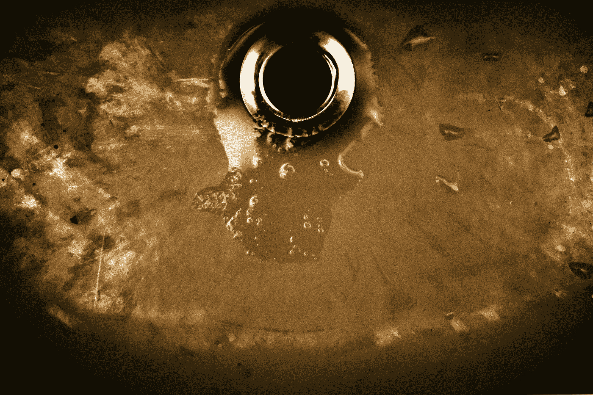
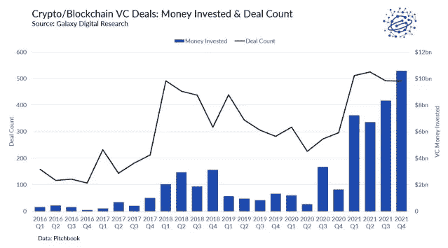

# 哇哦，流动资金从 Crypto 流出的声音

> 原文：<https://medium.com/coinmonks/wooosh-the-sound-of-liquidity-flowing-out-of-crypto-d60b536d16f5?source=collection_archive---------31----------------------->

至少现在是这样

Photo by [Scott Rodgerson](https://unsplash.com/@scottrodgerson?utm_source=unsplash&utm_medium=referral&utm_content=creditCopyText) on [Unsplash](https://unsplash.com/s/photos/drain?utm_source=unsplash&utm_medium=referral&utm_content=creditCopyText)

根据 Defillama 的测量，加密技术的总价值从 1921 年 12 月的 1850 亿美元下降到目前的 580 亿美元，下降了 69%。这是加密估值缩水的直接作用，因为同期 ETH 下跌了 77%。随着杠杆违约交易的解除，所有 token 的价值持续下跌。ETH 和 BTC 现在回到了 1 月 21 日的水平。所谓的加密 2021 年夏天已经被一笔勾销。

到目前为止，我们已经听说了 UST/露娜，Celsius，3AC，迪法恩斯资本…以及围绕巴别塔，BlockFi 和其他公司的谣言。这些参与者中的大多数都在相关资产支持的头寸上进行了长期杠杆操作。当资产总额下降约 80%时，这种风险敞口会造成很大伤害。追加保证金通知很快变得不可持续。为了偿还本金，必须出售流动性较差的资产。这需要时间，并创建门控场景或简单的默认值。

这些违约将在 DeFi 引起一段时间的反响，因为这些数十亿美元的基金也是新生生态系统的种子。那些没有受到赎回冲击的投资者，可能正坐拥一堆象征性资产，其价值仅为过去 6 个月估值的一小部分。据 Galaxy Digital 称，2011 财年，风投在加密领域投资了 330 亿美元，现在这笔钱可能已经用完了。

Galaxy Digital, Blockworks, Jan22

最重要的是，资金已经离开了秘密领域。自 5 月 22 日以来，稳定硬币的价值大约下降了 500 亿美元。诚然，UST 占其中的 180 亿美元，但它仍是 320 亿美元的稳定资本净退出，这反映出投资者不仅从风险资产中套现，还将资金转回贸易投资。

流动性状况如何？DeFi 中的流动性不足，成交量仅出现在 tricrypto2、sUSD 和 3pool 中。收益率下降，风险回报在其他地方变得不那么有吸引力。此外，方向性职位并不是当今的时尚。在这种环境下，项目将巨额预算用于农业奖励是毫无意义的。资源重新配置是为了长期生存，而不是短期流行。

不可否认的是，DeFi 已经存在。它的未来很可能更加制度化，将 KYC/反洗钱纳入正轨，并面向现实世界的使用案例。它肯定会放弃部分去中心化的梦想，转而采用集中的、受监管的和风险管理的流程。但与此同时，它将从 CeFi 交易对手那里获得大得多的资金，释放出大量资金和人才。

DeFi 生态系统正从流动性和收益率的内生来源转变为外部来源的影响。生态系统最终应该更能抵御冲击，拥有更好的现实生活用例。一个真正的进步。

**关于—**

*360 咨询有限责任公司是一家总部位于波士顿的 RIA 公司，管理投资，包括加密*

👉[上午 9 点至 30 点](https://twitter.com/930AM2)🐰🕳

**来源—**

👉风投在 2021 财年投资 330 亿美元[https://block works . co/report-VCS-invested-33b-in-crypto-and-区块链-startups-in-2021/](https://blockworks.co/report-vcs-invested-33b-in-crypto-and-blockchain-startups-in-2021/)

👉经合组织-加密资产制度化【https://www.oecd-ilibrary.org/docserver/5d9dddbe-en.pdf? expires = 1655759690&id = id&accname = guest&checksum = 684 af 9009 F6 f 9 de 647 b 1686 a7 fc 25088

> 加入 Coinmonks [电报频道](https://t.me/coincodecap)和 [Youtube 频道](https://www.youtube.com/c/coinmonks/videos)了解加密交易和投资

# 另外，阅读

*   [分散交易所](https://coincodecap.com/what-are-decentralized-exchanges) | [比特 FIP](https://coincodecap.com/bitbns-fip) | [宾邦评论](https://coincodecap.com/bingbon-review)
*   [用信用卡购买密码的 10 个最佳地点](https://coincodecap.com/buy-crypto-with-credit-card)
*   [加拿大最佳加密交易机器人](https://coincodecap.com/5-best-crypto-trading-bots-in-canada) | [Bybit vs 币安](https://coincodecap.com/bybit-binance-moonxbt)
*   [阿联酋五大最佳加密交易所](https://coincodecap.com/best-crypto-exchanges-in-uae) | [SimpleSwap 评论](https://coincodecap.com/simpleswap-review)
*   购买 Dogecoin 的 7 种最佳方式
*   [最佳期货交易信号](https://coincodecap.com/futures-trading-signals) | [流动性交易所评论](https://coincodecap.com/liquid-exchange-review)