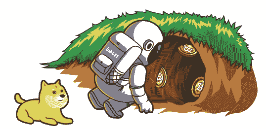
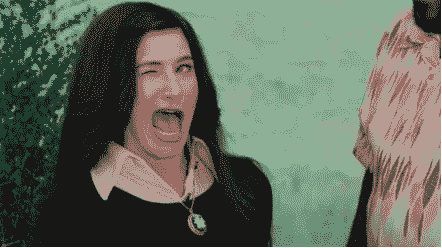
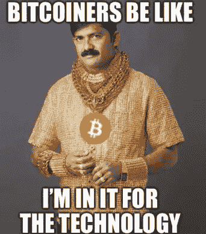

# 为 crypto 做贡献:在我的前 3 个月里有 3 个收获

> 原文：<https://medium.com/coinmonks/working-in-a-crypto-start-up-3-takeaways-in-my-first-3-months-db5c34e81585?source=collection_archive---------2----------------------->

2020 年 3 月封锁期间，我被困在家里，决定学习区块链和加密货币。我倾向于对我做的大多数事情都有点厌烦，再加上我十几岁时在 MMORPG 地牢里磨练出来的纪律，到我 20 岁出头时获得搓板腹肌。我每天都会在 YouTube 上观看加密视频，在 CoinDesk 上阅读相关文章，在分散的土地上的 wonder zone mine meteor 制作 NFT，不断计算 Uniswap 上提供的流动性的 APR %,这样的例子不胜枚举。因此，当为行业做贡献的机会向我走来时，我毫不犹豫地一头扎了进去。

Exploring the rabbit hole

我仍然认为自己是一个秘密婴儿，因为这个兔子洞很深。以下是我的经验，我希望这能给你一些启示，并鼓励你开始探索加密，这可能没什么。

**1。吃饭睡觉密码重复**

我对加密越来越感兴趣，这与我的朋友和同事对加密的兴趣无关。我感觉自己像个局外人，“crypto 要崩溃了”、“你被洗脑了”、“监管来了”的判断。

随着思维模式的转变，在我的职业或个人生活中，我没有人可以就最新的趋势和技术进行深入的交谈。既然我已经学会了加密，那我就应该找一群志同道合的朋友。

现在，我可以和我认识的最聪明的人进行关于加密的疯狂深入的对话。他们对技术的理解是深刻的。我参与的这个项目提供了大量的学习机会。你知道他们怎么说和聪明人一起工作，你会变得更聪明。

短短 3 个月，我的密码智商从 42 提高到 69。(iykyk)

对行业的贡献让我可以每天应用技术。在个人层面上，我也让自己更多地参与 DeFi，特别是产量农业，杠杆贷款，模仿 alt 硬币，尽可能分享我对不和谐的知识，最重要的是每天都有乐趣。

**2。事情的处理方式不同**

我相信大多数公司；高层领导很可能是一群婴儿潮一代。在我以前的工作场所，由于疫情，我团队中的年轻成员经常嘲笑高级领导对引入 Zoom 作为在家工作安排的一部分感到自豪。

我想在这里分享的一个不同做法的例子是大多数加密项目的客户服务。当你面临问题时，没有热线或电子邮件可供你联系，那么你去哪里寻求帮助呢？

不和电报。

我认为这是做客户服务的好方法。通常，社区会回答问题，而客户服务管理员不用动一根手指。当然，这并不适用于每一家企业，但这是一个以不同方式提供客户服务的例子。

crypto 的思想是关于去中心化的，这与第一性原理的思想非常吻合。我们不应该因为“应该”就去做某件事。

First principles thinking explained with Pizza

**3。职业道德令人惊叹**

我的大多数朋友都有一个常见的误解，就是将比特币与股票进行比较，并得出比特币没有内在价值的结论。如果你挖掘得更深，你可能会知道比特币是作为一种替代交易媒介而产生的，而股票是一家公司的所有权，它根据该公司为世界创造的价值来积累价值。比特币不在乎有没有内在价值。比特币和所有其他外币一样。

此外，大多数人会认为加密是一个骗局或经常用于洗钱，因为它是不受管制的和新的。我认为他们通常没有做足够的功课。我们不应该急于批评我们不理解的东西。相反，我们应该花更多的时间来获取相关的知识，了解背后的技术。

也就是说，这项技术的早期采用者是真正的信徒，认为加密和它的技术是为了帮助世界走向自由的未来。他们的动机不仅仅是经济利益，而是为世界建设一个更美好的未来。这就解释了为什么他们在熊市中交易钻石，赚了很多钱来改变生活。

回到我现在和一群聪明人一起做贡献的部分。他们不是诈骗犯或骗子，相反，他们是建设者，在未知的领域绘制我们的未来。我很兴奋也很自豪能成为这个有意义的旅程的一部分。Crypto 给了我一种更深层次的成就感。我们应该有意义感和目标感，比如让世界变得更美好，或者至少在工作中获得乐趣。

感谢阅读，下个月见。

*作为我的新年决心的一部分，我将分享我与 crypto 的经历，以讲述由我工作中的朋友们启发的更好的故事。*

*免费加密&股票连同推荐一起启动你的旅程:*[*https://docs . Google . com/spreadsheets/d/1 f2bx-xkvmezorxdzqavgckina 1 PME _ uI9pa _ c4l 4-DM/edit？usp =分享*](https://docs.google.com/spreadsheets/d/1f2bX-xKvmEzOrxDZqAvgCkIna1pmE_uI9pa_C4l4-DM/edit?usp=sharing)

> 加入 Coinmonks [电报频道](https://t.me/coincodecap)和 [Youtube 频道](https://www.youtube.com/c/coinmonks/videos)了解加密交易和投资

# 另外，阅读

*   [如何匿名购买比特币](https://coincodecap.com/buy-bitcoin-anonymously) | [比特币现金钱包](https://coincodecap.com/bitcoin-cash-wallets)
*   [瓦济里克斯 NFT 评论](https://coincodecap.com/wazirx-nft-review)|[Bitsgap vs Pionex](https://coincodecap.com/bitsgap-vs-pionex)|[Tangem 评论](https://coincodecap.com/tangem-wallet-review)
*   [如何使用 Solidity 在以太坊上创建 DApp？](https://coincodecap.com/create-a-dapp-on-ethereum-using-solidity)
*   [币安 vs FTX](https://coincodecap.com/binance-vs-ftx) | [最佳(SOL)索拉纳钱包](https://coincodecap.com/solana-wallets)
*   [如何在 Uniswap 上交换加密？](https://coincodecap.com/swap-crypto-on-uniswap) | [A-Ads 审查](https://coincodecap.com/a-ads-review)