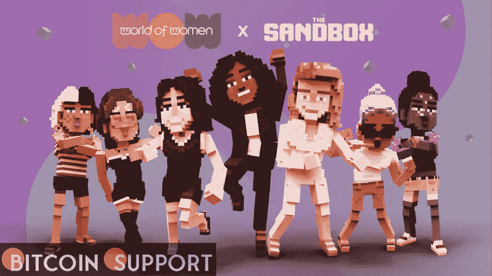

# 妇女世界与沙盒合作发起了一项 2500 万美元的包容性运动

> 原文：<https://medium.com/coinmonks/world-of-women-collaborates-with-the-sandbox-on-a-25-million-inclusivity-drive-663994627146?source=collection_archive---------102----------------------->

**Visit our website:-** [**https://bitcoinsupports.com/**](https://bitcoinsupports.com/)

新成立的 WoW 基金会将利用这笔资金投资于旨在增加女性参与 Web 3 和元宇宙的教育和辅导项目。

NFT 妇女世界项目与沙盒公司合作，创建了一个平台，以促进 Web 3 和元宇宙的女性包容和代表性。该项目被称为“WoW 基金会”，将在五年内获得 2500 万美元，资金将用于教育和指导。

数码插画师、不可替代的 token (NFT)艺术家亚姆·卡尔凯(Yam Karkai)和她的男友拉斐尔·马拉维耶(Raphael Malavieille)在 7 月份建立了女性世界网络，发布了一万个独特的女性 NFT 头像。根据该组织 11 月份的报告，在过去的 21 个月里，女性艺术家占 NFT 艺术品销售总额的 5%。自去年 11 月推出以来，《女人的世界》一跃成为 NFT 排行榜的榜首，在二级市场 OpenSea 上的底价为 7.1 ETH(约 1.75 万美元)。瑞茜·威瑟斯彭(Reese Witherspoon)在今年 2 月通过她的媒体公司 Hello Sunshine 加入了该项目，该项目从中受益匪浅。WoW 基金会将利用这笔资金为艺术家建立一个虚拟学院，并投资于元宇宙网络中的多元化和包容性女性空间。该组织表示，它希望通过充当孵化器并提供指导、资金、指导和进入沙盒网络的机会来增加女性的参与。沙盒是区块链游戏领导者 Animoca Brands 的子公司。

此外，学生将通过沙盒中的沉浸式体验获得免费的 Web 3 在线讲座，完成课程后，他们将获得认证并获得“NFT 文凭”Sandbox 的联合创始人兼首席运营官 Sebastien Borget 表示:“通过支持教育和资助女性项目，我们相信这些项目将有助于在该领域培养出一代强大的女性建设者。除了虚拟学院之外，沙盒中还有一个 WoW 博物馆，作为 WoW 基金会的展示平台。

**访问我们的网站:-**[**https://bitcoinsupports.com/**](https://bitcoinsupports.com/)

**免责声明:以上为作者观点，不应视为投资建议。读者应该自己做研究。**