# 世界储备货币地位

> 原文：<https://medium.com/coinmonks/world-reserve-currency-status-af0dbc00299a?source=collection_archive---------34----------------------->

为什么每个人都忽略了纽约和迪拜与 WTC 有关的储备货币地位之争——一直追溯到 70 年代。

纽约有最高的建筑，美国加强了生产/工业。从那以后，我们失去了 2001 年之前的所有 3 个增长和优势(无生产、市场崩溃、基础设施失败、不领先)

— —现在，在迪拜建成最高建筑迪拜塔后不久，已经有了原创的 WTC，引领着收入技术革命，0%封顶。获得税收，并在本周宣布作为 SCA 的加密中心——证券商品管理局提供监管！

这只是叫嚣第二种储备货币…或替代品--这些国家知道美国人会跟随，因为他们对自己的金融系统失去了信心…$。

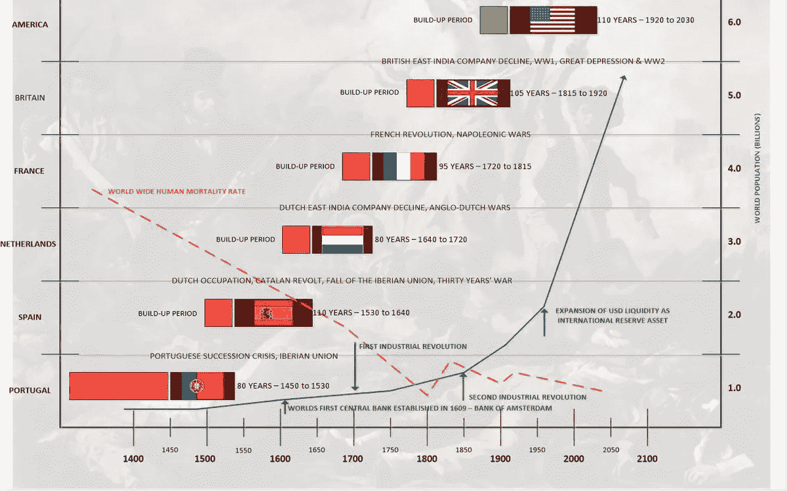

我们正处于 100 多年的历史货币关口，进入通货膨胀和超级印刷，这带来了不断上升的利率&现在是战争。

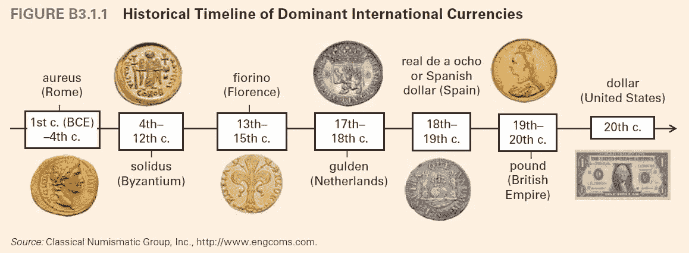

这是。正是。如何。发生。在历史上。每次。

加上第三次世界大战和俄罗斯/伊朗/中国都恨美元和阿联酋控制石油。我的意思是…这正在发生…对吗？？？

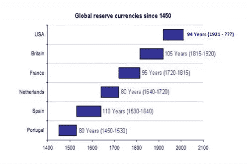

***我们这个世界真正的金钱是维持生命的资源。—比特币技术提供了一种通用货币，让任何国家都无法控制或选择制裁。(正如你今天所看到的，对美国公平的事情可能对其他所有人都不公平。谁来做这个决定？嗯。)***

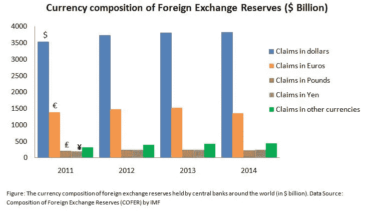

现在————我先打破了冰头；) ….y *你看这些文章集锦，玩一点点连珠(日期/姓名！)* …。另外，俄罗斯/伊朗/中国/以及印度的暗示似乎都是同一页…这与美国/欧洲/北约的说法相反…..这真的一点也不牵强。** *俄罗斯/伊朗/中国/印度在试图阻止他们之后，都回去通过了允许他们入境的加密规则***

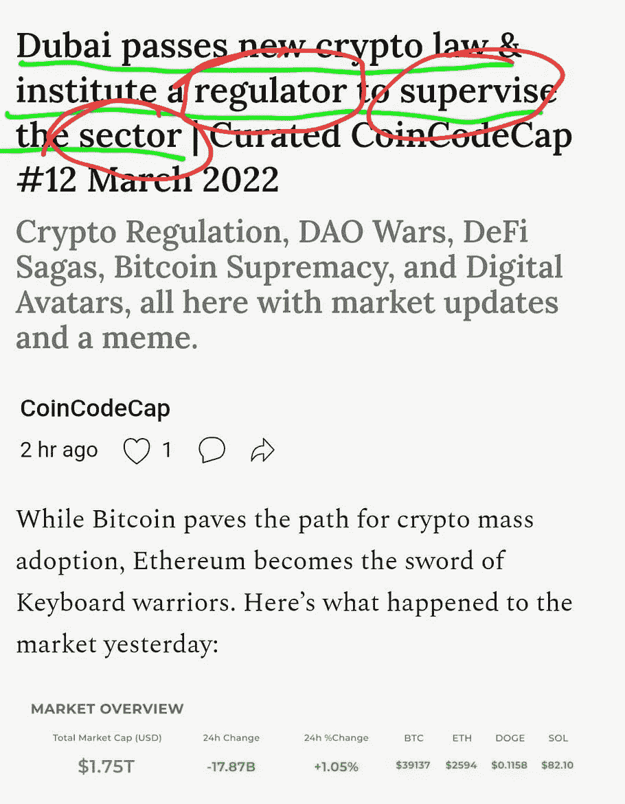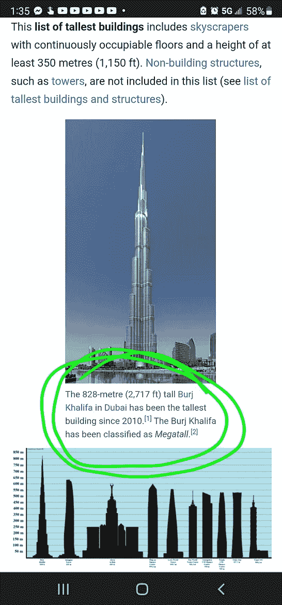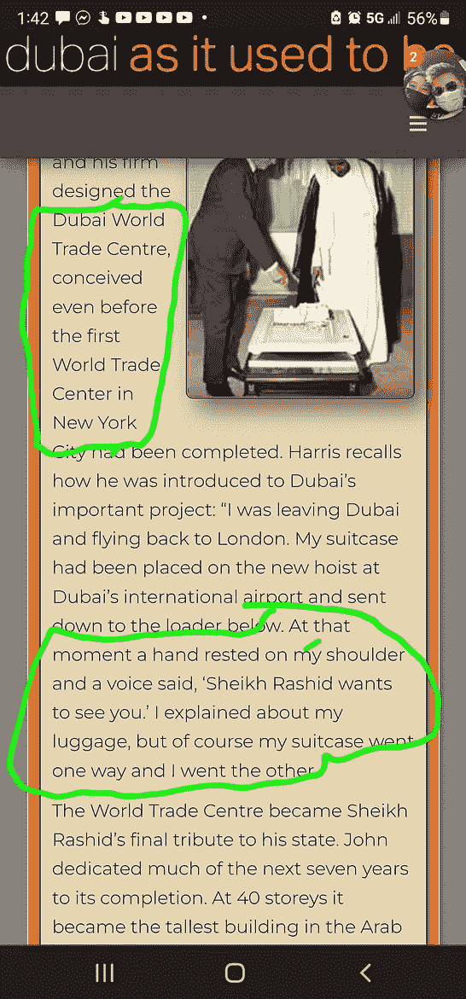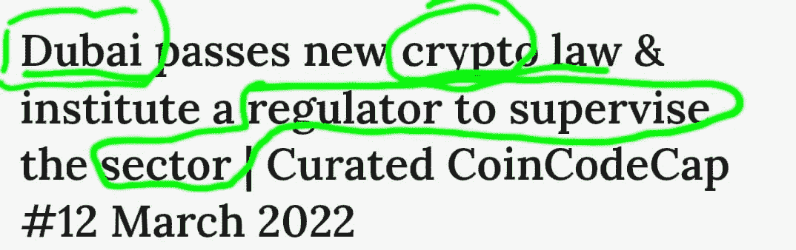

特别是加上过去 3 年发生的所有非常公开的事情…我会加上 Cov。已经非常完美地设置了这个…我们都知道它来自哪里。我的意思是…我们应该继续有史以来最大的连接点板！！

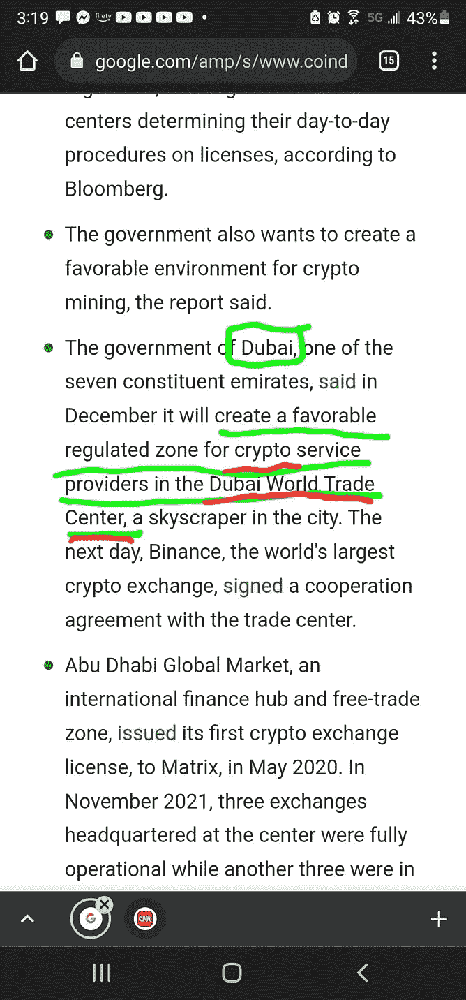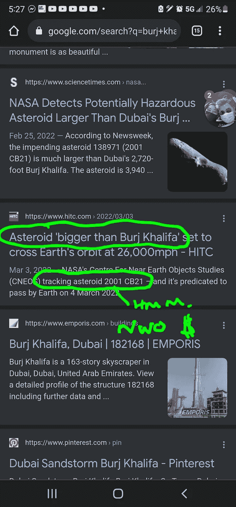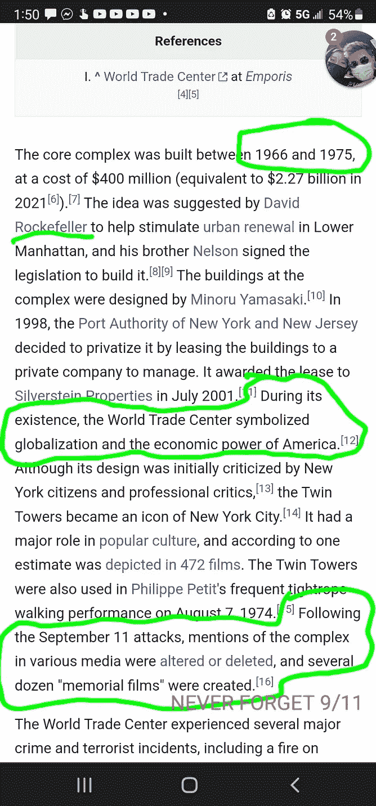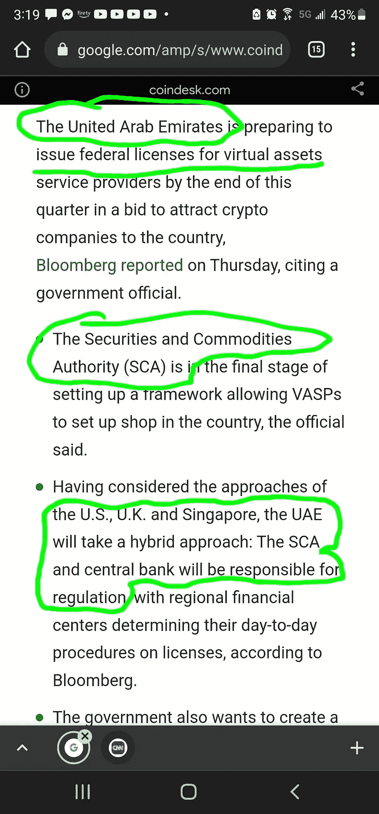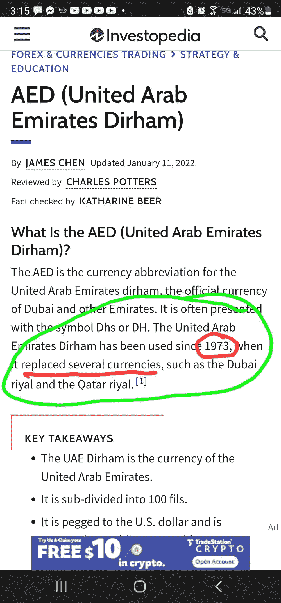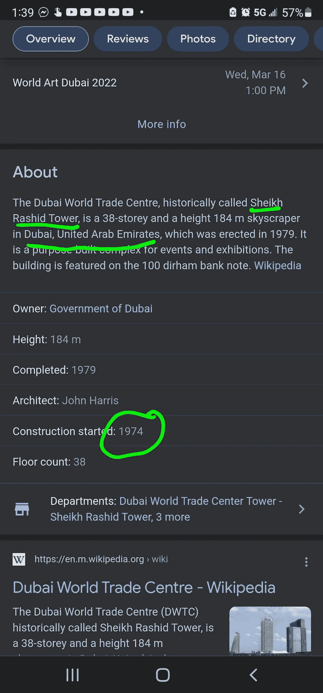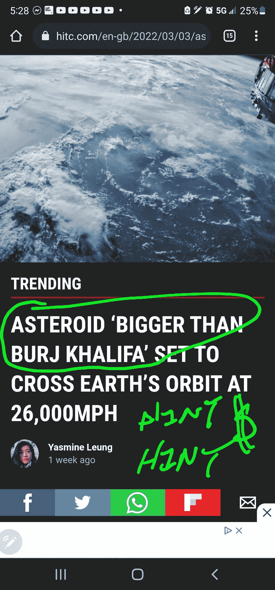

> 加入 Coinmonks [电报频道](https://t.me/coincodecap)和 [Youtube 频道](https://www.youtube.com/c/coinmonks/videos)了解加密交易和投资

# 另外，阅读

*   [加密套利](/coinmonks/crypto-arbitrage-guide-how-to-make-money-as-a-beginner-62bfe5c868f6)指南| [如何做空比特币](/coinmonks/how-to-short-bitcoin-568a2d0b4ae5)
*   [如何在加拿大购买加密货币？](https://coincodecap.com/how-to-buy-cryptocurrency-in-canada)
*   [无聊猿游艇俱乐部(BAYC)回顾](https://coincodecap.com/bored-ape-yacht-club-bayc-review) | [拜比特 vs 比特币基地](https://coincodecap.com/bybit-vs-coinbase)
*   [5 款最佳加密交易终端](https://coincodecap.com/crypto-trading-terminals) | [最佳 DeFi 应用](https://coincodecap.com/best-defi-apps)
*   [比特币基地 vs 瓦济克斯](https://coincodecap.com/coinbase-vs-wazirx) | [比特鲁点评](https://coincodecap.com/bitrue-review) | [波洛涅克斯 vs 比特鲁](https://coincodecap.com/poloniex-vs-bittrex)
*   [德国最佳加密交易所](https://coincodecap.com/crypto-exchanges-in-germany) | [Arbitrum:第二层解决方案](https://coincodecap.com/arbitrum)
*   [币安交易机器人](/coinmonks/binance-trading-bots-d0d57bb62c4c) | [OKEx 评论](/coinmonks/okex-review-6b369304110f) | [阿塔尼评论](https://coincodecap.com/atani-review)