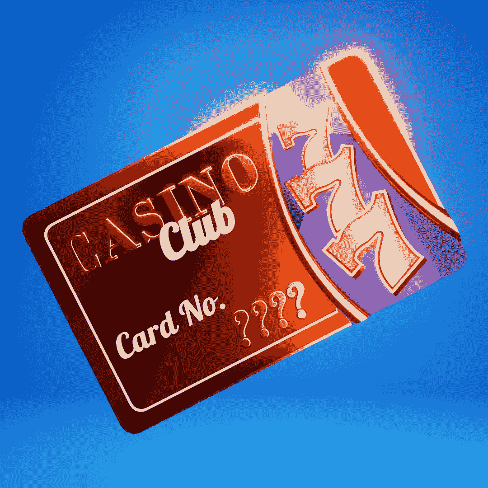

# 你会投资元宇宙的彩票业务吗？

> 原文：<https://medium.com/coinmonks/would-you-invest-in-a-lottery-business-in-the-metaverse-9d956aed3a9e?source=collection_archive---------14----------------------->

元宇宙的第一家彩票公司刚刚开业，但围绕这一创新理念的宣传已经达到了顶峰。事实上，它被比作人们第一次对元宇宙本身感到兴奋的时候，现在它终于来了，人们想知道他们是否应该投资它。但是是什么让彩票业务如此特别呢？请继续阅读，寻找答案！
[了解更多信息](https://www.metacardsclub.com/med)

# 虚拟彩票区块链

虚拟现实正在快速发展，很容易想象有一天你可以走在虚拟世界的街道上，看到每个人都可以使用的彩票站。为了了解在这种情况下能赚多少钱，让我们考虑一下现实世界的统计数据。目前，全球每年彩票收入超过 1000 亿美元——这个数字每年都在增加。

# 它是如何工作的？

基于区块链的技术，所有的支付都受到智能合同的保护，没有办法欺骗或使用欺诈。首先，用户必须安装 Meta Mask。其次，所有者可以从安全的智能合同中提取利润。将有一个智能合同，旨在运行随机数生成，将决定刮刮卡的输赢或谁是彩票的赢家。
之后，玩家可以开始买票，试试运气。

# 为什么人们会玩这个游戏？

彩票最大的抽奖是头奖。人们希望赢得数亿美元，并为生活做好财务准备。虽然人们确实喜欢找乐子，但他们也想赢钱，彩票给了他们实现梦想的机会。你永远不会通过赢得另一项挑战或在工作中获得晋升而成为世界上最富有的人；如果你想一夜暴富，只需要买几张彩票。那为什么没人玩呢？

# [机遇](https://www.metacardsclub.com/med)

你认为投资元宇宙第一家彩票公司的潜力值得冒险吗？“第二人生”中的彩票已经存在快 9 年了，实际上有数百万用户。每张票的平均价格约为 1.50 美元，仅这一项每月就能获得近 100 万美元的收入！这种彩票产品被称为粘性产品，因为人们会一次又一次地回来购买彩票。在我们看来，彩票在“第二人生”和 Sansar 这样的虚拟世界中有着巨大的潜力。对于那些无法进入正规赌场甚至在线赌博网站的人来说，这将是一个游戏规则的改变。我们希望我们能把他们最喜欢的娱乐活动带到元宇宙，从而有所作为

# 加入我们:

[# metacadsclub](https://www.metacardsclub.com/med)
[推特](https://twitter.com/Metacardsclub)

> *加入 Coinmonks* [*电报频道*](https://t.me/coincodecap) *和* [*Youtube 频道*](https://www.youtube.com/c/coinmonks/videos) *了解加密交易和投资*

# 另外，阅读

*   [Bookmap 评论](https://coincodecap.com/bookmap-review-2021-best-trading-software) | [美国 5 大最佳加密交易所](https://coincodecap.com/crypto-exchange-usa)
*   最佳加密[硬件钱包](/coinmonks/hardware-wallets-dfa1211730c6) | [Bitbns 评论](/coinmonks/bitbns-review-38256a07e161)
*   [新加坡十大最佳加密交易所](https://coincodecap.com/crypto-exchange-in-singapore) | [购买 AXS](https://coincodecap.com/buy-axs-token)
*   [红狗赌场评论](https://coincodecap.com/red-dog-casino-review) | [Swyftx 评论](https://coincodecap.com/swyftx-review) | [CoinGate 评论](https://coincodecap.com/coingate-review)
*   [投资印度的最佳密码](https://coincodecap.com/best-crypto-to-invest-in-india-in-2021)|[WazirX P2P](https://coincodecap.com/wazirx-p2p)|[Hi Dollar Review](https://coincodecap.com/hi-dollar-review)