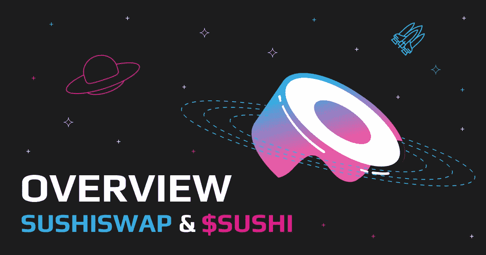

# 你想要一些寿司吗？SushiSwap 和$寿司评论

> 原文：<https://medium.com/coinmonks/would-you-like-some-crypto-sushi-sushiswap-and-sushi-review-629a5fbc6d10?source=collection_archive---------34----------------------->

SushiSwap(寿司)于 2020 年 9 月由两位匿名开发者创造，他们分别是 Chef Nomi 和 0xMaki。这篇文章概述了你需要知道的关于寿司钱包的所有知识，以及如何购买寿司硬币。

# SushiSwap 是什么？

在以太坊区块链上，SushiSwap 是最流行的去中心化应用(dApp)之一。SushiSwap 的分散交易(DEX)协议采用了自动做市商(AMM)的概念。简单来说，SushiSwap 没有订单簿。相反，它使用智能合约，随着算法设定价格，购买和出售加密货币变得更加容易。

SushiSwap 是一个基于以太坊的分散式交换机，它是从 Uniswap 克隆而来的。SushiSwap 允许您兑换各种代币和使用其他金融服务。这个系统中没有中央集权。相反，它使用智能合约或代码来完成交易，这些合约或代码将其他用户提供的流程和流动性自动化。

# SushiSwap 是如何工作的？

SushiSwap 只能用于将一种加密货币兑换成另一种加密货币；它不能用于将法定货币转换为加密货币，反之亦然。这是因为它采用了自动做市商模式。

用户可以通过向 SushiSwap 发送等值的两种加密货币来增加流动性。他们获得流动性提供商(LP)代币，并可以开始获得回报。用户可以通过将新创建的 LP 代币存入 yield farms 获得额外的 APY 奖励。这为用户留在流动性池中提供了额外的激励。

# SushiSwap 项目的主要特点

SushiSwap 有几个特点，让它区别于其他去中心化的应用。SushiSwap 等分散式交易所已经成为金融生态系统的重要组成部分，因为它们提供了平等的交易机会。SushiSwap 的主要特点包括:

**创建流动性池** : SushiSwap 通过使用智能合约来创建流动性池。交易者可以访问用户在协议上锁定的资产。流动性池的所有捐助者都获得两种好处:交易者在获取资产时支付的费用形式，以及代币形式。这些费用在所有贡献者之间按照他们的贡献比例分配。

**通过 BentoBox 和 Kashi** 提供贷款:SushiSwap 的 BentoBox 是一个贷款市场。因此，用户必须在一份合约中保留交易对的每个令牌。这是通过 Kashi 实现的，Kashi 是一个基于 BentoBox 的贷款和保证金交易平台。这是一种为各种合成资产、代币和加密资产的借贷和抵押创建高度个性化和高效协议的方法。

通过 Bentobox 支持多个 dapp:bento box 是许多分散应用(dapp)的保险库。此外，用户可以从 BentoBox 的功能中获益。使用 BentoBox 创建 dApps 的最大好处是它们已经被批准，并为客户节省了网络钱包费用。此外，这些 dApps 的气体效率极高，允许用户以更低的成本与之交互。

# 寿司代币

寿司币是一种基于 ERC20 的令牌，为 SushiSwap(一种基于以太坊的分散式加密货币交易所)和自动化做市商提供动力。寿司代币(Sushi)的持有者可以参与社区治理，并以代币为赌注获得 SushiSwap 代币交易费的分成。

流动性挖掘用于向 SushiSwap 流动性提供者分发$Sushi token。寿司币(寿司)的最大供应量为 2.5 亿，在 241，602，267 个寿司中流通供应量超过 1.92 亿个寿司币。

根据 2022 年 4 月 16 日从 Coingecko 获得的数据，SushiSwap token 目前的价格为 3.29 美元，市值为 635，324，328 美元。目前的交易量为 96，316，791 美元，市场支配地位估计为 0.02%。

# SushiSwap 产品

**Swap** : Swap 允许用户将一种加密货币换成另一种，比如将你的系绳(USDT)变成寿司币(寿司)。

**限价单**:限价单产品使 SushiSwap crypto 交易商能够在维持相同基础资本的同时，对各种代币下达各种限价单。分散限价订单的供应商，如寿司交易所，不必承担任何风险，因为填充机器人从每一笔填充订单中产生利润。

MISO 是一套开源智能合约，旨在尽可能简单地在 SushiSwapexchange 上启动一个新项目。MISO 是 Sushi crypto exchange 社区推出项目的独特平台。

BentoBox:BentoBox 是一个代币金库，为投入其中的资金支付利息。BentoBox 的突出特点是它能够跟踪用户的存款，在资金被使用时使用人工余额来计算他们的闲置现金。因此，BentoBox 为这些基金创造了收入，同时防止了损失。

**Kashi Lending:**Kashi 是一个借贷和保证金交易平台，允许任何人建立高效的借贷市场，并抵押一系列违约代币、稳定硬币和合成资产。

# SushiSwap 路线图

2021 年 1 月 10 日，SushiSwap 在一篇名为“2021”的博客文章中公布了其新计划。

DEX 平台表明，DeFi 领域即将出现的重大进展将具有复杂和先进的功能，例如由 Rune 和 Moonbeam 实现的跨链 DEX、Polkadot 实施以及真正分散的治理系统。

根据新闻稿，该网站还将展示新贷款产品 BentoBox 的介绍。此外，还展示了早期宣布的项目的更新，包括名为“Mirin”的 v2 发布

除此之外，该平台提到了与 ArcherDAO 的潜在集成。此外，对算法稳定器的支持将很快添加到、DSD 和 BAO。

SushiSwap 的联合创始人 0xMaki 讨论了不断扩大和激励良好的 SushiSwap 的想法。他表示，他希望通过让人们加入一个“道”来鼓励人们将资产产品化。他计划向更广泛的受众介绍 DeFi 生态系统，并在 Sushi 平台上突出展示新兴的分散式应用程序。

> 加入 Coinmonks [电报频道](https://t.me/coincodecap)和 [Youtube 频道](https://www.youtube.com/c/coinmonks/videos)了解加密交易和投资

2021 年的主要计划是转移到一个新的领域，将 SushiSwap 作为渴望生态系统的一个 OpenOrg 部分，而不是一个自动化市场。

目前，SushiSwap 已经完成了他们路线图中的一些项目，比如 BentoBox，而其他的项目还在后面。

# 探索竞争对手

让我们看看一些竞争平台，以便更好地理解我们到底应该选择哪一个。

# Uniswap

SushiSwap 和 [Uniswap](https://uniswap.org/) 是去中心化的平台，SushiSwap 是 Uniswap 的一个分支。然而，SushiSwap 和 Uniswap 之间有一些显著的区别。

**流动性挖掘**:uni swap 上没有流动性挖掘程序。在初始令牌分发后，用户没有任何其他选择来获得 UNI 令牌，但他们可以通过将令牌用于 SUSHI 治理令牌来利用 SushiSwap 的主动流动性挖掘计划。

**新硬币奖励系统** : Uniswap 对在其平台上推出的新硬币不给予任何额外奖励，而 SushiSwap 包括一个“Onsen Program”功能，作为新硬币的流动性提供者。该平台通过温泉机制向这些较新代币的持有者提供更大的寿司奖励，从而鼓励更近期和更小的项目。

# 1 英寸

SushiSwap 和 [1inch](https://1inch.io/) 都是去中心化的平台。此外，他们还拥有对提案投票的治理令牌。然而，这可能是相似之处的终点，因为它们是显著不同的平台，下面是它们的差异:

**平台:** SushiSwap 是一个分散的平台，通过点对点网络提供标准的金融服务。赌注，借贷，借款，交易都有。另一方面，1inch 是一个 DEX 聚合器，它将许多 DeFi 系统整合在一起。你可以在 1inch 上交易，但它专门帮助用户执行有利可图的交易。

**流动性:** SushiSwap 奖励流动性提供者，却苦于找不到流动性。另一方面，像 1 英寸这样的聚合器解决了流动性不足的问题。它们通过跨平台搜索来提高流动性和执行速度。

# 寿司交易:在哪里和如何进行？

寿司可以用几种不同的方式交换。使用像 Swapzone 这样的寿司硬币交换平台是最常见的方式。在 Swapzone 上，用户可以快速找到最佳的 SushiSwap 利率，并将任何加密货币转换为寿司代币。

[Swapzone](https://swapzone.io/) 提供最佳汇率，为您提供有关加密兑换优惠和服务的信息，以选择最佳方案并立即兑换加密货币，费用低廉，无需注册。[在这里](https://swapzone.io/currencies/sushiswap)你可以实时找到寿司的最优惠价格，并按照简单的流程交换寿司，无需 KYC 验证。

**进一步阅读:** [**什么是 Uniswap，如何将 BTC 兑换成$UNI？**](/@swapzone/what-is-uniswap-and-how-to-exchange-btc-to-uni-17c47014d760)