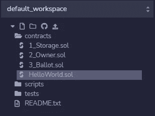
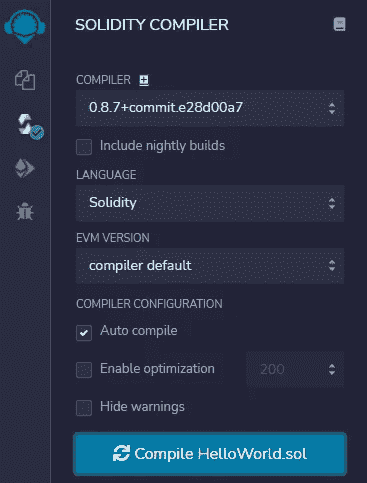
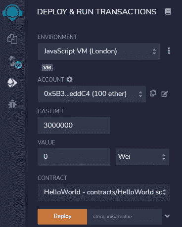
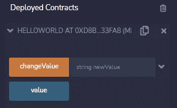
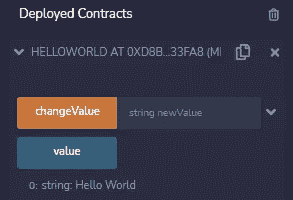
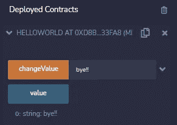

# 使用 Solidity 编写您的第一份智能合同

> 原文：<https://medium.com/coinmonks/write-your-first-smart-contract-using-solidity-c8e335d5ac0e?source=collection_archive---------20----------------------->


在写我们的第一个合同之前，让我简单介绍一下智能合同和可靠性。

## 什么是智能合同？

> “智能合约”只是一个运行在以太坊区块链上的程序。它是代码(它的功能)和数据(它的状态)的集合，驻留在以太坊区块链上的一个特定地址。

## 什么是扎实？

> Solidity 是一种面向对象的编程语言，用于编写智能合同。如果您对 Python 或任何花括号语言有经验，您可以找到一种语法熟悉的语言。

# 我们写点代码吧！！

我将使用[混合集成开发环境](https://remix.ethereum.org/)来开发合同。如果你是初学者，我建议你使用相同的。

我们要用 Solidity 写一个 Hello World 程序。

首先，在 contracts 文件夹下，创建一个名为“HelloWorld.sol”的新文件。确保您用'保存了文件。sol '在文件名的末尾。创建文件后看起来是这样的。



让我们打开文件，开始编写代码。

在文件的顶部，应该提到 solidity 版本，我使用的是 v0.8.0。为了避免冲突，请使用与我相同的版本。

要创建合同，我们使用关键字“合同”。合同关键字后面是合同的名称。所有合同代码，如变量、函数、修饰符等。括在大括号内。这个语法看起来类似于 JavaScript 中的一个类。

我们将在契约中声明一个名为“value”的状态变量。你可以随意命名。

如你所见，上面写着

```
string public value;
```

让我们分解这一行代码。“string”是变量的类型，“public/private”是访问修饰符，“value”是变量名。因此，声明变量的语法是:

```
<variable_type>  <access_modifier>  <variable_name>;
```

现在，我们需要在创建契约时给变量分配一个字符串。像许多其他编程语言一样，Solidity 也有一个适当的“构造函数”。一旦创建了协定，就执行构造函数代码，该代码用于初始化协定状态。与类类似，一个协定只能有一个构造函数。

我们必须向构造函数传递一个字符串来初始化' value '变量，这里我们传递一个名为 initialValue 的字符串。

数据类型“string”和变量名“initialValue”之间的“memory”关键字是什么？关键字“memory”用于保存临时值。它在函数调用之间被擦除。

因此，在函数中传递数组、结构或映射类型的语法是:(字符串基本上是一个字符数组)

```
<variable_type>  memory  <variable_name>;
```

我们使用符号“=”将“initialValue”赋值给“Value”。

```
value = initialValue;
```

最后，我们需要创建一个函数，以便在创建合同后更改值。让我们把这个函数命名为“changeValue”。

要声明一个函数，我们使用关键字 function。

希望您理解了数据向函数的传递。

```
(string memory newValue)
```

“public”关键字在函数声明中做什么？

我们必须将函数声明为“public”或“private”。“public”表示可以从契约外部调用该函数，而声明为“private”的函数不能从契约外部调用。

# 您现在已经成功地编写了您的第一个智能合同！！🤩🤩

现在让我们来编译 solidity 代码。选择相应的编译器版本并点击 compile。通常，在 Remix IDE 中，自动编译是启用的。因此，当您保存合同时，代码会自动编译。



现在我们有了编译好的代码，为了测试我们必须部署它的契约。确保在环境中选择了“JavaScript VM”。



在部署契约之前，我们必须向我们创建的构造函数发送一个值。因此，在 deploy 旁边，键入 Hello World 并部署契约。您可以在下面看到已部署的合同。



Remix IDE 允许我们使用按钮与智能合同功能进行交互。这是 Remix 提供的一个很酷的功能。

现在点击“值”按钮:它应该显示我们在创建合同时发送的数据，即 Hello World。



您可以通过使用“changeValue”按钮和数据来更新值，然后使用“value”按钮来检查值是否已更改。



是的，它有！！我们的智能合同运行良好。

感谢你阅读这篇文章，❤

要了解更多关于区块链和智能合约的信息，请访问[ontheether.com](https://www.ontheether.com/)。

评论下你想学的区块链话题。

拍手声👏如果这篇文章对你有帮助。

在 [LinkedIn](https://www.linkedin.com/in/ajith-m-doodlebug/) 和 [GitHub](https://github.com/ajith-m-doodlebug/blockchain) 上和我联系。