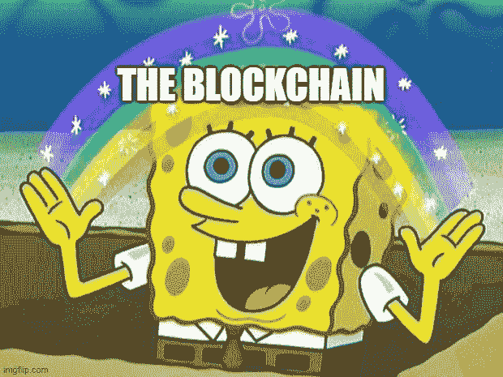
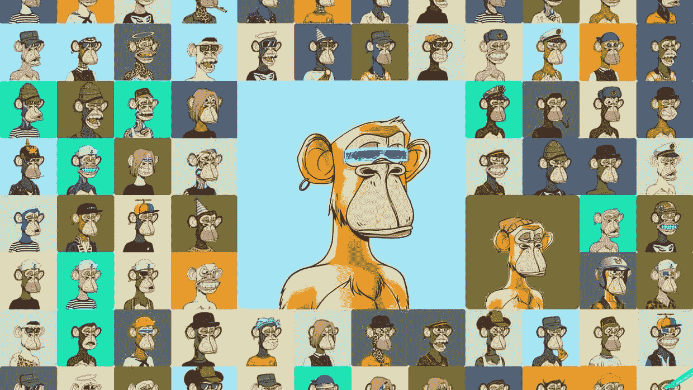
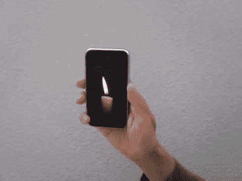
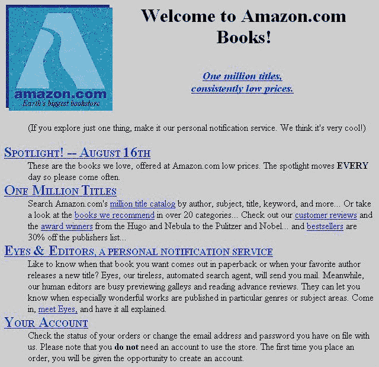
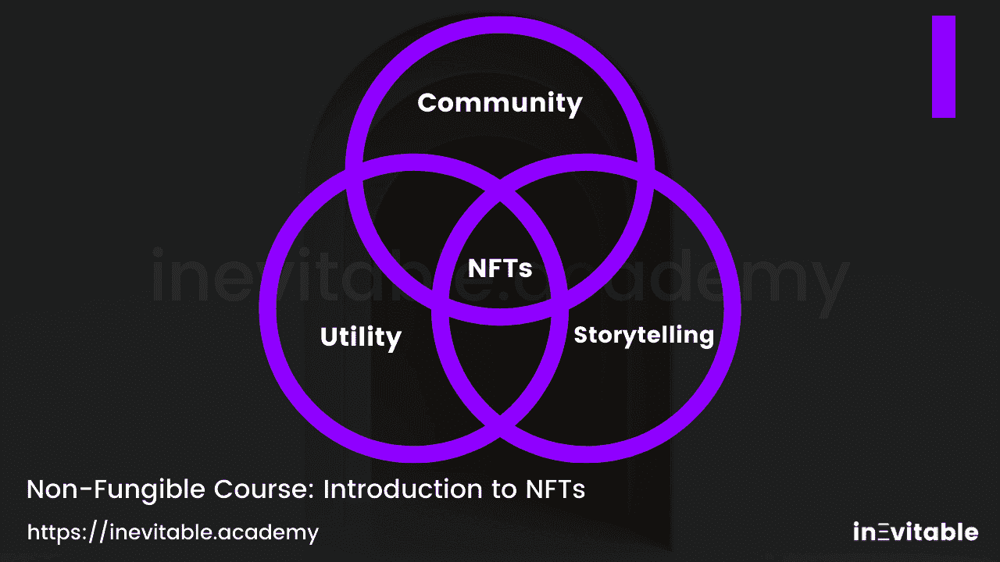
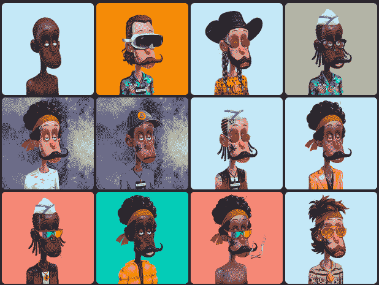
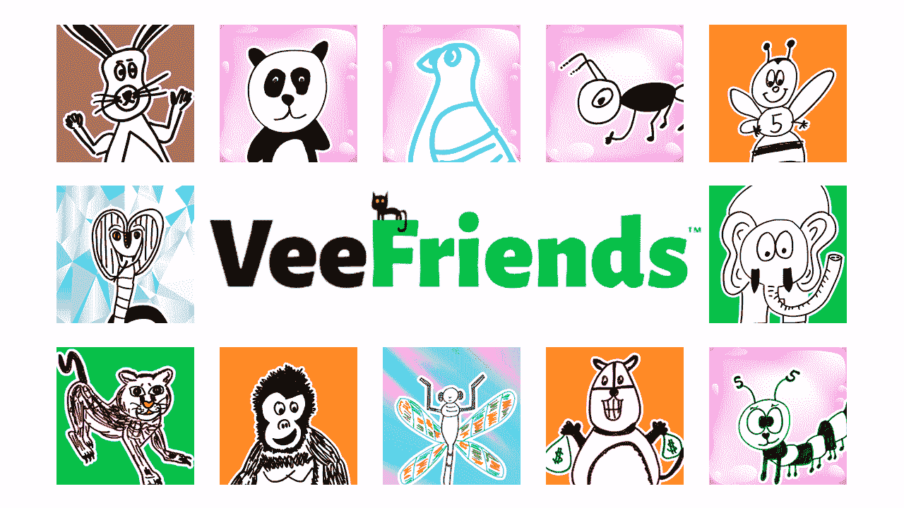
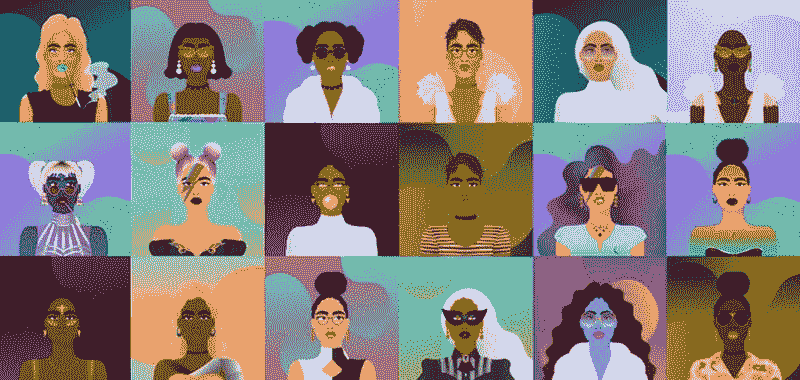
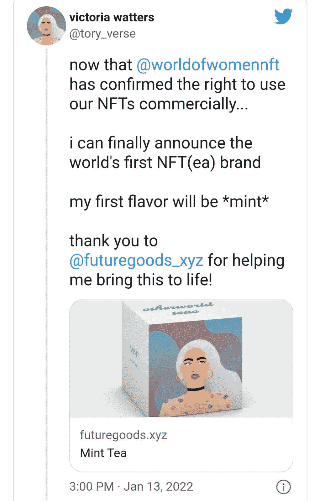
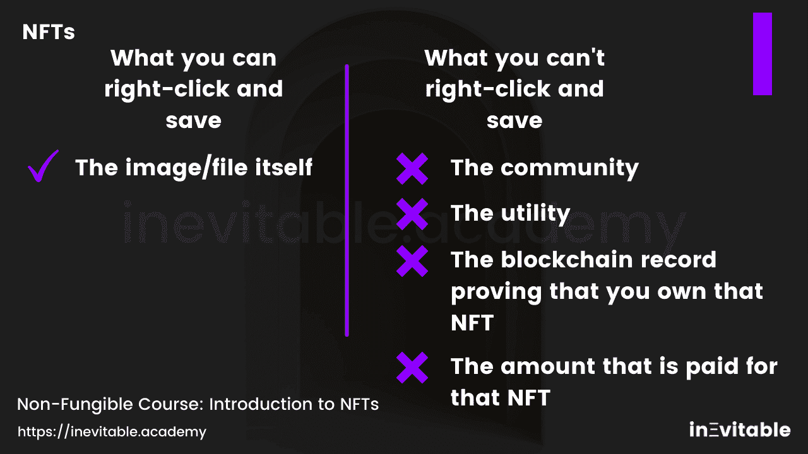

# 什么是 NFT，啊？

> 原文：<https://medium.com/coinmonks/wtf-are-nfts-huh-2c39cfbd0d7?source=collection_archive---------35----------------------->

NFT 代表不可替换的令牌。好吧，这还没说清楚。可互换的项目是那些可以在用户或组织之间互换的项目，并且都具有相同的价值。一张 5 美元的钞票和其他 5 美元的钞票价值相同。然而，想象一下你有一张有埃隆·马斯克签名的 5 美元钞票。

那么，这张钞票的价值可能不再仅仅是 5 美元。对于埃隆·马斯克的粉丝——疯狂的人——来说，它可能价值 1000 美元、10000 美元、100000 美元。对我妈妈来说，它仍然值 5 美元，因为她甚至不知道埃隆·马斯克是谁，也不在乎。对于一个埃隆·马斯克的超级粉丝来说？这个账单可能是个大问题。

那么，我们可以说，每一件 NFT 都是独一无二的——至少在理论上是如此。

在数字世界中，**NFT 几乎可以是任何东西**:一件艺术品、一首歌、一个迷因、一个 gif、一个视频、一本书、一个游戏项目、一个证书(是的，你这门课的证书将是一个 NFT，酷吧？).

**好吧，但是为什么非功能性测试现在如此重要？**

数字资产并不是什么新鲜事物。艺术品？一张照片？一首歌？一本电子书？它们已经作为数字文件存在了几十年。我们整天通过 WhatsApp、Messenger 或 Instagram 交换照片。

在他的书《不可避免的 T4:理解将塑造我们未来的 12 种技术力量》中，作者凯文·凯利说:

*“互联网是世界上最大的复印机。在最基本的层面上，这台机器复制了我们乘坐它时的每一个动作，每一个角色，每一个想法。为了将信息从互联网的一个角落发送到另一个角落，通信协议要求整个信息在途中被复制几次。一些数据位可能会在一天内被复制数十次，因为它们会在内存、高速缓存、服务器、路由器之间来回循环。科技公司通过出售促进这种无休止复制的设备赚了很多钱。如果某样东西可以被复制——一首歌、一部电影、一本书——而且它接触到了互联网，它就会被复制。”*

互联网的丰富有其优点。它带来了病毒式传播和接触。然而，当我们想给一个项目的排他性怎么办？**因此，NFT 是将高度可复制的数字物品转化为独特物品的完美技术。在互联网上归属所有权的困难现在有了解决办法。**

好吧，但是互联网已经存在将近 30 年了。那么，为什么 NFT 的繁荣只是现在才发生呢？

区块链。

(我就是喜欢那个迷因)。

区块链是一个不断增长的记录列表，称为块。这些块使用加密技术连接在一起。区块链就像一本不变的公开的记录书。任何人、任何地点、任何时间都可以对所有内容进行审计。这场革命始于 2008 年提出、2009 年推出的第一个大区块链:比特币。

你可以想象，NFT 生活在区块链。它们是将特定物品的所有权授予特定人的一种方式。所有这一切都是基于区块链，**任何人都可以独立地审计，无需任何中央机构的许可，因此不受审查。**

关于区块链有很多话要说，但这不是现在的重点。这里重要的一点是，你可以清楚地理解区块链是使 NFTs 成为可能的技术。它归属所有权，是不可改变的和分散的。

**“好吧区块链先生，我需要一些例子”。**

正如我们所说的，NFT 实际上可以是任何东西，从 JPEG 到将财产所有权分配给个人的文档。令牌化发票？检查。法律文件？检查。一场活动的门票？哦是的。在接下来的课程中，我们将为您带来几种不同的 NFT 的例子和用途，但今天我们想快速向您介绍世界上最具标志性的 NFT 集合之一:**无聊猿游艇俱乐部**。

无聊猿游艇俱乐部收集了 10，000 个独特的无聊猿 NFT——具有许多不同身体属性的猿的图像。

当宇迦实验室于 2021 年 5 月发布它们时，每只猿的价格约为 180 美元。今天，每只猩猩至少值 30 万美元。它们已经成为许多人在网上使用的奢侈品，就像我们在现实世界中使用衣服、汽车和其他物品一样。不仅如此:无聊猿已经成为 NFT 世界最有影响力的社区之一，无聊猿游艇俱乐部是当今最具标志性的 NFT 收藏之一。

“好吧，我很困惑，”你可能会说“为什么有人会为一张网上的猿类图片付费呢？这太疯狂了。这没有任何意义”。是的，我明白了。我们自己已经这样想过了。让我们开始吧。

还记得适用于 iPhone 的第一批应用程序吗？是啊，就实用性而言，它们并不令人印象深刻。

吹灭 iPhone 蜡烛就灭了？这听起来可能很傻。新技术一出现就被低估是正常的。

第一个亚马逊网站怎么样？

乍一看，第一个智能手机应用程序和第一个网站听起来像是笑话。毕竟，它们很简单，对吗？

技术专家、安德森·霍洛维茨公司的合伙人克里斯·迪克森在 2010 年发表的一篇文章中写道:****下一个大东西将开始看起来像一个玩具*** *。互联网经济令人惊讶的一件事是，今天的顶级互联网资产名单与十年前的名单有多么不同。现任者偷偷摸摸搞新的大东西的原因是下一个大东西总是开始被当作“玩具”而被抛弃。“(……)颠覆性技术被视为玩具，因为当它们首次推出时，它们“未能满足”用户需求。”**

*这是理解新技术范式的基础。我们正面临一场革命。就像互联网的开始一样。就像移动的开始一样。你猜怎么着，手机和互联网也开始看起来像玩具。*

***延迟时间***

*我们在《不可避免》的使命是帮助数百万用户登陆 Web 3 和元宇宙，专注于高水平的内容和技术。如果你喜欢这堂课，记得通过[点击这里](https://inevitable.lt.acemlna.com/Prod/link-tracker?redirectUrl=aHR0cHMlM0ElMkYlMkZpbmV2aXRhYmxlLmFjYWRlbXklMkZpbnRyb2R1Y3Rpb24tdG8tbmZ0cy10aGFuay15b3UlMkYlM0ZmaXJzdG5hbWUlM0RNdXN0YWZpenVyJTI2ZW1haWwlM0Rtcjk3NTcyNDIlNDBnbWFpbC5jb20lMjZjb21wYW55JTNEU3R1ZGVudCUyNmNvdW50cnklM0RCYW5nbGFkZXNoJTI2am9iX3RpdGxlJTNEU1RVREVOVCUyNmF1dG9EZXRlY3QlM0QxJTI2cmVmZXJyYWxDb2RlJTNEJTI2dXRtX3NvdXJjZSUzREFjdGl2ZUNhbXBhaWduJTI2dXRtX21lZGl1bSUzRGVtYWlsJTI2dXRtX2NvbnRlbnQlM0Qxc3QlMkJMZXNzb24lMjUzQSUyQldURiUyQmFyZSUyQk5GVHMlMjUzRiUyNnV0bV9jYW1wYWlnbiUzRERheSUyQjE=&sig=GuLZTR5V5dm3o8dmhQnCBX1FW3irzuuqHjCAGTSKasmW&iat=1647745345&a=%7C%7C611818266%7C%7C&account=inevitable%2Eactivehosted%2Ecom&email=uQLwTufj7Ml62fkqpgOfnUzkASpiHornD%2Fz2wZTd1jg%3D&s=eb97f19c1bb48dc2b6f82bf6a2ea5239&i=13A15A2A20)邀请你的朋友和同事。*

***新奇先于实用***

*Behance 的联合创始人 Scott Belsky 在他的书*中分享了另一个可以帮助我们理解 NFTs 的想法。**

**当你为客户打造新产品和体验时，在它们被证明有用之前，考虑它们将如何新颖——甚至像游戏一样。通常，人们接触新产品和体验仅仅是出于兴趣和新奇，只有随着时间的推移，他们才会发现产品的效用。**

*NFT 可能一开始看起来像玩具或废话，但这将会改变。如此如此如此之快。跟我重复:新奇先于实用。就像最初的移动应用程序或互联网的开端一样。*

*不要误会。NFT 不是金字塔计划或快速致富计划——尽管在某些情况下存在投机和交易因素。这些往往是最终成为公众对 NFTs 看法的因素，因为它们是最受关注的。但是 NFTs 的真正力量与另外三个因素有关:**社区、效用和讲故事**这将在未来几年变得越来越清晰。*

**

*让我们深入了解这些元素。*

***社区***

*在理解 NFTs 时要记住的最重要的一个方面是社区方面。互联网的未来更多的是“小”社区，在那里有共同兴趣的人们分享经验，而不是必然更大、更通用的社区。*

*事实上，这已经发生了。你有没有注意到几乎任何话题都有 Instagram 页面或 YouTube 频道？社区聚集在这些内容制作者周围。NFT 超越了这一趋势，有助于利用这一趋势。*

*NFT 不仅仅是一种新的创作形式，也是创作者、公司和品牌与其受众之间的一种新的关系形式。*

**“创造、创造、创造——未来 10 年，创造将和消费以及围绕消费的社区一样重要，所以创造不再是唯一的事情。如果说过去 10 年是关于消费的——我们购物更多，浏览更多，狂看更多——那么每一件事背后都有创造。”* —微软首席执行官塞特亚·纳德拉。*

*为了更清楚地说明这一点，我们为您带来了一个非常适合社区方面的 NFT 系列示例:*

**

*秘密大麻俱乐部是一个由 10，000 个 NFToker 头像组成的集合，就像上面这些一样，捕捉了与大麻世界有关的人们的想象力。当你从加密大麻俱乐部购买 NFT 头像时，你就加入了一个由来自全球各地的大麻爱好者组成的社区，他们讨论与这个世界有关的一切。*

*当你在社交网络上使用这个集合中的头像作为你的个人资料图片时，你是在传达你是那个社区和那个世界的一部分。例如，当我们穿着洛杉矶湖人队的球衣时，也会发生同样的事情。那个配件传达了我们的一些信息。对于 NFT 来说也是如此。*

***效用***

*另一个重要的方面与实用性有关。这是一个仍在发展中的领域。我想说，我们还没有看到任何关于 NFT 实际上可能有用的东西。10 年后，我们会像 2008 年看待 iPhone 应用程序一样，回顾今天 NFTs 的效用。*

*尽管如此，我们已经对 NFT 有了很大的用处，很多还在实验阶段。最酷的案例之一来自著名数字影响者加里·维纳查克的 VeeFriends 系列。*

**

*拥有一个 vee friend——上面的例子之一，有 10，265 个可用——可以让你参加与其他 VeeFriends 持有者的独家活动，独家会议，以及与 GaryVee 本人的独家活动。*

*这只是 NFT 世界中已经存在的公用事业的一个简单例子。在接下来的几年里，我们应该对可能性进行更多的探索。*

*大部分实用程序与 NFTs 的最基本的方面之一——智能合同有关。下节课我们会讲更多。*

***讲故事***

*世界上最大的品牌都是伟大的故事讲述者。想想像星巴克、可口可乐、耐克和苹果这样的品牌。没有讲故事支持一个不好的产品，这是真的。但是一个没有很好的故事情节的真正好的产品是一个没有人谈论和使用的产品。这同样适用于 NFT 的世界。*

*像《女人的世界》这样的系列之所以能有今天的成就，是因为围绕它产生了强有力的故事。然而，与更多“传统”品牌的世界不同，在非传统品牌的世界中，这种类型的故事可以在社区中更广泛地传播。*

**

*以《女人的世界》(WoW)为例，**拥有该系列中的一件 NFT 作品，所有者就有权随心所欲地探索 NFT 的形象。***

*例如，WoW 的所有者维多利亚·沃特斯(Victoria Watters)决定利用她的女性世界 NFT 推出一个茶叶品牌。*

**

***这是一份仍在构建中的元素列表。***

*当然，除了社区、效用和讲故事之外，这里还有很多其他因素，比如灵活性、交易或艺术欣赏。艺术是极其主观的。交易和灵活性是 3 个最重要元素的副产品:社区、效用和讲故事。*

*这些因素不能孤立地分析。一个 NFT 收藏可以包含社区、实用、讲故事等元素——事实上，最强大的是那些设法结合这些元素的元素。*

***“这一切都很酷……但是如果我只需右键单击并保存一个 NFT 呢？”***

*没有什么能阻止你右键点击并拯救一只无聊的猿。你可以随时这样做。同样，你可以打印一张蒙娜丽莎的照片，挂在你的客厅里。*

*但你不能只是围绕着《蒙娜丽莎》原著来印刷故事情节。你肯定不能印出蒙娜丽莎原作的价值。*

*同样，下面是你**可以**右键点击并保存的关于无聊猿猴的内容:*

*-猿的形象*

*下面是你**不能**右键点击并保存的内容:*

*-区块链上的所有权记录证明你确实拥有那只无聊的猩猩*

*-无聊猿**社区***

*-无聊的猿类**实用程序***

*-数十万或数百万美元被用来购买无聊的猿类*

**

> *加入 Coinmonks [电报频道](https://t.me/coincodecap)和 [Youtube 频道](https://www.youtube.com/c/coinmonks/videos)了解加密交易和投资*

# *另外，阅读*

*   *[加密复制交易平台](/coinmonks/top-10-crypto-copy-trading-platforms-for-beginners-d0c37c7d698c) | [五大 BlockFi 替代品](https://coincodecap.com/blockfi-alternatives)*
*   *【Crypto.com 评论】|[|](/coinmonks/crypto-com-review-f143dca1f74c)|[信用交易](/coinmonks/huobi-margin-trading-b3b06cdc1519)*
*   *[Bybit vs 币安](https://coincodecap.com/bybit-binance-moonxbt)|[stealth x 回顾](/coinmonks/stealthex-review-396c67309988) | [Probit 回顾](https://coincodecap.com/probit-review)*
*   *[顶级付费加密货币和区块链课程](https://coincodecap.com/blockchain-courses)*
*   *[CBET 评论](https://coincodecap.com/cbet-casino-review) | [库科恩 vs 比特币基地](https://coincodecap.com/kucoin-vs-coinbase) | [拜比特 vs 比特币基地](https://coincodecap.com/bybit-vs-coinbase)*