# WTF！我们已经在 web5 了吗？

> 原文：<https://medium.com/coinmonks/wtf-are-we-at-web5-already-22424c9b64ec?source=collection_archive---------10----------------------->

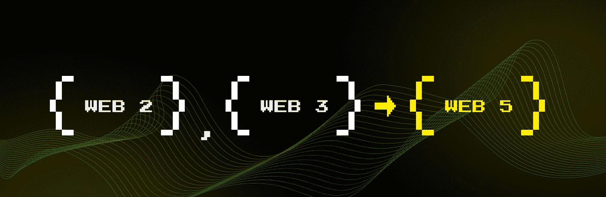

Source:[TBDEX](https://developer.tbd.website/projects/tbdex/)

从本质上讲，web3 和 web5 都旨在解决同一个基本问题；数据和身份的所有权。正如我们所知，在 web2 中，用户数据由拥有它们的公司所拥有和利用。例如，脸书利用用户数据产生广告收入。此外，web2 平台保留了很大一部分收益。例如，YouTube 的使用率为 45%，而在 web3 中，Opensea 的使用率为 2.5%。

尽管如此，web3 和 web5 之间最显著的区别是，web5 将建立在比特币区块链之上(假设杰克·多西是一个比特币最大值(T1))。

Web3 的目标是“区块链”和“令牌化”所有事物，而 Web5 只使用一种区块链——比特币——用于一个特定的用例:身份。Web5 是由[集团](https://block.xyz/)的子公司 [TBD](https://developer.tbd.website/) 宣布的。

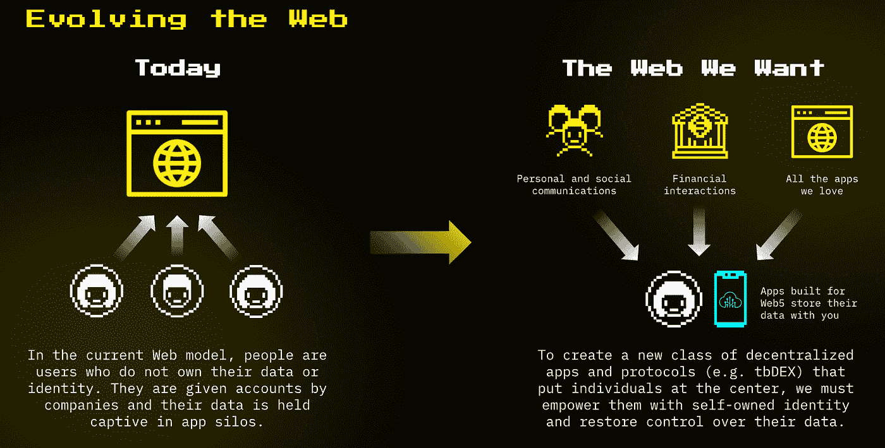

Source:[TBDEX](https://developer.tbd.website/projects/tbdex/)

杰克·多西认为 web5 是 web3 的杀手。

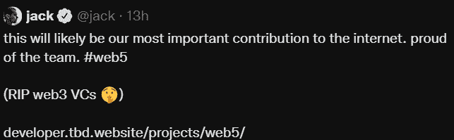

# 那么 web5 是如何工作的呢？

TBD 的 Web5 由软件组件组成。这些组件是:

*   分散标识符(did)
*   分散式网络节点(DWN)
*   可验证凭证(VC)
*   自主身份服务(SSIS)
*   自我主权身份 SDK

# 分散标识符(did)

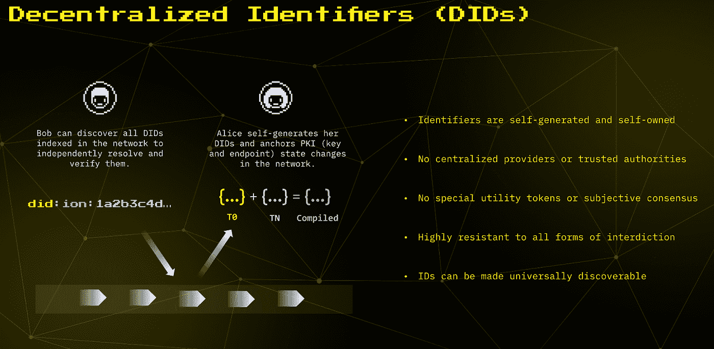

Source:[TBDEX](https://developer.tbd.website/projects/tbdex/)

Web5 利用了一个开放的、公共的和未经许可的 DID 网络，该网络运行在#比特币区块链之上。比特币网络有不能在网络上存储数据的局限性，但是，人们当然可以存储 did。DIDs 建立在[on](https://identity.foundation/ion/)之上。ION 是一个为比特币构建的第二层开放、无权限的网络。

这是基于[侧树协议](https://identity.foundation/sidetree/spec/)，它不需要令牌、可信验证器或额外的共识机制来运行(比特币爱好者不喜欢新的令牌😉).换句话说，没有什么是在区块链水平；没有智能合约，也没有像 EVM 那样的虚拟机。因此，没有新的令牌来保护单独的全球分类账。

ION 只允许 did 被他们的所有者停用，因此是抗审查的，并且包括注册功能以支持分散的包管理器和应用商店。理论上，分散式网络每秒钟可以处理数千次 DID 操作。

# 分散式网络节点(DWN)

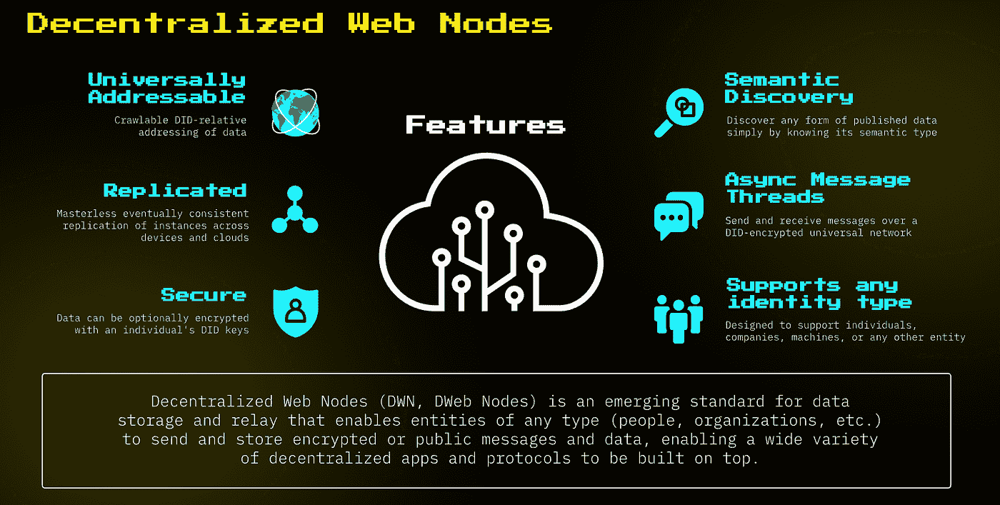

Source:[TBDEX](https://developer.tbd.website/projects/tbdex/)

Web5 的 DWN 是一个草案规范的参考实现。

这是一种数据存储和信息传输的机制，参与者可以使用它来定位与给定 DID 相关的数据。这将使实体(个人和组织)能够发送和存储加密或公开的消息和数据。因此，web5 为大量去中心化的应用和协议打开了大门。TBD 的目标是在 2022 年 7 月 1 日前生产出 1.0 版。

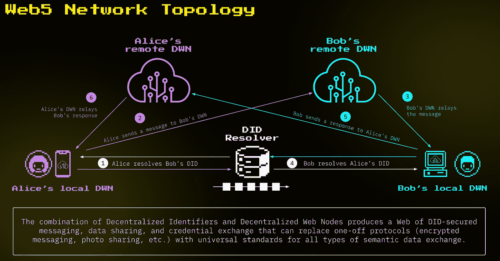

Source:[TBDEX](https://developer.tbd.website/projects/tbdex/)

# 可验证凭证(VC)

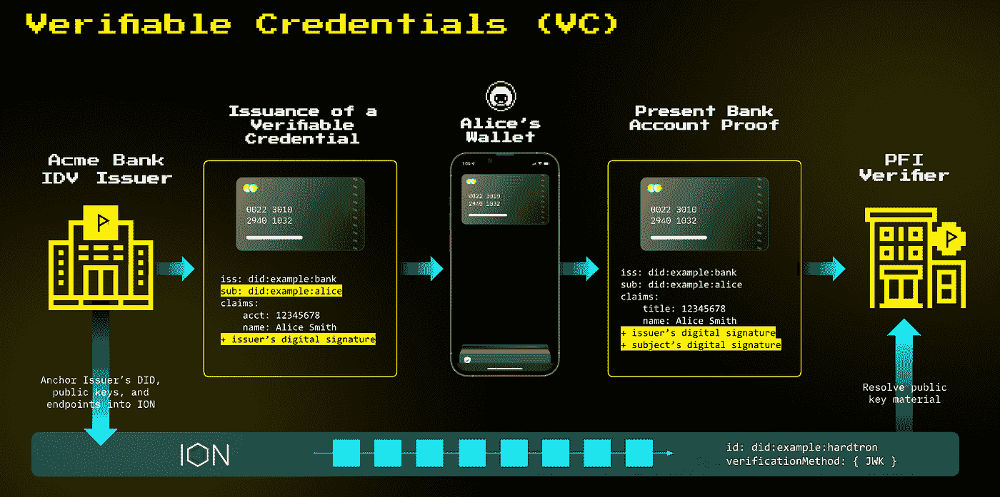

Source:[TBDEX](https://developer.tbd.website/projects/tbdex/)

VCs 是数字证书的开放标准。它们可以代表物理凭证中的信息，如护照、执照和银行记录。下面有更多关于风投的信息。

# 自主身份服务(SSIS)

SSIS 通过创建、签名、发布、监管、请求、撤销、交换、确认和验证它们来与 VC 交互。SSI 服务是包装 ssi-sdk 的 RESTful web 服务。SSIS 的核心功能包括但不限于:与可验证证书相关的标准交互、证书撤销、请求证书、交换证书、证书和其他可验证数据的数据模式、使用分布式 Web 节点的消息传递以及分布式标识符的使用。

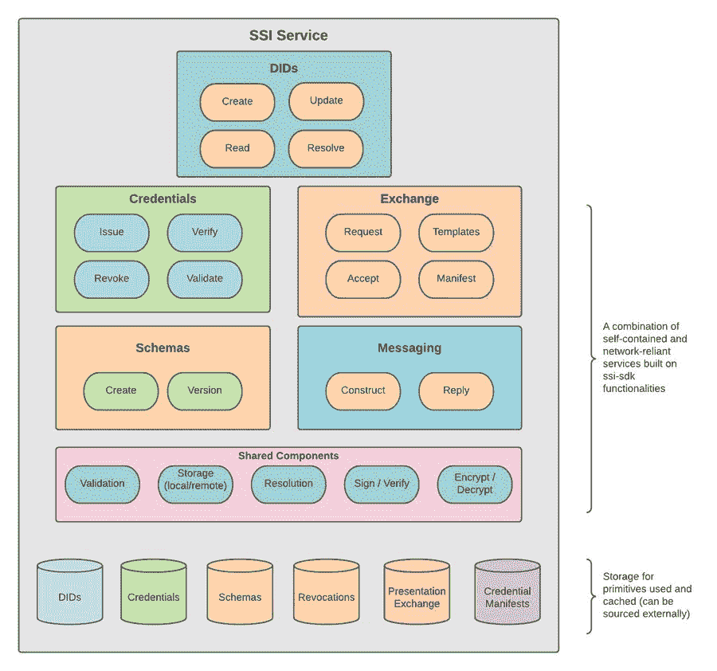

Source:[TBDEX](https://developer.tbd.website/projects/tbdex/)

# 自我主权身份 SDK

SSI-SDK 封装了自主身份标准。它旨在基于一组基于标准的原语提供灵活的功能，以模块化的方式构建 DID 应用程序——组件之间的依赖有限。

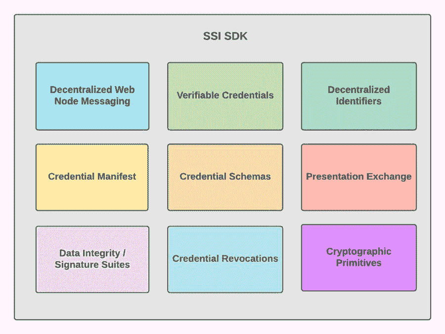

Source:[TBDEX](https://developer.tbd.website/projects/tbdex/)

上图勾勒了 SDK 的愿景。可以添加和/或删除标准。标准本身正在积极开发中，因此可能会发生变化。如果可能的话，我们的目标是找出我们构建实现所依据的标准的版本或修订版。

“ssi-sdk 旨在提供基于一组基于标准的原语的灵活功能，以模块化的方式构建分散式身份应用程序:组件之间的依赖性有限，”TBD 说。

# 什么是身份钱包

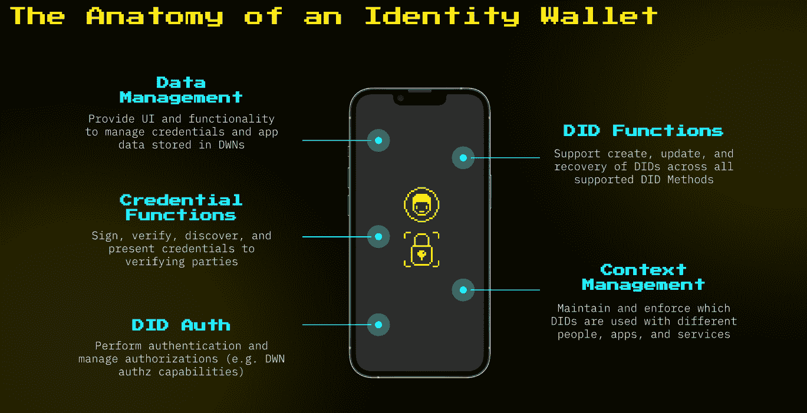

Source:[TBDEX](https://developer.tbd.website/projects/tbdex/)

身份钱包具有数据管理、DID 认证和授权的功能，能够签名、验证并向验证方提供凭证。

# PWAs 和 DWAs 的区别

渐进式网络应用程序(PWA)，基本上是你在苹果应用商店或谷歌应用商店找到的任何应用程序。它们存储在一个集中的应用服务器上。

分散式网络应用(DWA)

顾名思义，这些应用程序将存储在分散的网络上。

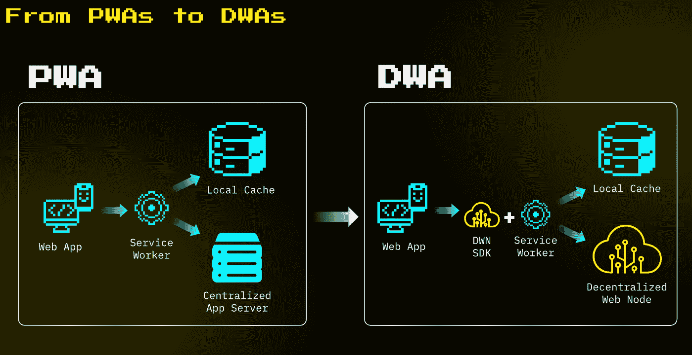

Source:[TBDEX](https://developer.tbd.website/projects/tbdex/)

# 用例

就我个人的经验而言，当我不得不从 Apple Music 转换到 Spotify 时，这非常令人恼火，因为我无法在这两个应用程序之间移植我的播放列表。Web5 解决这个问题。

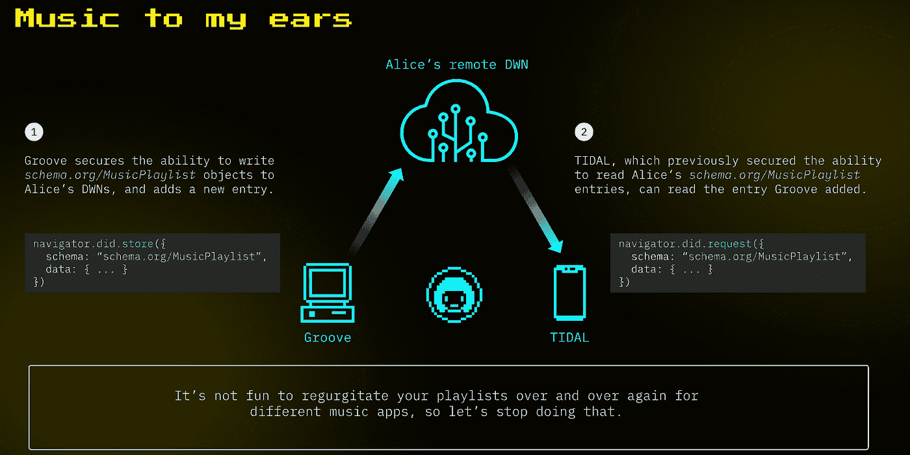

Source:[TBDEX](https://developer.tbd.website/projects/tbdex/)

另一个用例是计划假期，在预订机票、酒店和租车时减少摩擦。授予用户与酒店、航空公司和汽车租赁公司共享数据的能力，并使整个过程简单流畅。

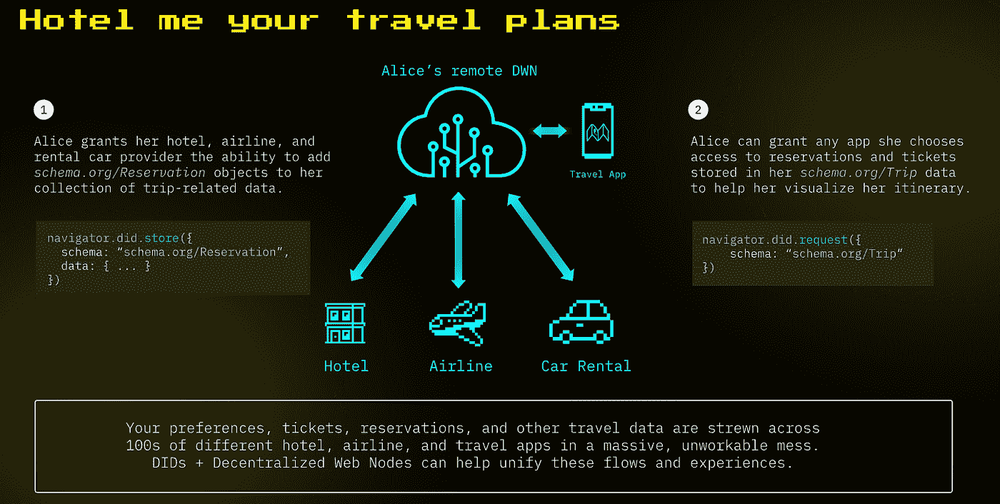

Source:[TBDEX](https://developer.tbd.website/projects/tbdex/)

最后，在购买新车时，我看到了这种应用，数据可以与注册机构、汽车制造公司、经销商和保险公司共享。毫无疑问，在未来几年，我们将看到这项技术的多次迭代。

我遇到的第一个 web5 应用[锡安 V2](https://blog.zion.fyi/announcing-zion-v2-a-web5-app-44ac7d66b1e1)

锡安 V2 的愿景；想象一个新世界，在那里你可以…

*   不用创建帐户就可以登录任何网站？
*   切换到新的流媒体服务并保留您的偏好
*   离开 Twitter 和 Instagram，带上你所有的关系

> 了解一下“刀”吧— [什么是“刀”？](/coinmonks/whats-a-dao-e67c359afbd8?source=user_profile---------2----------------------------)
> 
> 这里有一个关于 NFT 的早期帖子——[到底什么是 NFT？](/coinmonks/what-on-earth-are-nfts-a1f8b37fb77a?source=user_profile---------3----------------------------)
> 
> 你听说过绑定在你灵魂上的 SBT:[NFT——SBT](/coinmonks/nfts-that-are-bound-to-your-soul-sbts-5c29bd501c5c)

_________________________________________________________

跟我来:

Twitter — [MeyrickDabs](https://twitter.com/DabreoMeyrick)

Instagram — [fortheeye](https://www.instagram.com/fortheeye/)

你也可以在这里喂我一个水果:)[https://www.buymeacoffee.com/meyrick](https://www.buymeacoffee.com/meyrick)

> 加入 Coinmonks [电报频道](https://t.me/coincodecap)和 [Youtube 频道](https://www.youtube.com/c/coinmonks/videos)了解加密交易和投资

# 另外，阅读

*   [折叠 App 审核](https://coincodecap.com/fold-app-review) | [Kucoin 交易机器人](/coinmonks/kucoin-trading-bot-automate-your-trades-8cf0ca2138e0) | [Probit 审核](https://coincodecap.com/probit-review)
*   [如何匿名购买比特币](https://coincodecap.com/buy-bitcoin-anonymously) | [比特币现金钱包](https://coincodecap.com/bitcoin-cash-wallets)
*   [币安 vs FTX](https://coincodecap.com/binance-vs-ftx) | [最佳(SOL)索拉纳钱包](https://coincodecap.com/solana-wallets)
*   [比诺莫评论](https://coincodecap.com/binomo-review) | [斯多葛派 vs 3Commas vs TradeSanta](https://coincodecap.com/stoic-vs-3commas-vs-tradesanta)
*   【Capital.com】|[港加密借贷平台](https://coincodecap.com/crypto-lending-hong-kong)
*   [如何在 Uniswap 上交换加密？](https://coincodecap.com/swap-crypto-on-uniswap) | [A-Ads 评论](https://coincodecap.com/a-ads-review)