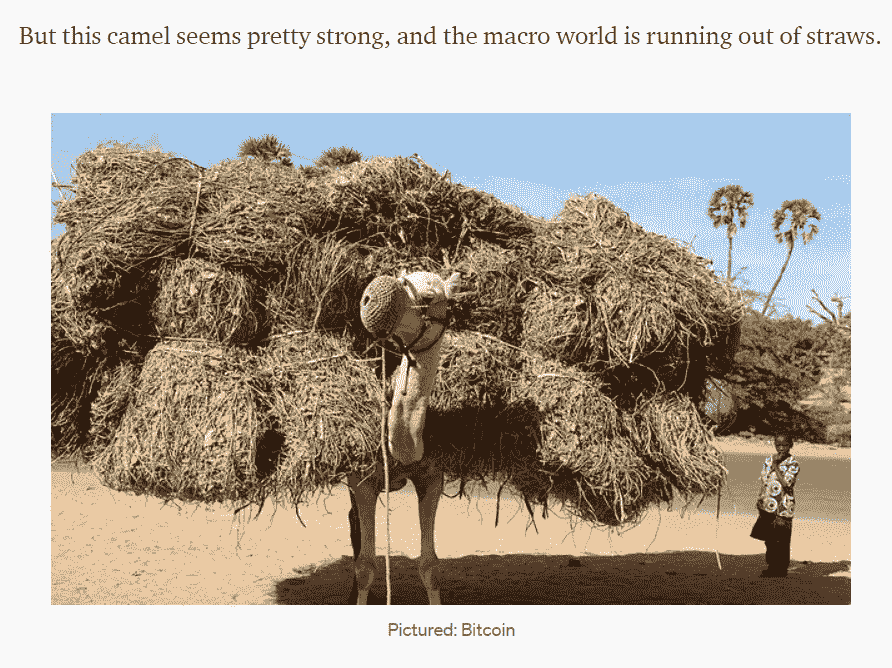
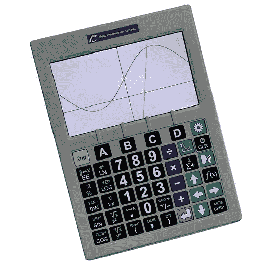
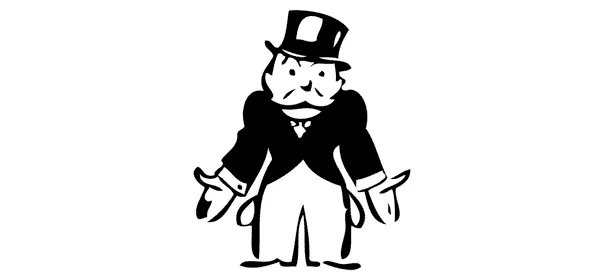
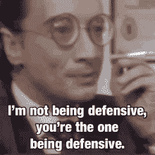

# WTF。

> 原文：<https://medium.com/coinmonks/wtf-ccbbb482078b?source=collection_archive---------19----------------------->

***说真的，搞什么鬼，FFS。***

我最近一直不对劲。。。

[me, proclaiming we’d never see $20K Bitcoin, March 15](/coinmonks/unblocking-blockchain-part-ii-db305bb94704)

。。。我已经失去了钱。。。

me, kissing away more than one-third of those bags just on the LUNA trade alone

。。。但是今晚我会睡得很好，因为我知道我没有失去其他人的数十亿美元，就像 DeFi lender [Celsius](https://www.forbes.com/advisor/investing/cryptocurrency/what-is-celsius/) 和 crypto VC 公司 [Three Arrows Capital](https://www.crowdfundinsider.com/2022/06/192367-hedge-fund-three-arrows-capital-hit-with-rumors-regarding-liquiditation-report/) 。

不，我把我的损失限制在我自己的比特币基地账户上，谢谢。

此外，当我得到 rekt 时，整个该死的市场不会威胁失去它的午餐。但是，就像一个奇怪的严肃游戏“在我们中间”，市场正在失去对谁是最受怀疑的人的关注。

BLOCKFI WAS AN IMPOSTOR?

那么，我们到底是怎么走到这一步的，尤其是在似乎不仅仅是两个月前，市场还经受住了这场风暴并正在转向的时候？

首先，露娜的快速天鹅跳水，现在感觉像是六年前而不是六周前。当月亮硬币突然变得价值百万分之一时，我损失了将近三位数的巨款，但是三支箭持有，哦，大约 5 . 6 亿美元。

你现在可以算算它值多少钱，或者，如果不值得的话，[这里有一个大屏幕图形计算器，可以帮你算出大概这么多钱](https://www.schoolhealth.com/sciplus-3500-large-display-graphing-scientific-calculator-with-speech-output?utm_source=bing&utm_medium=cpc&utm_campaign=PLA&scid=scbplp1039289&sc_intid=1039289&msclkid=ca2153dceeb211ec81bb4014e518627d)。

y = LUNA(x) plunges it straight off the screen.

坊间传言，3AC 通过*复合了他们的大胖 L，这基本上是投资者版的那个拿着口袋 a 输掉大底池的家伙，在下一手牌中用同花八三全押。扑克玩家称之为“继续倾斜”，因为它几乎总是会让你的所有筹码一败涂地。*

*为了给这场大火火上浇油，3AC 也是 [*杠杆交易*](https://leverage.trading/) ，这意味着他们在拿借来的钱冒险。这是一个非常糟糕的想法，除非你知道自己在做什么，而且在牛市中每个人都是天才。*

*但当事情变得愚蠢时，过度杠杆化的输家会达到两个可怕的里程碑:*和 [*平仓*](https://finance.yahoo.com/news/does-liquidation-mean-avoid-210601527.html?guccounter=1&guce_referrer=aHR0cHM6Ly93d3cuYmluZy5jb20v&guce_referrer_sig=AQAAABQBtkpQGM8vIPv3Aalhu4T523ArW39jbRMlhcWd3OLaM1gj_kxHCONBBFu-AFfTU4Vv0AIuOGfl6X9t53NZT2OUcG54IFwDQz9hiKPXEBwCo43f-9fZDLFC3HleaoHZV5BtcCDYf-vCohyJxfKmm-dnAoApWtzYHu2gGnJNqbN5) 。**

**由于 3AC 并不完全公开他们的资产负债表(预示)，让我们使用一个杠杆非常公开的人:3 月 29 日，当 BTC/美元是现在的两倍多时，迈克尔·塞勒获得了一笔巨额贷款，以他已经拥有的史高治·麦克老鸭金库为抵押，购买了 4000 多枚比特币。**

**“This is probably smart.” — me at the time**

**5 月 3 日，MicroStrategy 的首席财务官在 Q1 财报会议上宣布，如果比特币跌破 21，000 美元，该[公司将面临追加保证金通知，这意味着 Silvergate 可能会迫使他们要么提供更多抵押品，要么出售。say lor](https://fortune.com/2022/05/04/michael-saylor-microstrategy-margin-call-bitcoin/)[否认](https://coinjournal.net/news/there-is-no-margin-call-on-bitcoin-loan-says-michael-saylor/)目前为止发生了这种情况，并在推特上说[即使比特币跌破 3562 美元，MicroStrategy 也可以继续公布更多资产](https://twitter.com/saylor/status/1523996525151539203)，但有一点是不容置疑的，如果价格下跌足够多，他们的整个头寸将被清算，因为他们将有无法支付的账单。**

****

**You have to turn your pockets out and shrug when you’re bankrupt. It’s in the book. Chapter 1.**

**我们知道，三箭资本面临一些投资者的保证金电话，他们的回应就像我有一次拖欠房租时对房东的回应一样:他们只是有点不接电话。(我甚至躲过了一声有力的敲门声。不是我最自豪的时刻。)**

**现在，3AC 没有破产。他们仍然拥有大量资产——事实上，作为许多热门加密项目的早期投资者，他们仍然坐拥数十亿美元。但是大多数代币都被锁了几个月，当他们现在需要现金的时候就没用了。**

****

**Don’t know why 3AC didn’t call these guys.**

**在他们的露娜包解体后，三支箭在 5 月份悄悄地开始出售其持有的 stETH 股份。 [Staked ether 是一种由利多金融](https://lido.fi/ethereum)创造的代币，允许投资者张贴他们的以太坊并获得代币作为交换(而不是像[比特币基地](https://www.coinbase.com/price/ethereum-2)和其他人那样将 ETH 锁定数月)。**

**这是一个常见的标题，这种倾销导致 stETH 从 ETH 中“脱离”，就像 Terra 的稳定币 UST 从 1 美元脱离，并陷入死亡螺旋，将 LUNA 拖入地狱。但这并不准确，正如利多的联合创始人乔丹“@ Cobie”Fish 解释的那样。**

**stETH 基本上是 ETH 的欠条(加上一些利息)。如果你在麦当劳，有一张免费巨无霸的优惠券，那张优惠券价值 1 个巨无霸。但如果这是一张免费巨无霸的优惠券，只能在中期未来的某个不确定的时间点兑现，即使它附带一份薯条，公开市场上也可能有人不想用 1 个巨无霸来交换它。尤其是如果三箭资本公司从直升机上扔下 60，000 张这样的优惠券。正如科比所说:**

> **对 ETH 的 stETH 折扣将是现有 stETH 持有者需要多少流动性的函数，与以折扣价购买这种持有的 ETH 衍生产品的需求的函数。**
> 
> **一些较大的玩家最近通过退出 stETH 来表达他们对流动性的需求。**

**每卖出一台 stETH 3AC 都会让下一台更便宜，因为销售压力让它们在每笔交易中的价值越来越低。**

**Celsius 持有超过 400，000 stETH T1，所有这些相对于 ETH 都在贬值，而 [ETH 本身在一周内损失了 40%](https://cryptopotato.com/3-possible-reasons-why-ethereum-eth-is-down-40-in-7-days/)。**

**由于其客户试图重新获得他们迅速贬值的加密机，以恐慌性抛售，Celsius 自己的债务资产比率开始上升。倾覆发生得如此之快，以至于创始人兼首席执行官亚历克斯·马辛斯基猝不及防。6 月 11 日，[他在 Twitter 上亲自回复了](https://twitter.com/Mashinsky/status/1535767334668861440)，称对 Celsius 即将破产的分析是“恐惧、不确定和怀疑”的常见三个字母缩写**

****

**Nothing spreads FUD like the CEO telling you himself that you are spreading FUD. (Broadway Video/Tenor)**

**。。。就在第二天，[摄氏度屈服并冻结了所有提款](https://twitter.com/CelsiusNetwork/status/1536169010877739009)。**

**他们的倒下首先是因为 3AC 仍在与债权人玩壳游戏，其中至少有一个债权人声称:**

**I’m looking for a job in crypto! “Kneecapper” sounds like a role I could fill.**

**但是，如果你想要一个骗局，试着效仿 Celsius 对储户的钱所做的事情，试图获得比他们提供的更多的收益:**

**1.赌注押在丽都➡️得到 stETH
2。把斯泰斯送到以太坊➡️铸币厂的[锚](https://www.anchorprotocol.com/)金库[贝丝](https://www.binance.com/en/support/faq/2caf153380ff445ea5e587563be03f59)(币安的斯泰斯)
3。使用[虫洞](https://wormholenetwork.com/)
4 将贝丝发送到 [Terra](https://www.terra.money/) 网络。将贝丝留在锚上，获得 19.5%的收益**

**根据一位链上分析师的说法，Celsius 在 4 月底和 5 月初的两个星期里向即将注定失败的 Anchor Protocol 注入了超过 2 . 75 亿美元的资金——但是根据 Block Crypto 的说法，在整件事情变得一团糟之前，他们又抽回了至少 5 亿美元。**

**尽管他们声明反对，但这可能导致了卢娜/UST 的自焚，从而间接导致了他们自己的死亡。**

*****那么，搞什么鬼？*****

**听着，我不是专家。事实上，做空我已经赢了好几个月了。但是，用比我聪明的长期看涨者的话来说，加密市场中的这种垃圾是必要的，可以冲洗掉由过度杠杆化和递归收益农业等荒谬的傻逼举措产生的泡沫。**

**If you think unwinding the $1T crypto economy was fun, wait until we prick the $∞ Everything Bubble.**

**在这一点上，即使是最少量的 FUD 也能让市场上的每个人惊慌失措，而且不存在短缺。听着，大家又开始担心泰瑟了:**

**I’m starting to get tired of this, and I’ve been in crypto, like, two weeks.**

**但是，LUNA/Celsius/3AC ménage à twerp 似乎是一个完美的愚蠢循环，传染仅限于他们自己。处于悬崖边缘的其他人都是如此微不足道的角色，以至于山姆·班克曼-弗里德可以成为一个人的救助机器，这是有道理的。我的意思是，这个人的名字字面上是银行:**

**Back in my day, it took JP, Morgan AND Chase to bail somebody out! Harrumph!**

**所以我认为我们已经看到了最糟糕的情况。**

**但我什么都不知道，所以在这次死猫反弹中我从桌子上拿走了一大堆。**

**这意味着它可能很快就会变成抛物线。**

**WTF。**

****

**WTF.**

> **加入 Coinmonks [电报频道](https://t.me/coincodecap)和 [Youtube 频道](https://www.youtube.com/c/coinmonks/videos)了解加密交易和投资**

# **另外，阅读**

*   **最佳[加密借贷平台](/coinmonks/top-5-crypto-lending-platforms-in-2020-that-you-need-to-know-a1b675cec3fa) | [杠杆令牌](/coinmonks/leveraged-token-3f5257808b22)**
*   **最佳[加密制图工具](/coinmonks/what-are-the-best-charting-platforms-for-cryptocurrency-trading-85aade584d80) | [最佳加密交易所](/coinmonks/crypto-exchange-dd2f9d6f3769)**
*   **[比斯勒评论](https://coincodecap.com/bitsler-review)|[WazirX vs coin switch vs coin dcx](https://coincodecap.com/wazirx-vs-coinswitch-vs-coindcx)**
*   **[7 大副本交易平台](https://coincodecap.com/copy-trading-platforms) | [BuyCoins 点评](https://coincodecap.com/buycoins-review)**
*   **[my constant Review](https://coincodecap.com/myconstant-review)|[8 款最佳摇摆交易机器人](https://coincodecap.com/best-swing-trading-bots)**
*   **[Godex.io 审核](/coinmonks/godex-io-review-7366086519fb) | [邀请审核](/coinmonks/invity-review-70f3030c0502) | [BitForex 审核](https://coincodecap.com/bitforex-review)**