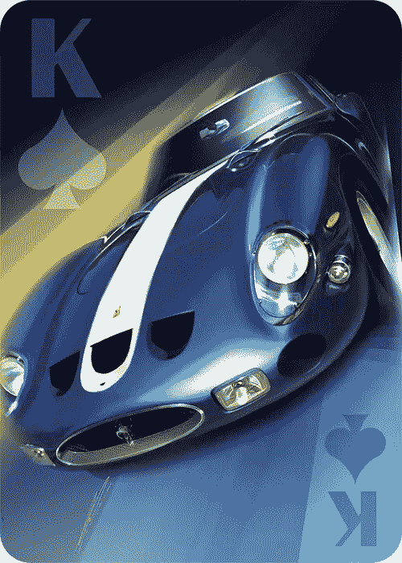

# WTF 是 NFT？

> 原文：<https://medium.com/coinmonks/wtf-is-an-nft-b4b07b1bf086?source=collection_archive---------20----------------------->

## (我为什么要在乎？)

**TLDR；**

*   NFT 是任何数字或实物资产所有权的不可更改的记录。
*   区块链技术正在迎来一个互联网的新时代，即所有权的互联网，任何有价值的东西都可以被令牌化，从而使购买、出售和交易变得容易，而不需要昂贵的可信中间人。
*   通往财富的道路是通过所有权。将任何物理或数字资产令牌化将向大众开放现有的和新的资产类别，并释放巨大的财富。
*   目前的 NFT 市场要么迎合已经了解并拥有加密货币的人，要么妥协，让购买 NFT 变得容易，然后锁定人们在他们的网站上转售加密货币。
*   大规模采用的关键是能够向你的所有观众销售 NFT。不仅仅是 crypto 的早期采用者。
    -人们注册时会得到一个钱包
    -用信用卡购买 NFT。不需要密码！
    -低交易费
    -NFT 应该放在你的钱包里，可以在其他市场转售

什么是 NFT？

不可替代的 NFT 令牌是存储在不可改变的区块链分类账上的独特物理或数字资产的所有权记录。

**不可替代？那是什么意思？**

不可替代是一个听起来很奇怪的术语，但它的意思是唯一的，不可互换的，不可分割的。就像独一无二的收藏品或原创艺术品。每张米奇·曼托棒球卡都是独一无二的。一张卡与另一张卡的价值不同，你肯定不想把它撕成碎片，然后卖掉。蒙娜丽莎也是如此。只有一幅原画。它比你从网上下载的蒙娜丽莎的海报或图像更有价值。同样，我不建议把它拆成碎片再卖。

可替代物品的例子有一美元钞票、一根金条，甚至像比特币这样的数字资产。这些物品不是唯一的，可以用相同的价值与相同的物品交换，并且可以分成更小的单元。如果我用我的金条或比特币换你的金条或比特币，这是相同价值的相同物品的等价交换。如果我们交换米奇·曼托的新秀卡，情况就不一样了。每张棒球卡都是独一无二的，可以处于不同的状态，因此具有不同的价值。

**市场价值取决于真实性和稀缺性的证明**

几年前，我在拉斯维加斯看到名人堂棒球运动员约翰尼坐在凯撒广场购物中心的长凳上，在一张桌子上为棒球签名。我排队花 100 美元买了一个。如果我主动卖给你那个棒球，你怎么知道它是真的？你会相信它是由 Johhny Bench 签署的，而不是伪造的，除非我有一个可信的第三方来鉴定它吗？

那个签名棒球的**值**是多少？这很大程度上取决于它的稀有程度和 T2 的稀有程度。那天，那个周末，约翰尼一生中签了多少个棒球？知道目前名人堂约翰尼板凳棒球的供应量是 500 还是 50k，对其价值有很大的影响。

Is this Johnny Bench signed baseball authentic? How many baseballs has he signed?

[法拉利 250 GTO](https://opensea.io/assets/ethereum/0x495f947276749ce646f68ac8c248420045cb7b5e/4736812485652333611718529738695925740833249142534997347534581377573377277953/) 并不是最快、操控性最好的车，有些人会说它不是最好看的老爷车。那么，为什么它是有史以来价值最高的汽车，一辆在 2018 年的售价估计为 7000 万美元？因为 1962 年到 1964 年只生产了 36 部。另外，新的买家必须得到恩佐·法拉利和 Luigi Chinetti(该公司的北美经销商)的批准，所以这是一个非常排外的俱乐部。顺便说一句，这些车最初售价为 18，000 美元。

You might not be able to afford a real Ferrari 250 GTO but you can [buy the NFT](https://opensea.io/assets/ethereum/0x495f947276749ce646f68ac8c248420045cb7b5e/4736812485652333611718529738695925740833249142534997347534581377573377277953/)

数字文件的精确复制品可以被无限复制，却无法证明其真实性、稀缺性和所有权。在区块链和 NFTs 改变之前，数字文件没有真正的价值。当一个 NFT 被铸造时，你知道是谁创造了它，会铸造多少个版本，以及目前谁拥有它。这给了人们信任和信心，他们所购买的是真实的，稀缺的，因此有价值的。

**告别昂贵的中间商**

正如我之前所说，NFT 是存储在不可改变的区块链账本上的独特实物或数字资产的所有权记录。把它想象成你汽车的解雇通知书或者你房子的契约，但是有一些关键的优势。在你出售你的房子之前，产权代理必须核实你拥有它，其他第三方，如银行和律师，必须促进销售和转让。NFT 不再需要这些昂贵且耗时的中间商。公共区块链上的矿工验证和保护交易。区块链上运行的智能合约(编码逻辑和规则)使买卖双方能够直接销售和转让 NFT，通常只需几分钟，无需第三方。

Blockchain smart contracts eliminate the need for trusted middlemen to exchange value

**NFT 到底是怎么回事？**

这是一个游戏规则改变者，使艺术家、品牌和人物能够释放他们的艺术作品和知识产权的价值。其结果是数字艺术、收藏品和游戏的爆炸式增长。NFT 的销售额从 2020 年的不到 1 亿美元增长到 2021 年的 249 亿美元，预计到 2030 年将达到 2110 亿美元。

**我为什么要关心？**

通往财富的道路是通过所有权。我们正在进入一个互联网的新时代，所有权的互联网，任何有价值的东西都可以被令牌化，从而使购买、出售和交易变得容易。通过用更便宜、更快捷的区块链技术取代可信的中间人，令牌化将让更多投资者(不仅仅是富人和有关系的投资者)能够接触到许多现有资产类别，并刺激新资产类别的创新。

现在它是数字艺术和收藏品，但很快每个人都将能够建立投资组合，并积极交易代表房地产、奢侈品、高端葡萄酒和威士忌、电影、音乐、碳信用额、初创公司等资产类别的 NFT。想象一下，下一次一个运动队建造一个新体育场，而不是城市发行债券，他们通过向球迷出售 NFT 来资助新体育场，作为回报，球迷从 NFT 代表的席位中获得一部分收入，外加其他额外津贴。如果你认为全球股票市场很大，那么债券市场要大 30%，达到 119 万亿美元，是时候进行令牌化了。NFTs 将改变项目和企业获得资金的方式。

**我是创造者、品牌或个性**

NFT 提供了一种释放你的品牌和 IP(知识产权)价值的方式，并直接销售给你的粉丝和客户。把你的粉丝和顾客变成投资者，为你的下一张专辑、电影、书籍、创业等提供资金。你不需要很多顾客花一点钱，你只需要你的超级粉丝，他们愿意为独家内容和访问支付更多的钱来谋生。此外，你可以从二次销售中获得版税，从你的作品中产生持续的经常性收入。NFT 是不断给予的礼物。

**我是粉丝、收藏家或投资者**

NFT 把粉丝和消费者变成了投资者。作为支持你最喜欢的艺术家、音乐家、运动队、慈善机构、政治家等的交换。你得到了一个可证明的稀缺的数字收藏品，这不仅给了你吹嘘的权利，而且还有增值的潜力。NFT 还可以带来真实世界的额外待遇，如签名的实物和体验，如贵宾票和见面和问候。

有了将任何物理或数字项目标记化并创建透明、可访问的市场的能力，就有能力释放巨大的经济价值并创建更具包容性的数字经济，使人们能够通过所有权创造财富。

**大规模采用的关键是什么？**

当任何人都可以释放其品牌名称和知识产权的价值，直接向其所有受众销售 NFT 时，就会出现大规模采用。艺术家和品牌仅限于向一小部分理解和拥有加密货币的观众销售 NFT。用户体验包括下载和安装加密钱包，购买加密，并将其转移到您的加密钱包。

NFTs 市场迎合了这些加密货币的早期采用者。一些市场接受信用卡，但通常限制用户在其网站上转售 NFT。它们是集中的、有围墙的花园，以分散化和互操作性为代价提供了购买的便利。

大规模采用任何人都可以容易地购买、收集和转售 NFT 的关键是

*   买家在注册时会得到一个钱包
*   用信用卡购买。不需要密码！
*   低铸造成本/交易费用
*   互用性在非购买市场上转售 NFT

**总之**

我们仍然处于区块链、加密和 NFTs 的早期阶段。这个领域每天都在发展，创新的步伐也很快。NFTs 的垂直行业和商业应用确实受到你的想象力的限制，我很高兴看到未来几年将会发生什么。

走吧。NFT 自己为任何艺术家或品牌提供定制品牌店面，向他们的所有观众销售 NFTs，而不仅仅是 crypto 的早期采用者。前往 www.gonftyourself.com[了解更多信息，订阅并联系我们，讨论如何释放您的品牌和知识产权的价值，通过销售 NFT 创造新的经常性收入流。](http://www.gonftyourself.com)

> 加入 Coinmonks [电报频道](https://t.me/coincodecap)和 [Youtube 频道](https://www.youtube.com/c/coinmonks/videos)了解加密交易和投资

# 另外，阅读

*   [币安 vs FTX](https://coincodecap.com/binance-vs-ftx) | [最佳(SOL)索拉纳钱包](https://coincodecap.com/solana-wallets)
*   [比诺莫评论](https://coincodecap.com/binomo-review) | [斯多葛派 vs 3Commas vs TradeSanta](https://coincodecap.com/stoic-vs-3commas-vs-tradesanta)
*   [Capital.com 评论](https://coincodecap.com/capital-com-review) | [香港的加密借贷平台](https://coincodecap.com/crypto-lending-hong-kong)
*   如何在 Uniswap 上交换加密？ | [A-Ads 评论](https://coincodecap.com/a-ads-review)
*   [WazirX vs coin dcx vs bit bns](/coinmonks/wazirx-vs-coindcx-vs-bitbns-149f4f19a2f1)|[block fi vs coin loan vs Nexo](/coinmonks/blockfi-vs-coinloan-vs-nexo-cb624635230d)
*   [本地比特币审核](/coinmonks/localbitcoins-review-6cc001c6ed56) | [加密货币储蓄账户](https://coincodecap.com/cryptocurrency-savings-accounts)