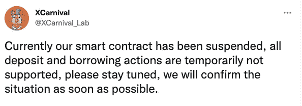
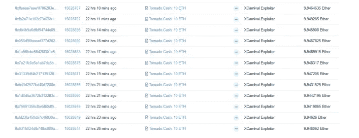
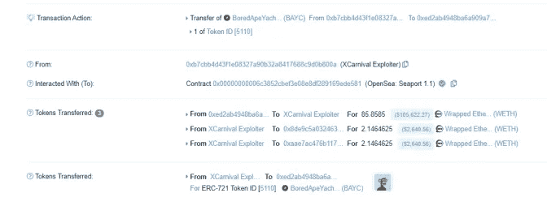
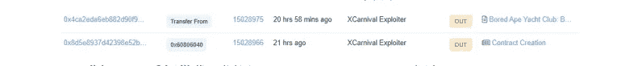
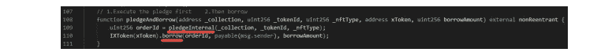
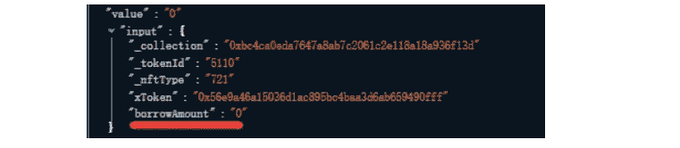
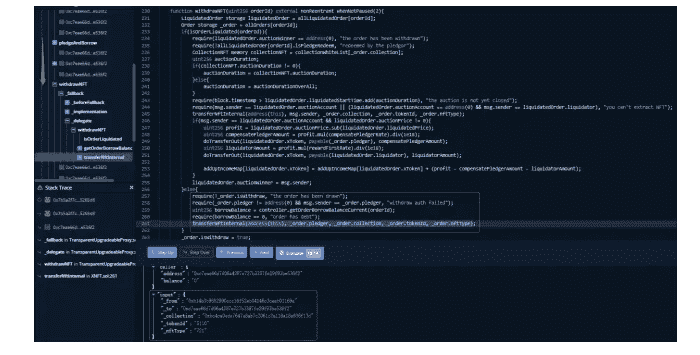
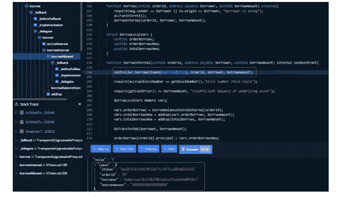
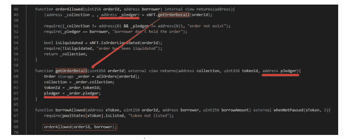
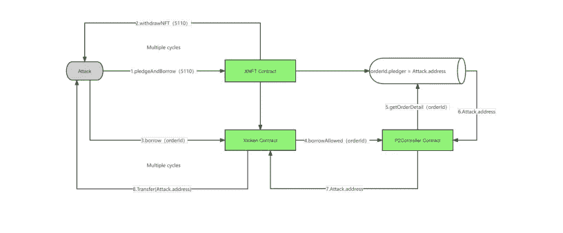

# XCarnival 攻击分析

> 原文：<https://medium.com/coinmonks/xcarnival-attack-analysis-1e5722f03a09?source=collection_archive---------6----------------------->

2022 年 6 月 26 日，NFT 借贷协议 XCarnival 被黑，黑客获利 3087 ETH。

**0x01 攻击信息**

攻击者地址

0 xb7 CB B4 d 43 f1 e 08327 a 90 b 32 a 8417688 c 9 d0b 800 a

攻击者合同

0 xf 70 f 691d 30 ce 23786 CFB 3a 1522 CFD 76d 159 ACA 8d

0x 3 EDF 976 df 38 f7d 6273884 b 4066 e 3689 ef 547d 816

0x7b 5a 2f 7 CD 1c C4 ee f1 a 75d 473 e 1210509 c 55265d 8

0x 234 E4 b5 FEC 50646 D1 d 4868331 f 29368 fa 9286238

正式合同

xto ken 0x 5417 da 20 AC 8157 DD 5c 07230 CFC C2 b 226 FD CFC 5663

XNFT 0x 39360 AC 1239 a0b 98 CB 8076d 4135 d0f 72 b 7 FD 9909

P2Controller 0x 34 ca 24 ddcdaf 00105 a3 BF 10 ba 5a AE 67953178 b 85

**0x02 攻击步骤**

1)通过混币平台 Tornado.Cash 共获得 120 ETH。

2)使用 87 ETH 购买 ID 为 5110 的 BAYC。

3)部署攻击契约，将 5110 BAYC 转移到攻击契约。这里我们以攻击契约**0x7b 5a 2f 7 CD 1 C4 ee f1 a 75d 473 e 1210509 c 55265d 8**为例:

4)进行 NFT 入股和贷款，调用**xnft . graceandborrow**方法。

攻击者在下注 NFT 后没有借到资金，然后通过 **XNFT.withdrawNFT** 取出 NFT。

在一次交易中，为了增加与攻击者控制的地址相对应的 **orderId** 的数量，执行多次赌注、贷款和 NFT 提款操作。

5)攻击者借用之前已经被 staked 的 orderId，逐个借用上一步生成的 orderId。

6)攻击者将获利资金转移到钱包地址。

**0x03 主要漏洞**

攻击者通过多次股权借贷和 NFT 提款操作增加攻击者相关地址和 orderId 的对应关系，然后调用 Xtoken 契约进行借贷。由于借款人检查的是攻击者 staked 的订单 id 地址，因此攻击者可以使用多次调用借款，并传入之前的订单 id 来获得大量借款。

**攻击流程如下**

**0x04 总结和建议**

根据这种攻击，攻击者主要通过多次跑马圈地贷款和提取 NFT 获得大量与自己地址对应的订单 id，然后通过多次调用借款方法提取大量资金。时间受到严格限制，因此攻击者可以多次**点击 farming** 来增加下注订单的数量。之后，在 Xtoken 契约中，只使用订单 id 来确定是否可以借款，这样攻击者就可以在完成跑马圈地订单后进行多次借款操作。

**0x05 安全建议**

建议严格限制 NFT 跑马圈地时间，确保不能瞬间撤回；

建议严格限制 NFT 跑马时间对领取奖励的影响；

建议在跑马圈地后借款时检查是否满足多个条件

> 加入 Coinmonks [电报频道](https://t.me/coincodecap)和 [Youtube 频道](https://www.youtube.com/c/coinmonks/videos)了解加密交易和投资

# 另外，阅读

*   [分散交易所](https://coincodecap.com/what-are-decentralized-exchanges) | [比特 FIP](https://coincodecap.com/bitbns-fip) | [Pionex 评论](https://coincodecap.com/pionex-review-exchange-with-crypto-trading-bot)
*   [用信用卡购买密码的 10 个最佳地点](https://coincodecap.com/buy-crypto-with-credit-card)
*   [最佳卡达诺钱包](https://coincodecap.com/best-cardano-wallets) | [Bingbon 副本交易](https://coincodecap.com/bingbon-copy-trading)
*   [如何给 MetaMask 钱包添加 Arbitrum？](https://coincodecap.com/how-to-add-arbitrum-to-metamask-wallet)
*   [KuCoin vs 北海巨妖 vs BitYard](https://coincodecap.com/kucoin-vs-kraken-vs-bityard)
*   [加密交易的最佳 VPN](https://coincodecap.com/best-vpns-for-crypto-trading)