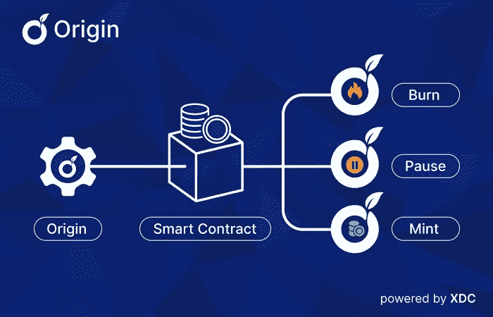

# XDC 起源——一个用户友好的 XDC 网络令牌创建工具

> 原文：<https://medium.com/coinmonks/xdc-origin-a-user-friendly-token-creation-tool-for-xdc-network-9bf4bfe8c2ff?source=collection_archive---------11----------------------->

XDC 网络是最有效和可持续的区块链生态系统之一。为了让网络站在区块链创新的最前沿，网络的管理者们不断发布新的工具，用于 XDC 的创新。

XDC 最新发布的 Origin 是一款网络应用，允许用户在 XDC 区块链上创建、发行和管理代币，而无需编写任何代码。Origin 自动化了整个令牌创建过程，包括智能契约创建、API 集成和契约部署。有了像 XDC 起源这样的工具，开发人员可以花更少的时间编码或编程，让他们有更多的时间关注项目的其他方面。Origin 还消除了在区块链创作的技术壁垒。

## 为什么需要像 XDC 起源这样的工具？

Origin dApp 旨在简化区块链上令牌创建的方法。它取代了更复杂的传统方法，后者涉及在测试部署之前从头构建代码。XDC 基金会及其刚刚发布的 Origin，通过为开发者提供这种响应迅速、安全、用户友好的解决方案，帮助他们更好地快速跟踪他们的(操作)。

## XDC 起源带来了什么好处？

Origin 提供了一种先进而简化的用户体验。除了创建令牌之外，该工具还提供以下功能:

1.允许用户为初始令牌产品创建智能合同，并通过几个简单的步骤部署合同

2.允许开发人员将智能合约与任何外部 API 相连接

3.帮助检索智能合约中的价格馈送数据，并生成名副其实的函数

4.通过 KYC 提供快速验证

5.提供全面的控制面板，帮助用户访问他们的帐户和相关数据。

6.为用户提供不同 XDC 令牌的个人帐户

7.支持管理部署在 XDC 区块链的多个合同

# 尾注

随着 Origin 的推出，XDC 基金会为区块链行业引入了一个高效、自动化的智能合同开发和令牌创建平台。Origin 创建的任何令牌或合同都将受益于 XDC 网络的混合架构、高效率和 EVM 兼容性，所有这些都不需要编码。

> *加入 Coinmonks* [*电报频道*](https://t.me/coincodecap) *和* [*Youtube 频道*](https://www.youtube.com/c/coinmonks/videos) *了解加密交易和投资*

# 另外，阅读

*   [有哪些交易信号？](https://coincodecap.com/trading-signal) | [Bitstamp vs 比特币基地](https://coincodecap.com/bitstamp-coinbase) | [买索拉纳](https://coincodecap.com/buy-solana)
*   [ProfitFarmers 回顾](https://coincodecap.com/profitfarmers-review) | [如何使用 Cornix 交易机器人](https://coincodecap.com/cornix-trading-bot)
*   [十大最佳加密货币博客](https://coincodecap.com/best-cryptocurrency-blogs) | [YouHodler 评论](https://coincodecap.com/youhodler-review)
*   [my constant Review](https://coincodecap.com/myconstant-review)|[8 款最佳摇摆交易机器人](https://coincodecap.com/best-swing-trading-bots)
*   [MXC 交易所评论](/coinmonks/mxc-exchange-review-3af0ec1cba8c) | [Pionex vs 币安](https://coincodecap.com/pionex-vs-binance) | [Pionex 套利机器人](https://coincodecap.com/pionex-arbitrage-bot)
*   [我的密码交易经验](/coinmonks/my-experience-with-crypto-copy-trading-d6feb2ce3ac5) | [《比特币基地评论》](/coinmonks/coinbase-review-6ef4e0f56064)
*   [CoinFLEX 评论](https://coincodecap.com/coinflex-review) | [AEX 交易所评论](https://coincodecap.com/aex-exchange-review) | [UPbit 评论](https://coincodecap.com/upbit-review)