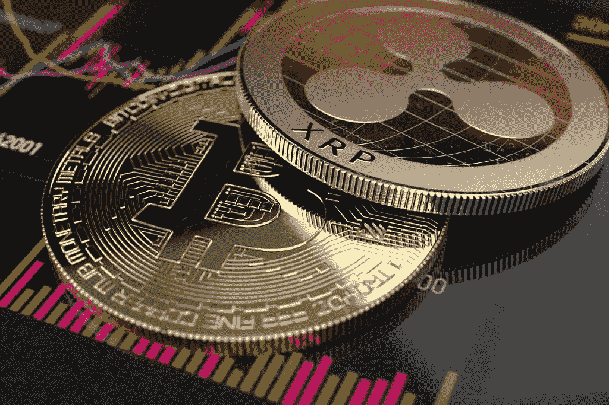
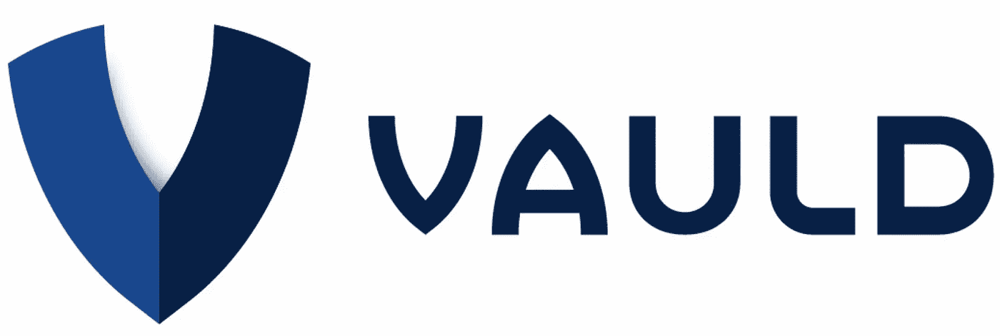
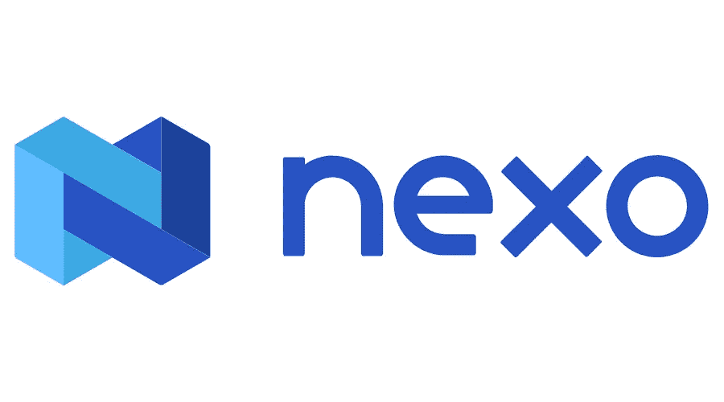
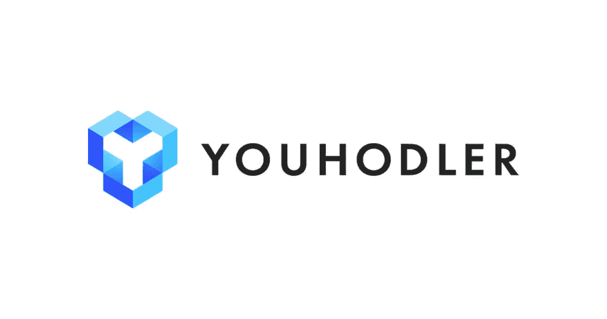
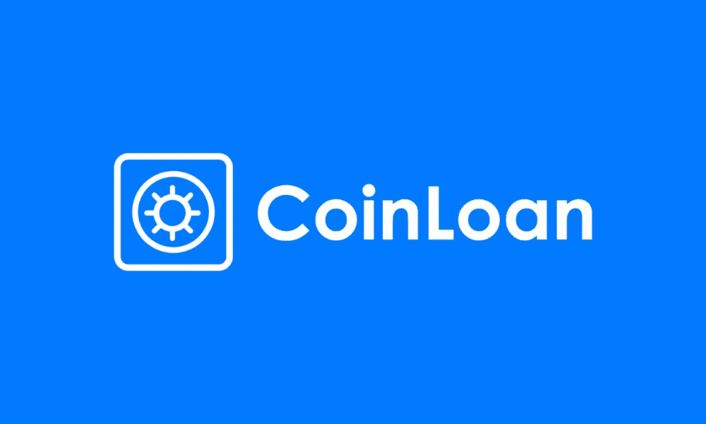

# XRP——寻找最佳(借贷)APY 的初学者指南[因借贷平台崩溃而收回]

> 原文：<https://medium.com/coinmonks/xrp-a-beginners-guide-to-finding-the-best-staking-lending-apy-b7404e909498?source=collection_archive---------31----------------------->

XRP 可以说是最被低估的加密资产之一。在 2017 年的牛市中，XRP 创下了近 4 美元的历史新高，在这个周期中，它还没有机会超越昔日的辉煌。这主要是由于美国证券交易委员会对 XRP 的创造者 Ripple 的诉讼。

在我们等待 Ripple 诉讼结束的时候，人们可以享受他们的 XRP 带来的被动收入。

下表列出了你可以用来赚取更多 XRP 的顶级借贷平台。

1.  Vauld

Photo curtesy of [https://jobs.lever.co/Vauld](https://jobs.lever.co/Vauld)

*   APY 每天支付 4.6%的利息。
*   30 天锁定期的 APY 为 6.7%。
*   不需要了解你的客户(KYC)。
*   [https://www.vauld.com/rates](https://www.vauld.com/rates)

2.Nexo

Photo curtesy of [https://seekvectorlogo.com/nexo-io-vector-logo-svg/](https://seekvectorlogo.com/nexo-io-vector-logo-svg/)

*   APY 每天支付 4%。
*   30 天锁定期的 APY 为 5%。
*   仅美国客户需要了解您的客户(KYC)。
*   https://nexo.io/

3.尤霍德勒

Photo curtesy of [https://thecollegeinvestor.com/36901/youhodler-review/](https://thecollegeinvestor.com/36901/youhodler-review/)

*   APY 每天支付 4.5%的利息。
*   需要了解你的客户(KYC)。
*   不适用于美国/中国/韩国公民。
*   【https://www.youhodler.com/earn-crypto/earn-xrp 

4.硬币贷款

Photo curtesy of [https://techbullion.com/](https://techbullion.com/c)

*   APY 每月支付 7.2%的利息。
*   需要了解你的客户(KYC)。
*   https://coinloan.io/earn-interest-on-crypto/

XRP 的诉讼预计将于 2022 年底结束，在此之前，享受赚取被动收入。借贷愉快！

免责声明:以上信息不是财务建议。