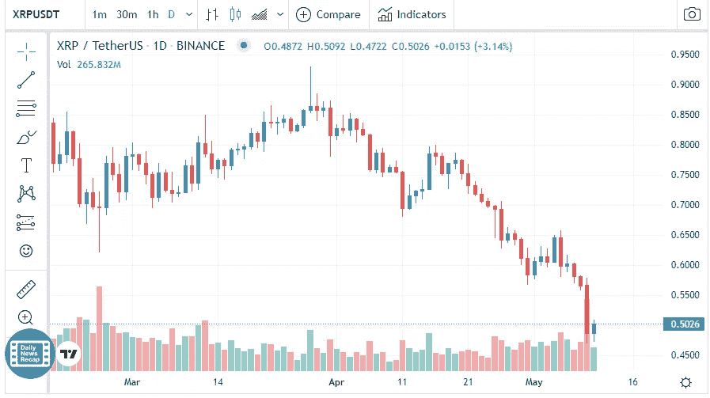

# XRP 价格分析

> 原文：<https://medium.com/coinmonks/xrp-price-analyse-a77ecad95cd1?source=collection_archive---------53----------------------->

Source photo [XRP price today, XRP to USD live, marketcap and chart | CoinMarketCap](https://coinmarketcap.com/currencies/xrp/)

在本周的第一天，Ripple 的价格跌至 2021 年 7 月以来的最低水平，卖家在持续到周一的周末下跌后暂停。

在 0.50 美元，XRP 的购买压力开始让步，因为多头试图最后一次获胜。

尽管如此，预计将从 0.5150 美元区域反弹。看跌趋势保持不变。