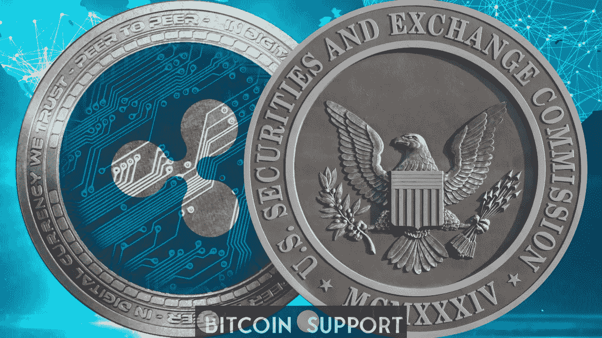

# XRP 对证券交易委员会:瑞波决定“不”挑战证券交易委员会的关键笔记编辑

> 原文：<https://medium.com/coinmonks/xrp-vs-sec-ripple-decides-to-not-challenge-the-secs-critical-notes-redactions-3c496ea04e49?source=collection_archive---------20----------------------->

**Visit our website:-** [**https://bitcoinsupports.com/**](https://bitcoinsupports.com/)

Ripple、Bradley Garlinghouse 和 Chris Larsen 在 Ripple 与 SEC 的纠纷中提出了回应。这份通知是对美国证券交易委员会要求对该案一部分记录进行编辑的回应。然而，被告表示，他们不会质疑证交会的修订。T2 法院将审查 XRP 诉证券交易委员会诉讼案中笔记的节录部分。

被告在通知中声明，他们没有审阅笔记中被编辑的部分。与此同时，委员会向法院提交了未经编辑的版本。据 Ripple 说，他们依赖于 SEC 对票据的描述和法院的评估。

双方指 SEC 官员在与第三方讨论时获得的手写文件。据报道，这些笔记包含 2014 年和 2018 年的内部通信。法院必须分析笔记，以确定链接的部分是否准确地反映了作者自己的想法或与 SEC 雇员开会时的讨论。然而，被告已经明确表示，根据他们掌握的事实，他们目前不打算反对证交会的修订。

**到 4 月 22 日，瑞波和证交会将提交一份拟议的调度订单。根据律师 James K Filan 的说法，Ripple 应该遵从法院来决定被编辑的部分是否受到公诉部判决的保护。然而，直到今天，只有法院和证券交易委员会看到了这两份笔记。

斐讯声明，本回答是代表诉讼中所有被告提出的，而不仅仅是 Ripple。因此，两个星期的答复期将从个别被告送达通知时开始。他建议他们可以在 4 月 8 日之后提交。

以前，Eastabrook 音符是关注的中心；今天，这些笔记成了头条新闻。由于几个多余的通知，案件的进展正在放缓。另一方面，Sarah Netburn 法官指示各方商定一份即决判决的案情摘要时间表。到 4 月 22 日，双方预计将提交一份联合拟议的调度令。

**访问我们的网站:-**[**https://bitcoinsupports.com/**](https://bitcoinsupports.com/)

**免责声明:以上为作者观点，不应视为投资建议。读者应该自己做研究。****

> *加入 Coinmonks* [*电报频道*](https://t.me/coincodecap) *和* [*Youtube 频道*](https://www.youtube.com/c/coinmonks/videos) *了解加密交易和投资*

# 另外，阅读

*   [Bookmap 评论](https://coincodecap.com/bookmap-review-2021-best-trading-software) | [美国 5 大最佳加密交易所](https://coincodecap.com/crypto-exchange-usa)
*   最佳加密[硬件钱包](/coinmonks/hardware-wallets-dfa1211730c6) | [Bitbns 评论](/coinmonks/bitbns-review-38256a07e161)
*   [新加坡十大最佳加密交易所](https://coincodecap.com/crypto-exchange-in-singapore) | [购买 AXS](https://coincodecap.com/buy-axs-token)
*   [红狗赌场评论](https://coincodecap.com/red-dog-casino-review) | [Swyftx 评论](https://coincodecap.com/swyftx-review) | [CoinGate 评论](https://coincodecap.com/coingate-review)
*   [投资印度的最佳密码](https://coincodecap.com/best-crypto-to-invest-in-india-in-2021)|[WazirX P2P](https://coincodecap.com/wazirx-p2p)|[Hi Dollar Review](https://coincodecap.com/hi-dollar-review)