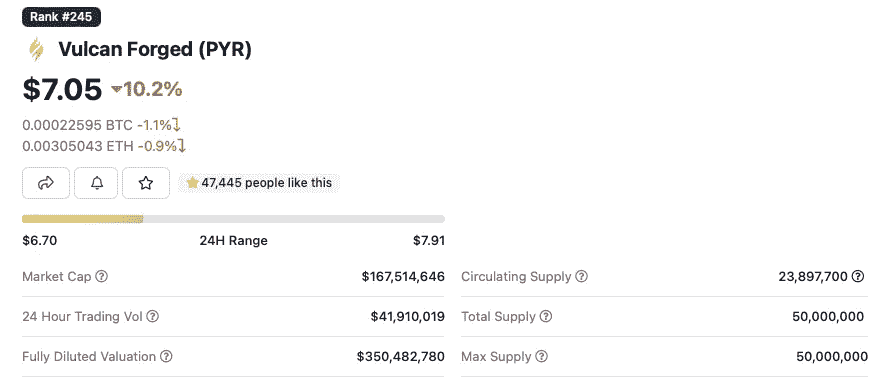

# XRP 的宏伟计划要失望了

> 原文：<https://medium.com/coinmonks/xrps-grand-plan-to-disappoint-29d0ddc777af?source=collection_archive---------7----------------------->

剧透警告:XRP 不会让你成为百万富翁，如果你打算把你的未来押在硬币上，那就不要。想想以太坊或者想想深埋在泥土中的东西…

## **免责声明**:这篇文章试图阐明**市值分析**的重要性，以及理解如何在投资硬币之前阅读市值。为了充分研究所涵盖的一些概念，有许多控制变量和假设用于构建经济模型。

For the XRP investors: This is what’s called a “meme”

> 2022 年把钱都投在 [**大片**](https://en.wikipedia.org/wiki/Blockbuster_LLC) 有什么问题？

没有投资回报率，因为该公司已经看到了他们的受欢迎程度达到顶峰时，是他们的表演时间。不要误解我，他们的光盘仍然惊人地工作，不存在通过网飞糟糕的服务器缓冲的问题，你也不必为互联网连接支付额外的费用，但是…如果你想赚些真钱，你在 45 年前投资 Blockbuster 会更好。

Cost of not innovating ^

# 什么是市值？

一枚硬币的市值是目前流通的资产的总价值。(来源:Chainbrief & Investopedia)

换句话说:**当前价格 X 流通硬币数量**

市值是我们用来在 [Coingecko](https://www.coingecko.com) 或 [Coinmarketcap](https://coinmarketcap.com) 上对硬币进行排名的，因为它决定了一个项目的“规模”。一枚硬币的**价格**仅仅是对流通中的硬币和市场上购买的硬币之间的供需平衡水平的描述。

Figure 1: How Price is derived

图 1 展示了一枚硬币的价格是如何在公开市场上得出的。这是需求和供给相互作用的方式。该图描述了当数量 *Q* 和价格 *P* 相互作用时，我们如何达到一个平衡 *e* 这是硬币的流通供给和市场需求相一致的地方，这就是你在 Coingecko 上看到的价格和供给。

## 什么是完全稀释的市值？

这就是**记号经济学**发挥作用的地方。我相信你已经听说过这个术语在秘密世界里经常被提起，但是它实际上是什么意思呢？

**令牌经济学**指的是“加密令牌的经济学研究”(Yazdanparast)。这需要总的供应计划、代币的燃烧、工作证明/股份证明的经济性、国库锁定代币等。

代币的**完全稀释市值** (FDMC)是在给定当前价格的情况下，如果未来所有的硬币都投入流通，代币的总价值。这一指标本质上描绘了资产相对于其未来自我的位置——这有助于理解一枚硬币可能面临的**通胀压力**。这没有反映在流通供应中，也很少被大多数影响者提及…这是你应该开始记笔记的地方。

Bitcoin’s Token Data on Coingecko.com

比特币的最大供应量为 21，000，000 个代币，其开采能力减半计划会定期降低供应速度。这意味着这 2100 万个比特币将被开采到 2140 年。比特币的市值是当前供应的 *19，035，006 枚代币 X 写博客时的价格——32974 美元(* ***哎哟*** *)。*这给了我们 627，668，073，161 美元的比特币市值和 692，462，589，000 美元的 FDMC**。**

由于比特币仍有大约 300 万枚代币要“印刷”，我们可以预计比特币经济的供应会带来一些通胀压力。当一种产品的供给增加而需求减少时会发生什么？产品价格下降。幸运的是，比特币需求的预期增长率远高于缓慢的预定供应产出，这将有助于比特币保持价格上涨，并击败这种通胀压力。

Figure 2: Increase in supply

基本经济再次，*图 2* 显示了在需求保持不变的情况下**供给的增加如何导致价格因通胀压力而下降。希望我们现在意见一致。**

婴儿潮一代来了:

# “那么这一切和我亲爱的 XRP 有什么关系？”

回到重磅炸弹理论——当你可以在 1977 年投资重磅炸弹的时候，为什么你要在 2022 年投资重磅炸弹？

为了维持一个正常运行的经济模型，我将为我的下一个解释做出如下假设:

*   需求是恒定的/不变的
*   供给是我们的独立变量(我们操纵它)
*   市值是我们的因变量(我们不操纵的变量)

让我们研究一下来自 Coingecko 的 XRP 的记号组学:

XRP’s Token Data

当保持需求不变时，理想情况下，我们希望硬币的 FDMC 尽可能接近市值。为什么？这是因为一枚硬币的未来价值越接近它的当前价值，硬币的象征性的通货膨胀压力就越小。这意味着——就像比特币一样，我们可以专注于需求的增长率，而不是供给的增长率——这将使*成为硬币之月。*

XRP 目前的 appx 市值。260 亿美元是 appx 的产品。480 亿代币在流通。这导致价格为 0.5 美元。现在，如果我们以 0.5 美元的价格在 XRP 投资 1000 美元，并希望我们的现金达到 10 倍，我们需要 XRP 的价格达到 5 美元。这**(重要的是)**实际上意味着我们需要 XRP 的**市值达到 10 倍**，也就是 XRP 现在将有 2600 亿美元在其生态系统中流通。

加密货币市场的总市值目前为**1.5 万亿美元……**这意味着，为了让你将 1000 美元变成区区 1 万美元，你需要整个加密市场将价值近 2340 亿美元的资金汇集到 XRP 经济中(约占现有整个加密市场的 6.5%)，或者让新的资金进入加密——直接进入 XRP 生态系统。

2340 亿美元作为参考将几乎轻松地消耗掉诸如 USDT、BNB、索拉纳、卡尔达诺**、**卢纳和美元**加起来**的市值**的代币。**从更清晰的角度来看，2340 亿美元，JP 摩根目前的市值是 3640 亿美元…

那么…你还想在 XRP 找一个 10X 的吗？听着，我并不是说这是不可能的——这项技术毫无疑问是革命性的，我喜欢用 XRP 汇款，但在他们的法律斗争和日益激烈的竞争中，主流的采用将证明 XRP 很难以你想要的速度获得收益，如果你想把 1000 美元变成 100 万美元。

为了给棺材钉上最后一颗钉子，请记住，我们还没有踢开 XRP 在其供应量翻倍时面临的通胀压力……是的，XRP 的流通供应量是其最大供应量的一半。因此，如果我们现在保持需求和市值不变，让 XRP 经济充斥着各种廉价代币，翻倍的供给可能会让 XRP 的价格减半……或者类似的情况。

> 好吧那么文呢

首先，煤气费…我是说以太坊。

Figure 3: Watchtheburn, Ethereum Becoming deflationary

对，我说的是**通缩**。

自从 2021 年 8 月 EIP-1559 大升级以来，以太坊已经变成了一种通缩资产。*图 3* 显示了上个月燃烧的 ETH 量。仅上个月就有价值近 5 亿美元的以太币被烧毁…相比于硬币的象征经济学，在这种情况下，供应量仍需达到最大值，通胀压力迫在眉睫，以太币看起来就像是一个显而易见的东西。以太坊也是 crypto 中几个协议的支柱，基本上是目前 NFT 市场的主体，运行良好的复杂智能合约，没有任何法律纠纷……**咳咳* *

这里有一个问题，现在我们已经确定了 ETH 是通货紧缩的，我们的控制变量是恒定的需求，让我们现在取消控制，淹没需求的大门(因为 NFT 市场正在增长，ETH 2.0 即将推出)，当需求的增长率超过供应的增长率时，你就有了 ETH 市值的巨大增长的秘诀…在这种情况下，最终将变成负数。也就是说，理论上，如果需求保持不变，供应减少，你的 ETH 应该升值。

但是，10 倍的 ETH 需要额外的 2.6 万亿美元才能将你的 1000 美元投入到 1 万美元的资金池中。尽管象征经济学比 XRP 好得多，但它仍有很多内容要覆盖。

# 那么我将在哪里获得收益呢？

Why do I rave on so much about PYR?

$PYR 是一种游戏币，发行量仅为 5000 万枚，市值为 1.68 亿美元。如果你需要 10 倍的现金，你将“只”需要 15 亿美元的投资流入生态系统。现在我知道 15 亿美元不是玩笑，但 2.6 万亿美元甚至 2340 亿美元也不是玩笑…

考虑到与 XRP 这样的硬币相比，在一个以游戏形式存在的工作产品和活跃玩家的经济大于分散土地和沙盒加起来的经济(Chanda，B.K .)的情况下，在像 Vulcan Forged 这样的硬币上获得 2 倍的回报要容易得多。关键是，市值越低，获利的可能性就越大——显然风险也会增加，但如果你不想冒险，你为什么还要读这篇文章呢？

“当 XRP 赢了这场官司，当这场法律战结束，当……没有，但我们基本上已经赢了，现在只是尽职调查……”

节省你的时间和金钱，进行成熟的投资。投资那些得益于先发制人优势而发展壮大的资产不会让你变得非常富有，除非你已经很富有了，并冒着数百万的风险。如果人们的情绪真的如此积极，XRP 很快就会被交易所接受，而且肯定会打败这个案子，那它为什么还没有涨到 1000 美元呢？想必所有聪明的投资者现在都会买入 0.5 美元的 XRP 股票吧？什么事耽搁了？我不关心政治，而是关注收益。多汁的 V12 获得射击火焰。

一枚硬币的总供应量和流通量越接近，它就越健康，因为在供应量减少时，通货膨胀的压力就会减少。寻找市值较低的宝石，发挥效用，并在那里获得 X 收益。把前 10 名留给你拥有百万财富的时候。

由于这是一个实验性的案例研究，建设性的批评是赞赏的。

> 明智投资。不要做一个硬币 maxi，要做一个利润 maxi。

## 参考

chain brief:[https://chain debrief . com/difference-between-market-cap-and-fully-delivered-market-cap-crypto/](https://chaindebrief.com/difference-between-market-cap-and-fully-diluted-market-cap-crypto/)

investopedia:[https://www . investopedia . com/terms/m/market capitalization . ASP](https://www.investopedia.com/terms/m/marketcapitalization.asp)

Yazdanparast，e:

 [## 关于记号组学，你需要知道的是

### 供应、烧钱、货币政策、代币发行、收益等等。

medium.com](/coinmonks/all-you-need-to-know-about-tokenomics-39642fe11d02) 

【https://watchtheburn.com】T4 以太坊燃烧时间表

https://finance . Yahoo . com/news/ether-burn-rate-plungs-seven-103429295 . html 黑格，S:以太坊开始通缩

[https://themediaverse . com/Vulcan verse-has-more-active-users-than-decoland-x-the-sandbox/](https://themediaverse.com/vulcanverse-has-more-active-users-than-decentraland-x-the-sandbox/)Chanda，B.K. Vulcan Forged

> 加入 Coinmonks [电报频道](https://t.me/coincodecap)和 [Youtube 频道](https://www.youtube.com/c/coinmonks/videos)了解加密交易和投资

# 另外，阅读

*   [5 款最佳加密交易终端](https://coincodecap.com/crypto-trading-terminals) | [最佳 DeFi 应用](https://coincodecap.com/best-defi-apps)
*   [最佳网上赌场](https://coincodecap.com/best-online-casinos) | [币安评论](/coinmonks/binance-review-ee10d3bf3b6e) | [BitMEX 评论](https://coincodecap.com/bitmex-review)
*   [麻雀交换评论](https://coincodecap.com/sparrow-exchange-review) | [纳什交换评论](https://coincodecap.com/nash-exchange-review)
*   [美国最佳加密交易机器人](https://coincodecap.com/crypto-trading-bots-in-the-us) | [不断回顾](https://coincodecap.com/changelly-review)
*   [在印度利用加密套利赚取被动收入](https://coincodecap.com/crypto-arbitrage-in-india)