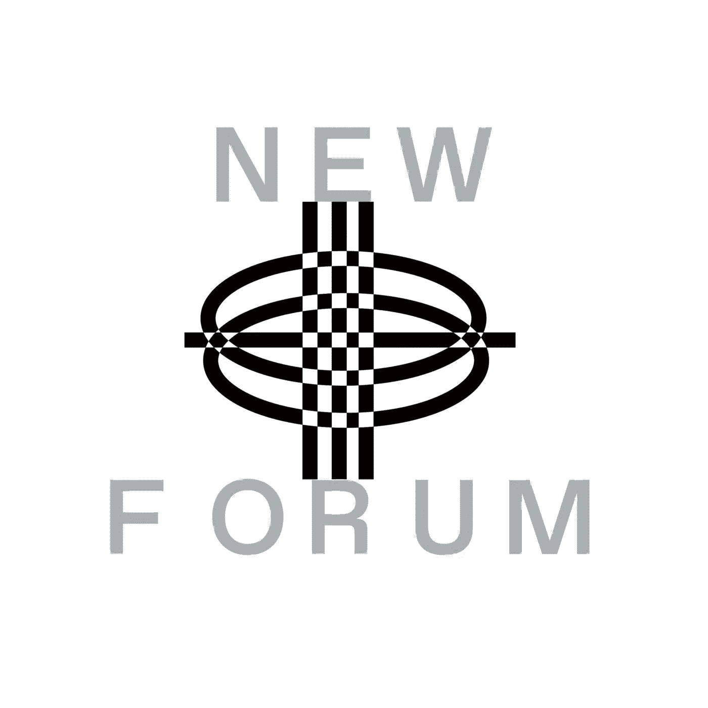

# 扬西·斯特里克勒将创造者经济解释为单人模式与多人模式的对比

> 原文：<https://medium.com/coinmonks/yancey-strickler-explains-the-creator-economy-as-single-player-mode-vs-multiplayer-mode-dao-cons-7119ef0ddd88?source=collection_archive---------16----------------------->

Yancey Strickler | Writer & Co-Founder of [Metalabel](https://twitter.com/Metalabel_xyz)

这是一个绝对的荣誉，有 Yancey Strickler 在这一集精彩的 NEWFORUM，充满了许多关于创造者经济发展的见解。

Yancey 是一名作家，Metalabel 的联合创始人，metal Abel 是一个不断增长的知识、资源和工具的世界，它激发了创造性的协作、合作和相互支持。

他还是 Kickstarter 和 Creative Independent 的联合创始人，这是一个为创意人员提供情感和实践指导的资源，由 Kickstarter 出版。

我们就多人模式下的创作意味着什么、逃离创造者经济以及在线社区在 21 世纪发挥重要作用的潜力展开了对话。他还谈到了 Metalable 的愿景和使命，以及为什么它可以比 DAO 更好地构建效率、执行效率和文化。

他还谈到了 Metalable 的愿景和使命，以及为什么它可以比 DAO 更好地构建效率、执行效率和文化。

# Yancey 是谁，他的故事，背景，以及这一切是如何将他引向 Web3 的？

Yancey 最初是一名作家，他的第一份职业是音乐记者，为 Pitchfork、Spin 杂志和 Village Voice 评论唱片。

他当时创立了一家唱片公司，并在这个过程中建立了新的友谊，这一友谊后来变成了 Kickstarter 的创立。

> “我是 Kickstarter 的三个创始人之一；我们开创并向世界介绍了众筹，然后我花了十二年的时间致力于 Kickstarter 最后四年是作为 CEO 和 Kickstarter。我们受到启发，允许创作者在没有中间人批准的情况下资助项目，让它们直接面向公众；让他们设定他们的愿景。现在已经有 65 亿美元，我认为在过去的 12 年里，它已经通过 Kickstarter 转移到了创意项目，所以迄今为止，我认为已经通过这个网站完成了大量的近 20 万个项目……”——Yancey

2017 年，Yancey 辞去了 Kickstarter 的首席执行官一职，他花了几年时间写了一本名为《这可能是我们的未来》的书。

这本书是对社会金融化的批评，他们从 Kickstarter 中受到了什么启发，试图创建一个以使命为导向的公司，并非常认真地对其更广泛的社区承担责任。

Yancey shared 花了几年时间来谈论金融化的挑战，并提出和介绍一种像 Kickstarter 这样的更多元化的价值愿景的工具。

Yancey 表示，坚持自己的道德信仰和支持他人的价值观是有价值的，这些东西是使生活值得生活的一部分，是使我们感觉良好的一部分，是一个充满活力的社会的一部分。

他补充说，我们想住在某些地方而不想住在其他地方的原因都与这些事情有关，然而我们的每一个公制系统最终都有钱，这决定了它的选择。

> “当我在研究这本书的时候，研究什么样的实际途径可以导致一个更加多元化的世界，在这个世界中，价值不仅仅与金融价值相关，这让我想到了公共分类账，也让我想到了区块链，它是一种工具，可以将任何形式的价值赋予任何可以数字识别的对象，允许根据需要或某人以前采取的一些行动来提供某种东西， 我认为它只是一个空间，允许你重新设置一个价值系统，从头开始设计一个价值系统，对我来说，公共账本作为区块链的基础设施就像一个实用的工具，可以产生许多我个人受到启发的东西……”—Yancey

这让 Yancey 关注了这个空间，并与空间中的许多人聊天。

他补充说，Metalable 开始于大约一年前，在他写完他的书之后，这可能是我们的未来。

在他的完整采访中，你可以听到更多关于 Bentoisem 的内容，这是他的书介绍的一种哲学，一种看待生活、做出选择、利用时间和以更多元化的价值观构建组织的方式。

# 什么是金属制品？愿景和使命是什么？

> “Metalable 是一个释放俱乐部，那里的人们关心同样的事情，他们关心环境，他们关心加密，关心朋克，摇滚，概念艺术，关心他们来自哪里的食物，但是有相同兴趣的人们， 可以一起合作和发布项目，这不仅仅是每个人将子堆栈发送到虚空中并处理他们的订户数，而是一种鼓励合作的工具和结构，它鼓励人们一起处理项目，并将其建立在公共账本和区块链的基础上； 你可以分配这些作品的所有权，能够分配这些作品的财务成果……”

他进一步解释说，Metalabel 正在创建工具和基础设施，允许具有共同创作兴趣的人群组成团队，创建一个简单的结构，通过这个结构他们可以操作并开始发布，这可能是一个新的记录。它可以是一个视频，一次抗议，或者一个在线画廊的开幕；这可能是任何事情，但他们正在提供工具，并试图规范一个新的行动。

> “创作者经济是一种单人模式。创造者经济是你作为孤独的创造者来增加你的订户数量，在多人模式中作为一个元标签是创造力；这是你和另外五个人手拉着手，一起放东西，互相扶持……”——扬西

听到更多关于 Metalables 背后的愿景和使命，以及 Yancey 和他的团队很高兴在这一集中向世界推出的几个月内即将推出的 drop 版本。

# 金属刀和刀有什么不同？

> “我一直对 DAOs 将改变世界的想法持怀疑态度。我认为在线社区已经改变了世界，并将继续改变……”——Yancey

他分享了金属标签和刀的区别。在他看来，阿刀就是一群人，同一个令牌，同一个不和谐的挂出，理论上一起投票做决定。他相信很少有人投道。元标签是一群有相同兴趣的人，他们发布表达这种兴趣的公共作品。

他补充说，Metalable 有一个目的，一个指向它的点，一个输出，而不仅仅是一个俱乐部或社交俱乐部。它背后的意图是创造一种文化，推动事情向前发展。

> “我认为刀是一长串东西中的一部分，但我不知道我是否相信从长远来看，它们会那么重要。我认为网络社区的成熟非常重要，它将塑造 21 世纪，就像 20 世纪是由公司或政府塑造的一样”——Yancey

他进一步解释了为什么网络社区通过创造和推动文化来塑造 21 世纪。

> “无论你是在 Reddit、Discord 或 Telegram，还是 WhatsApp 上，我都不知道地点有多重要，但的确，比如说 snapshot 或类似的东西，有工具可以让这些社区稍微结构化一些，但我认为这已经发生了很长时间……”—Yancey

# **究竟是什么让金属制品与刀区分开来？**

阿刀说你对这种不和谐感兴趣；你可以在一个社交俱乐部里，一起做你选择做的事情。无论你们决定一起做什么，发生什么都不重要。他继续解释说，金属制品旨在释放文化。这是为了工作。这是一种艺术实践。

> “所以，如果你考虑一个唱片公司，如果你是一个从不发行任何音乐的唱片公司，那对我来说就像刀一样……”——Yancey

在 NewForum 的这一集中，Yancey 分享了更多关于 Dao 的想法，以及为什么他不相信它们在未来会很重要。

> “一个标签关乎产出，关乎制造文化；它存在的原因是为了制造文化，对我来说，一把刀从来不制造任何东西，我认为大多数刀从来不制造任何东西。我不认为那是错误的，它没有被破坏，因为那不是它的意图。它的意图只是在一起，所以我认为它的目的是什么……”——扬西

Yancey 非常深入地研究了 DAO 主题，解释了它的利与弊，以及为什么像 Metalable 这样的结构对于创建文化更有效。

我们还谈到了去中心化的创造者经济对未来工作的潜在影响，以及他对驾驭创意经济的建议。这一集以 Yancey 讨论创作价值和数字化而结束。他讨论了他对当前围绕 NFTs 的炒作的想法，以及我们是否应该担心赚大钱的潜力会吸引各种各样的人，这些人可能不会对称为 Web3 的不断发展的新兴生态系统的健康投资。

✨Enjoy:这是一次与扬西·斯特里克勒的深刻而清晰的对话！✨

[加入社区](https://twitter.com/newforum_nco)了解 [@ystrickler](https://twitter.com/ystrickler) 并在 web3 社区中发现其他创始人和远见者！

✨follow·扬西·斯特里克勒&金属标签公司！✨

推特:[@ ystrickler](https://twitter.com/ystrickler)|[@ metal Abel _ XYZ](https://twitter.com/Metalabel_xyz)网址: [www.metalabel.xyz](https://www.metalabel.xyz/)

#新论坛#道#创业邦#区块链#在线社区

爱 x 新论坛

# Twitter @newforum_nco

不和谐[@加入](https://discord.gg/DHepA4WTkN)

# 新论坛

[NewForum](https://newforum.notion.site/newforum/Welcome-to-NewForum-48f9661398ec4ec6a1af37fcc96dc926) 由 [Newcoin Foundation](https://newcoin.org/) 提供支持，专注于促进分散化社交应用的扩展，也称为 Social 3.0，形成一个生态系统和一个由远见者、创造者和投资者组成的社区。它为思想者提供了一个安全的交流、传播和分享思想的空间，以确保一个新网络的自觉和道德发展，嵌入关怀、自由和创造力的价值观。✨每周新集！在 [Twitter](https://twitter.com/newforum_nco) 、 [Newlife](https://newlife.io/) 、 [Youtube](https://www.youtube.com/channel/UCWvHyau1nIJBffmaaj6FmbQ) 和 [LinkedIn](https://www.linkedin.com/showcase/newforum/) 上关注我们，了解 web3 的更多信息，认识生态系统！加入生态系统[不和](https://discord.gg/DHepA4WTkN)！

> 交易新手？试试[加密交易机器人](/coinmonks/crypto-trading-bot-c2ffce8acb2a)或者[复制交易](/coinmonks/top-10-crypto-copy-trading-platforms-for-beginners-d0c37c7d698c)