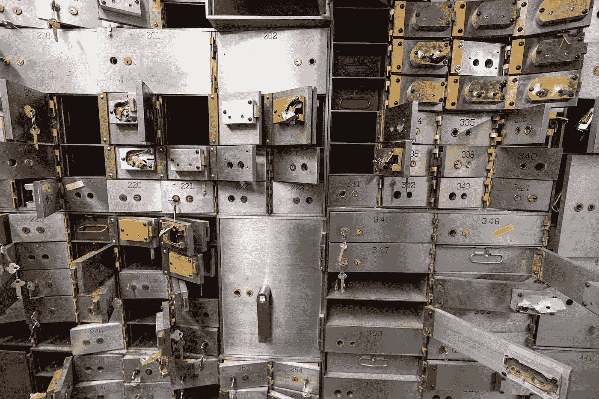
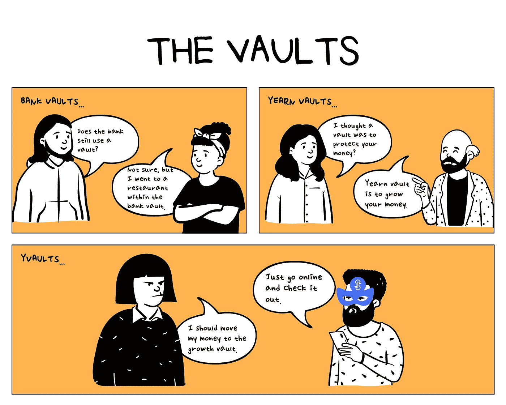

# 渴望财经漫画——第二部

> 原文：<https://medium.com/coinmonks/yearn-finance-comic-part-2-70501f251bc5?source=collection_archive---------43----------------------->



Photo by [Jason Pofahl](https://unsplash.com/@jasonpofahlphotography?utm_source=unsplash&utm_medium=referral&utm_content=creditCopyText) on [Unsplash](https://unsplash.com/s/photos/vault?utm_source=unsplash&utm_medium=referral&utm_content=creditCopyText)

什么是渴望金库？这和银行金库有什么不同？

我们来探索一下。



[https://twitter.com/xuanling11/status/1517613481872158720](https://twitter.com/xuanling11/status/1517613481872158720)

```
**Table of Content**[Bank Vault](#3154)[Yearn Vault](#4b1c)[yVault](#5b06)
```