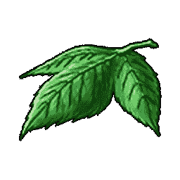

# Yggdrasil 树叶，龙之任务 11 的终极药物

> 原文：<https://medium.com/coinmonks/yggdrasil-leaves-dragon-quest-11s-ultimate-medicine-87328b8fc5?source=collection_archive---------13----------------------->

在紧急情况下，少用这些。

所以现在，我在一个神秘的地下室里，我发现瑟琳娜和她烦人的姐姐维罗妮卡在一起。然后，我碰到了一片 Yggdrasil 叶子。当涉及到战斗或用它们来救活某人时，这些小宝贝应该总是被用作最后的手段。