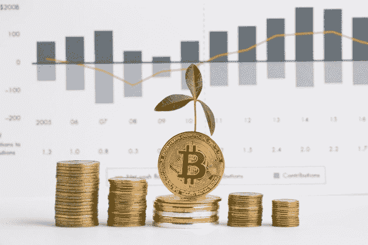
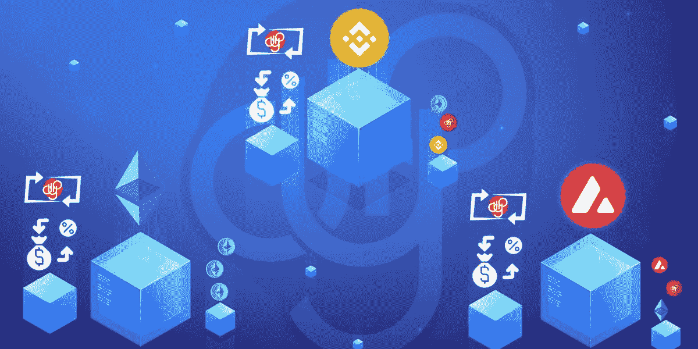

# 产量耕作与打桩:哪个更好？

> 原文：<https://medium.com/coinmonks/yield-farming-vs-staking-which-is-better-aee84863da87?source=collection_archive---------1----------------------->

这已经不是什么秘密了:去中心化金融在过去的两年里蓬勃发展。对于任何投资资本规模的投资者来说，DeFi 提供了许多被动创收机会。产量农业和赌注——两个最大的收入选择——选择哪一个？

*来源:Freepik*

截至 2022 年 1 月，一个令人发笑的[920 亿美元的价值被锁定在基于 DeFi 的协议中](https://www.theblockcrypto.com/data/decentralized-finance/total-value-locked-tvl)。同一消息来源还提到，仅在 2021 年，DeFi 在 Ethreum 网络上的增长就超过了 700%。这种增长的尽头还没有出现。

在这篇文章中，我们将通过 DeFi staking 和产量农业意味着什么，以及他们如何工作。我们还将介绍它们的主要区别，以及如何从中获益。

# 分散融资(DeFi)的真正含义是什么

[分散金融](https://www.coindesk.com/learn/what-is-defi/) (DeFi)是区块链空间中一项不断发展的金融技术，它依赖于分布式分类账——与加密货币一样。该模式旨在消除银行传统上对资金以及金融产品和服务的控制。

DeFi 使个人、贸易商和公司能够通过区块链技术进行独立的金融交易，不再需要中介。这是通过利用安全系统、连通性以及增强的软件和硬件的对等(P2P)网络来实现的。

投资者能够利用 DeFi 的两个很好的方法是赌注和收益农业。

# 什么是产量农业？

产出农业，也称为流动性挖掘，是从加密资产中获利的一种很好的方式。在某些方面，高产农业是不同层次的“高风险、高回报”的赌注。

通过使用智能合同的力量，DeFi Yield farming 将资金借给其他人，并从中赚取丰厚的报酬。这些奖励通常通过一个被称为年收益率(APY)的公式，以相同的象征形式分配。随着越来越多的投资者加入同一个流动性池，APY 利率会下降。

高产农业是 DeFi 的一个竞争领域，农民们不断地从代币农场中争夺最好的产量。

*来源:加密新闻快讯*

# 什么是赌注？

[赌注](https://academy.binance.com/en/articles/what-is-staking)一直是投资者最喜欢的功能，以充分利用他们的加密资产。“投资”你的资产意味着随着时间的推移，你将获得一定比例的回报。这是通过“赌注池”实现的，这可以与传统的有利息回报的储蓄账户相比(只是回报率更高)。

下注代币时获得奖励的原因是因为区块链会使用代币。为此，该系统使用“利益证明”，这是一种共识机制，确保交易的验证和安全性，无需银行或其他中介。如果你决定加入一个赌注池，你的加密货币也开始参与这个过程。

通常，投资者持有的加密资产越多，被选为下一个分组验证者的机会就越大。

# 产量农业与赌注:选择哪一个？

风险肾上腺素和加密知识通常是在决定经营还是投资加密资产时的决定性因素。总的来说，希望这篇关于产量农业和打桩的简要指南能帮助你做出明智的决定。

与金融机构的传统模式相比，赌博和农业仍然是相当新的被动收入模式。这些术语彼此密切相关，打桩通常被视为产量农业的一个分支。每种策略都涉及持有加密货币以赚取回报，并允许投资者利用 DeFi 生态系统的价值。

> 加入 Coinmonks [电报频道](https://t.me/coincodecap)和 [Youtube 频道](https://www.youtube.com/c/coinmonks/videos)了解加密交易和投资

## 另外，阅读

*   [十大最佳加密货币博客](https://coincodecap.com/best-cryptocurrency-blogs) | [YouHodler 评论](https://coincodecap.com/youhodler-review)
*   [AscendEx 保证金交易](https://coincodecap.com/ascendex-margin-trading) | [Bitfinex 赌注](https://coincodecap.com/bitfinex-staking)
*   [最佳卡达诺钱包](https://coincodecap.com/best-cardano-wallets) | [Bingbon 副本交易](https://coincodecap.com/bingbon-copy-trading)
*   [印度最佳 P2P 加密交易所](https://coincodecap.com/p2p-crypto-exchanges-in-india) | [柴犬钱包](https://coincodecap.com/baby-shiba-inu-wallets)
*   [八大加密附属计划](https://coincodecap.com/crypto-affiliate-programs) | [eToro vs 比特币基地](https://coincodecap.com/etoro-vs-coinbase)
*   [最佳以太坊钱包](https://coincodecap.com/best-ethereum-wallets) | [电报上的加密货币机器人](https://coincodecap.com/telegram-crypto-bots)
*   [交易杠杆代币的最佳交易所](https://coincodecap.com/leveraged-token-exchanges)
*   [AscendEx Staking](https://coincodecap.com/ascendex-staking)|[Bot Ocean Review](https://coincodecap.com/bot-ocean-review)|[最佳比特币钱包](https://coincodecap.com/bitcoin-wallets-india)
*   [Bitget 回顾](https://coincodecap.com/bitget-review)|[Gemini vs block fi](https://coincodecap.com/gemini-vs-blockfi)|[OKEx 期货交易](https://coincodecap.com/okex-futures-trading)
*   [美国最佳加密交易机器人](https://coincodecap.com/crypto-trading-bots-in-the-us) | [变化回顾](https://coincodecap.com/changelly-review)