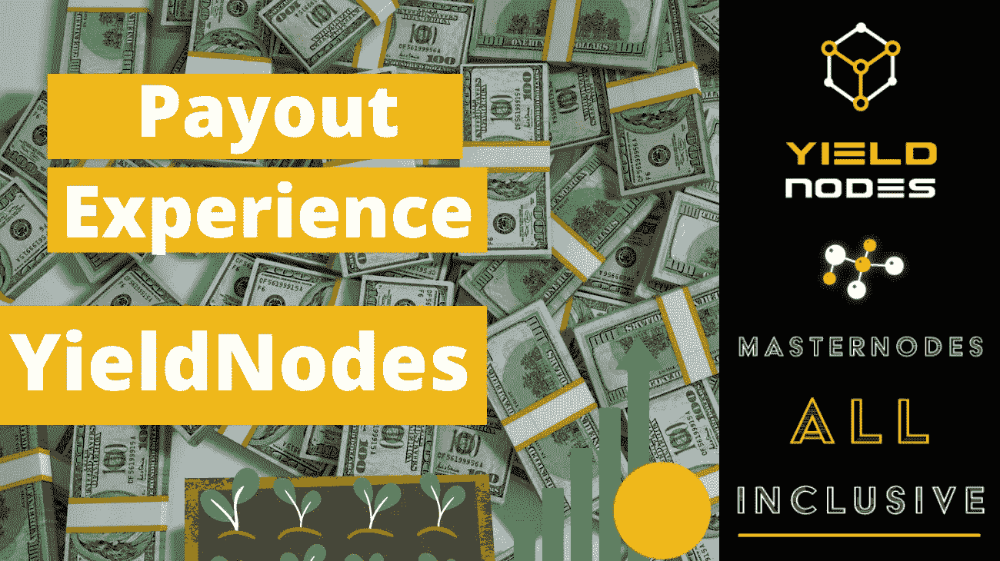
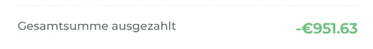
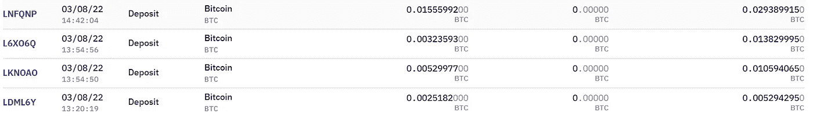
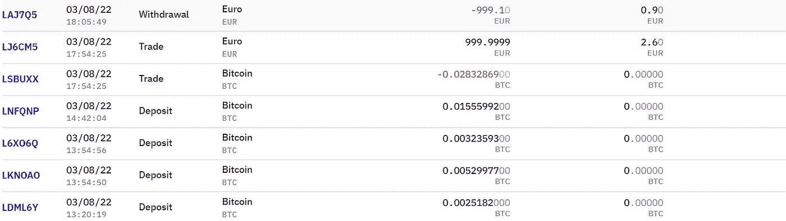

# YieldNodes 支出证明(一步一步)——你能从 YieldNodes 拿到钱吗？

> 原文：<https://medium.com/coinmonks/yieldnodes-proof-of-payout-step-by-step-can-you-get-money-out-from-yieldnodes-83ab48813c82?source=collection_archive---------10----------------------->

Can you really get your money out of YieldNodes?

大家好，欢迎来到 YieldNodes 的这篇文章。

我想表明，YieldNodes 支付广告与我刚刚收到的付款。如果你想知道戒断过程一般是如何进行的，你可以查看我的[完全戒断指南(点击这里)。](https://www.publish0x.com/defi-adventures/yieldnodes-full-withdraw-guide-how-to-harvest-your-yields-xnxdgdz)

在一个循序渐进的指南中，我想告诉你如何收集这些钱并实际使用它们。我们开始吧！

基础知识:投入的资金锁定 6 个月。利润可要求立即提取(下月支付)。但是它对我有什么作用呢？

# 我的支付经历

在从 YieldNodes 获得一些收益并产生一些附属收入后，我上个月请求了多次支付。我总共要求支付€951.63 英镑。这是今天处理并支付的(比特币网络处理交易的速度相当快)。

My total payout from YieldNodes requested last month

总支出为 0.02661382 比特币，今天存入我的北海巨妖账户:

BTC received in my Kraken account

为此，我在北海巨妖创建了一个存款地址，并要求 YieldNodes 把我的 BTC 寄到那里。详情可在我的[取款指南](https://www.publish0x.com/defi-adventures/yieldnodes-full-withdraw-guide-how-to-harvest-your-yields-xnxdgdz)中找到。

我把 BTC 换成了欧元，并要求支付到我的银行账户上。现在，我将使用这些资金来预订一个假期(没有财务建议，请注意，这些收益可能需要缴税)

Converting BTC to Euro and requesting a payout to my bank account

请注意，我的账户上有一些额外的 0.002 BTC，所以我可以全额支付€999

北海巨妖的手续费是，从 BTC 兑换欧元的交易收取 2.60€，取款收取 0.90€。这相当于支出的 0.35%，被认为是相当合理的。YieldNode 对支付不收取任何费用。

虽然在 BTC 处理存款和支出看起来有点复杂，但我认为这是 YieldNodes 的一个积极方面。由于许多加密交易都是通过 BTC 完成的(这对组合通常具有最高的流动性)，这使得 YieldNodes 很容易将存款投入使用。

支出在支出当天转换为 BTC，因此你并没有真正承担资金价格突然变化的风险。正如你从我的例子中看到的，我可以立即将 BTC 换成欧元，避免任何价格波动的风险。

# 为什么我必须等待支付？

正如 YieldNodes 的团队在他们的 FAQ 中解释的那样，他们希望尽可能高效地使用沉淀的资金。为了保证资金可以用于租用服务器和运行实际的主节点，而不会移动太多(这将是资本效率低下的)，他们决定实施这些撤回时间。

我理解这可能会引起一些用户的怀疑。迄今为止，每笔支出都及时到位，回报也不言自明。这不是一个快速致富的计划，而是一个中长期的投资机会。

# 结论

所以我对 YieldNodes 的支付经历非常满意。他们承诺在 3 月 8 日处理 2 月 15 日之前提出的支付请求，这正是他们所做的。从上面的截图可以看到，我今天收到了我的资金。

所以，要回答题目中的问题:是的，你可以从 YieldNodes 中取出你的钱。

你的体验是什么？你是定期从 YieldNodes 支付你的钱还是严格的自动复合？请在评论中告诉我！

# 想从 YieldNodes 开始吗？

*   你自己去研究 YieldNodes 吧，说到底我只是网上随便找的一个人！
*   使用[我的会员链接(点击此处)](https://yieldnodes.com/?a=MyKawjWO4Aj6qAW&trk=publish0x)进行注册，我将赚取您存款的 5%,无需额外费用。提前感谢！
*   只投资你能承受的损失
*   通过比特币存款—查看我的[完整存款指南(点击此处)](https://www.publish0x.com/defi-adventures/yieldnodes-step-by-step-deposit-guide-use-bitcoin-wallet-kra-xlzrqxp)
*   决定你是否想要支付你的收入或复合他们！
*   如果你想了解更多，请告诉我，你可以通过[推特](https://twitter.com/n1ce34007134)联系我

如果你想了解更多，请查看我在 YieldNodes 上的其他博客。

如果你觉得这篇文章有帮助，请考虑给它一个大拇指，并在注册 YieldNodes 时使用我的链接。

祝您愉快！

n1e

附注:今天我想用一点个人风格来结束我的博客。由于我是电子音乐的超级粉丝，最近又重新发现了 YouTube 上令人敬畏的“Cercle”频道，该频道在很棒的地点发布了超级天才音乐家的帖子，我想关闭每个有我此刻真正喜欢的 DJ 设置的博客。尽情享受，并在评论中告诉我你的想法:)

Currently on repeat for me: Vintage Culture at Museum do Amanha

*最初发表于*[*https://www.publish0x.com*](https://www.publish0x.com/defi-adventures/yieldnodes-proof-of-payout-step-by-step-can-you-get-money-ou-xoopdqq?a=3YaOyGxQdx)*。*