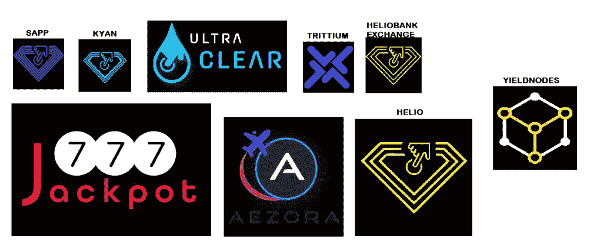

# Yieldnodes 在 5 月份的回报率达到了惊人的 6.5%。让我们来看看蓝宝石和 Decenomy

> 原文：<https://medium.com/coinmonks/yieldnodes-returns-an-amazing-6-5-in-may-lets-take-a-look-at-sapphire-and-decenomy-4323a6276ae2?source=collection_archive---------4----------------------->

## 他们在多大程度上解释了 Yielnodes 的表现

五月很难熬…

我们刚刚见证了近代史上最大的财富毁灭之一。

市场崩盘，比特币进一步下跌 24%，目前比 11 月份的高点下跌了 54%。

S&P 股市暴跌，纳斯达克指数也是如此，因为通胀担忧和加息将市场置于严重熊市的境地。

中国的封锁正在扰乱供应链。乌克兰战争加剧了食品和能源价格的上涨。这给家庭的可支配收入带来了巨大压力，因此可投资的资金减少了。

除此之外，UST /卢纳脱钩和随后的崩溃，沉重的抛售压力降临加密市场，大多数 alt 和 DeFi 硬币受到严重打击。

一些人甚至说，市场崩溃的最糟糕时期可能就在我们前面。

但在所有这些情况下，Yieldnodes 团队以主节点资产 6.5%的回报率再次实现了这一目标。

Source: Yieldnodes

我对此非常满意。

正如我的月度报告所证实的那样，Yieldnodes 仍然是我投资组合中回报率最高的。

 [## 4 月收入:被动收入 1，979 美元，下降 40%，但收益节点保持稳定

### 定期更新我的(漫长的)旅程，在自动驾驶仪上每月产生 1 万美元的被动收入

medium.com](/@John_treadle/april-revenue-1-979-in-passive-income-down-40-but-yieldnodes-stays-solid-379eaf57577) 

通常 Yieldnodes 的回报率接近每月 8%至 10%，每周 2%至 2.3%，但考虑到抛售的规模，我认为这是一个非常不错的表现。

他们是怎么做到的？当一切都付诸东流时，他们怎么能获得这样的回报呢？这是真的吗？

我写了一篇关于 Yieldnodes 如何安全和可持续的文章(见下文)，解释了我为什么相信这个项目。

 [## Yieldnodes 的安全性和可持续性如何？

### Yieldnodes 在当前的市场动荡中脱颖而出，但它们有多安全呢？

medium.com](/@John_treadle/how-safe-and-sustainable-is-yieldnodes-4bd84d01e5f6) 

然而，要理解其月度表现，还需要更深入的考察。

为了更深入地挖掘，我观察了两个最重要的项目:**蓝宝石**和更广泛的**十亿生态系统**。

让我们跳进来。

# 蓝宝石，一种由 Yielnodes 团队接管的主节点加密货币

Yieldnodes 团队没有披露其单个资产的业绩，但他们在几个月前接管了 Sapphire，Yield Nodes 的很大一部分业绩都与 Sapphire 相关联。

Source: Sapphire

以下是该团队对蓝宝石的描述。

*“一枚硬币从实干家给实干家。*

*蓝宝石硬币(SAPP 硬币)将在实体经济中作为一种稳定的支付手段使用，并将只发放给为项目带来附加值的值得信赖的合作伙伴。* …

我们的目标是拥有一种易于使用的硬币，确保快速支付转账，被使用和被需要，最重要的是，与它的社区一起生活和呼吸。

*SAPP 开发者逆转加密货币的通常程序…利润只能通过投机而不是通过价值创造来实现。从长远来看，这肯定会失败。*

*目前 SAPP 硬币的开发者来自实体经济，他们正是为此而改造硬币的。*

稳定、货币供应控制和实际价值创造是基本参数。创建界面是为了在遵守所有法律的同时将硬币用于真正的购买过程”。

作为 Sapphire 的所有者，Yieldnodes 团队运营其主要的 masternodes，以下是摘自 masternode.online 的特征。

Sapphire stats (Source: Masternodes.online)

现在来看看蓝宝石的价格图。硬币似乎做得比好，尤其是与整体市场相比。

Sapphire Price Chart (Source: Coinmarketcap)

围绕硬币也有相当活跃的社区，检查[蓝宝石不和谐](http://discord.gg/RtQY3w9k4x)。

Sapphire 有 2467 个节点，这是它们的地理布局图；他们大多在德国和美国。

Sapphire nodes map (Source: masternodes.online)

概括一下，蓝宝石项目展示了一些有趣的规格:

*   出色的大师级回报(54%)
*   市值 7.17 亿美元的 SAPP 硬币价格走势稳健
*   有能力的开发团队
*   一个动态社区，你可以关注他们的推特 [@Sapphire_core](https://twitter.com/Sapphire_Core)
*   2，467 个节点，主要位于美国和德国

该项目需要密切关注，但目前看来进展顺利。蓝宝石似乎是 Yieldnodes 最稳定、最强劲的创收来源。

# 十年经济生态系统和硬币

Decenomy 代表分散经济。

这是一个由大约 20 个硬币和项目组成的生态系统，主要由 Yieldnodes 团队管理..

这是 Decenomy 包括的项目样本。

Source: Medium

如果你想获得更多关于这些主要可仿制硬币的精确信息，你可以查看。

另一个来源是 [masternodes.online](https://masternodes.online/) 。

蓝宝石似乎是名单中最重要的硬币。

Yieldnodes 团队还表示，他们将很快宣布与政府建立 Decenomy 合作伙伴关系！有一些关于这可能是什么的猜测，保持关注。

最后，团队已经为 Yieldnodes 和 Decenomy 上发布的所有文章和内容建立了一个[知识库。如果你想精通编程，它会教你:](https://knowledgebase.yieldnodes.com/)

*   如何控制自己
*   设置服务器
*   赌十元硬币

# 结论

Yieldnodes 团队从未停止给人留下深刻印象。

他们的模型似乎比许多节点项目更加稳健，这些项目在 2021 年如雨后春笋般涌现，现在正因为硬币的价值付诸东流而崩溃。

Yieldnodes 项目持续提供无与伦比的回报，五月的前两周就是一个示范。

我肯定会继续持有和复合这个伟大的项目。

*注意:以上是 Yieldnodes 的附属链接，如果你想尝试这项服务你可以点击一下，绝对不会对你有任何影响。我将只是收到一小笔佣金，并对此表示感谢。*

*如果你喜欢这个故事，并且愿意支持我(和其他成千上万的作家)，那么考虑一个* [*中型*](/subscribe/@John_treadle) [*订阅*](/subscribe/@John_treadle) *每月只需 5 美元或每年 50 美元。*

*。*

> 加入 T21 电报集团，学习加密交易和投资