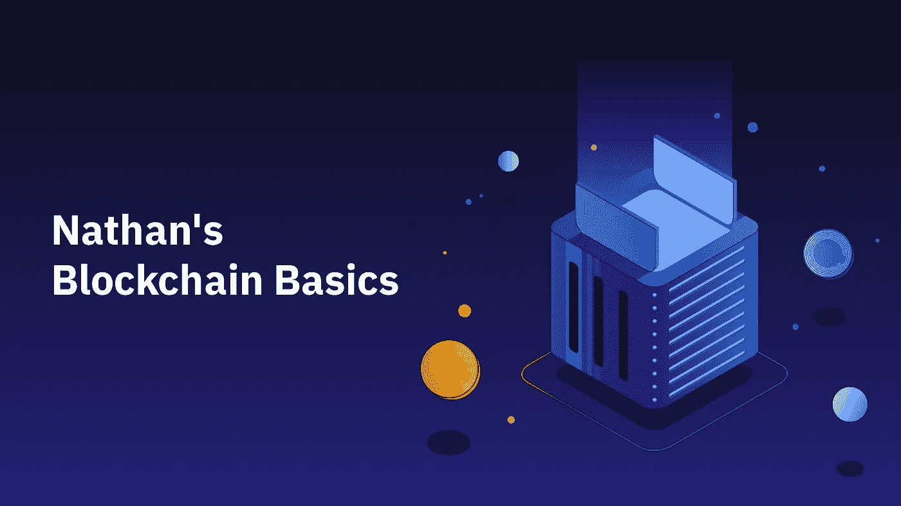

# 你连比特币的一半都不到

> 原文：<https://medium.com/coinmonks/you-aint-half-the-coin-bitcoin-is-35b43ed0a9a6?source=collection_archive---------56----------------------->

**比特币减半**

每当 21 万个区块被确认时，比特币就会减半，按照目前的速度，大约每四年一次。这被称为“减半”，因为矿工的报酬减半。

采矿奖励是创造新比特币的唯一方式，因此每减少一半就意味着加密货币供应量的大幅减少。减半的过程将持续到第 2100 万个比特币被创造出来，那将是供应的结束。

2100 万个比特币的硬性上限从一开始就被编入了比特币的代码中，无法更改。减半是确保新比特币的发行随着时间推移缓慢进行的一种方式。有限的供应是为了挑战和提供一种替代法定货币的货币，法定货币是由银行创造的，并受到通货膨胀的影响。

由于供应不断减少，随着时间的推移，挖掘比特币变得越来越难，越来越贵，这意味着价格需要提高才能变得值得。由于运行数百台专用采矿计算机的电力成本，新铸造的比特币必须提供足够的利润，超过运营采矿业务的间接成本，才能保持盈利。

最终的减半预计发生在 2140 年。之后，该网络的用户将为每笔交易支付少量费用，以奖励继续保护和验证该网络的矿工。

在最安全的交易所之一购买比特币， [Bybit](http://www.bybit.com)

> 加入 Coinmonks [电报频道](https://t.me/coincodecap)和 [Youtube 频道](https://www.youtube.com/c/coinmonks/videos)了解加密交易和投资

# 另外，阅读

*   [币安交易机器人](/coinmonks/binance-trading-bots-d0d57bb62c4c) | [OKEx 评论](/coinmonks/okex-review-6b369304110f) | [Atani 评论](https://coincodecap.com/atani-review)
*   [最佳加密交易信号电报](/coinmonks/best-crypto-signals-telegram-5785cdbc4b2b) | [MoonXBT 评论](/coinmonks/moonxbt-review-6e4ab26d037)
*   [如何在 Bitbns 上购买柴犬(SHIB)币？](https://coincodecap.com/buy-shiba-bitbns) | [购买弗洛基](https://coincodecap.com/buy-floki-inu-token)
*   [CoinFLEX 评论](https://coincodecap.com/coinflex-review) | [AEX 交易所评论](https://coincodecap.com/aex-exchange-review) | [UPbit 评论](https://coincodecap.com/upbit-review)
*   [十大最佳加密货币博客](https://coincodecap.com/best-cryptocurrency-blogs) | [YouHodler 评论](https://coincodecap.com/youhodler-review)