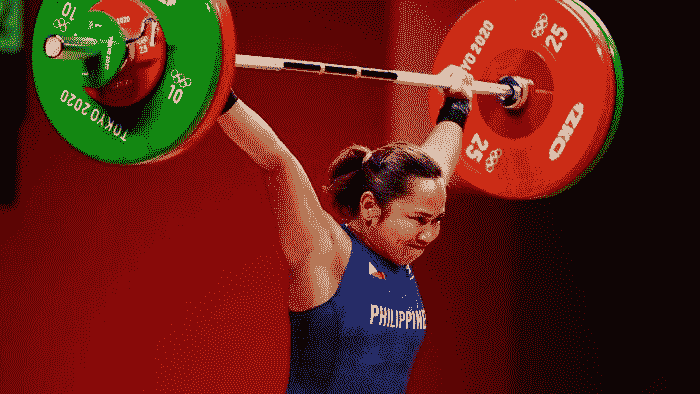
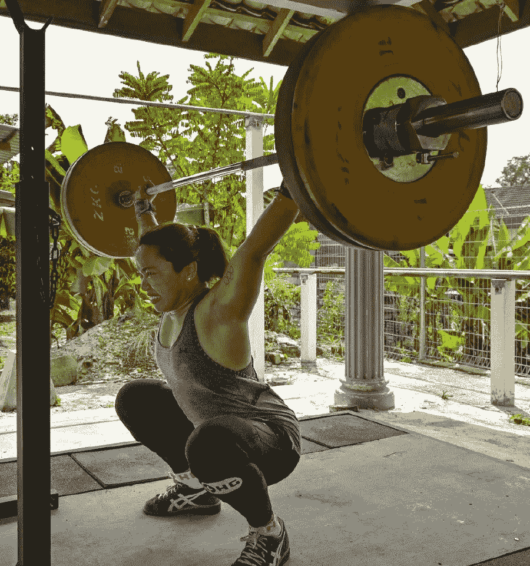
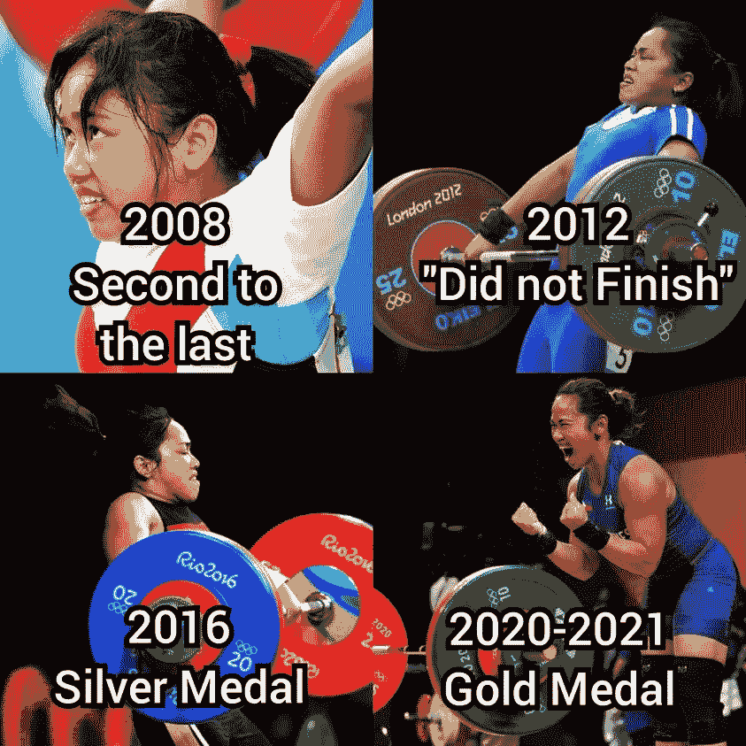

# 你一生中被闪电击中的几率是赢得奥运金牌的 50 万倍。

> 原文：<https://medium.com/coinmonks/you-are-500-000-times-more-likely-to-get-struck-by-lightning-than-winning-the-olympic-gold-medal-in-f6f42c0806f5?source=collection_archive---------61----------------------->

127kg above the head for a 55kg lady. That is really impressive.

根据国家气象局的数据，一个人一生中有 1/15300 的几率被闪电击中，这被定义为 80 年的跨度。

使用桌面数学，你有 80 亿分之一的机会赢得某项运动的金牌。

每个项目 1 块金牌，80 亿人。那是八万分之一的机会。

这意味着从统计数据来看，你被闪电击中的可能性是赢得奥运金牌的 50 多万倍。

这就是赢得一枚奥运金牌的难度。

这在某种背景下如何？

所以在你继续读下去之前，问问你自己:你的借口是什么？

菲律宾唯一赢得奥运会金牌的人。

Hidilyn Diaz 是一名奥运会举重运动员，她在马来西亚远离家人的地方度过了过去两年的大部分时光，为她的祖国菲律宾创造了历史。

30 岁的她身高 1.58 米，在 55 公斤级比赛中，挺举举起了 127 公斤，获得金牌。

这是一个不可思议的壮举，不仅对一位女士来说如此，对一个有如此多不利因素的人来说也是如此。

在一项由俄罗斯和中国举重运动员主导的运动中，他们有几十年的血统、训练、环境、天赋和资源，使他们相对于其他人具有不公平的优势。

相比之下，菲律宾从来没有正式的举重项目，也没有前冠军、教练或训练设施来培养奥运冠军。

生态系统。

这就是拥有一个强健的生态系统和没有生态系统之间的区别。

每一个参赛的国家都有一个值得仰望的英雄，一个支持他们的国家，一个支持他们实现奥运梦想的生态系统。

Hidilyn 是在被自己的国家流放期间刻苦训练后做到这一点的，多年前，她被自己的同胞嘲笑，没有最先进的设备，她不得不自己筹集资金，只有教练在她身边。

She trained far away from her family and loved ones, in the shadows and with rudimentary equipment, under the sweltering heat and humidity.

有人说她太老了，她发育得太晚了。

有人说菲律宾运动员赢不了。

有人说她看起来像个男人，应该停止举重。

她还是去做了。

多年来。

也许这就是为什么我们喜欢失败者。

因为做一个失败者，就是没有理由或能力去赢得某些东西。

没有机会获得金牌，甚至没有机会在面对困难时生存下来。

但是如果机会变得对你有利，或者当你不顾痛苦和艰难坚持下去。

出乎所有人意料的是，当突然之间，似乎完全凭着决心，情况允许完美的提升，失败者获胜时，它揭示了一些不足为奇的东西。

> 交易新手？试试[加密交易机器人](/coinmonks/crypto-trading-bot-c2ffce8acb2a)或者[复制交易](/coinmonks/top-10-crypto-copy-trading-platforms-for-beginners-d0c37c7d698c)

一个奇迹。

毫无疑问，Hidilyn 所做的是一个奇迹。

但她为之放弃了这么多，这是一个经过计算的、有分寸的奇迹。

She kept at it for more than a decade. Don’t tell me the road to success is easy.

我不知道成功是否应该如此困难，但它确实令人满意。

Hidilyn 绝对激励我做得更好，再去一次，继续坚持。

现在，我将等待她不可思议的奥运夺金之旅的电影或纪录片。

我只希望他们能公正地对待她的故事，如实陈述。

也就是说，不管是谁，做什么或者为什么做事情，只要你用心去做，你就能做到。

那么，你现在的借口是什么？

*去年，当我看到她在东京奥运会上举起金牌时，我深受鼓舞，写下了这篇文章。

-

你曾经在任何事情上赢得第一名吗？

-

#创业#商业#创业#成长#奥运金牌#东京 2020 #奥运会#社交媒体#菲律宾#创业# Hidilyndiaz #举重#借口

> 加入 Coinmonks [电报频道](https://t.me/coincodecap)和 [Youtube 频道](https://www.youtube.com/c/coinmonks/videos)了解加密交易和投资

# 另外，阅读

*   [投资印度的最佳密码](https://coincodecap.com/best-crypto-to-invest-in-india-in-2021)|[WazirX P2P](https://coincodecap.com/wazirx-p2p)|[Hi Dollar Review](https://coincodecap.com/hi-dollar-review)
*   [加拿大最佳加密交易机器人](https://coincodecap.com/5-best-crypto-trading-bots-in-canada) | [库币评论](https://coincodecap.com/kucoin-review)
*   [火币加密交易信号](https://coincodecap.com/huobi-crypto-trading-signals) | [HitBTC 审查](/coinmonks/hitbtc-review-c5143c5d53c2)
*   [TraderWagon 回顾](https://coincodecap.com/traderwagon-review) | [北海巨妖 vs 双子座 vs BitYard](https://coincodecap.com/kraken-vs-gemini-vs-bityard)
*   [如何在 FTX 交易所交易期货](https://coincodecap.com/ftx-futures-trading)